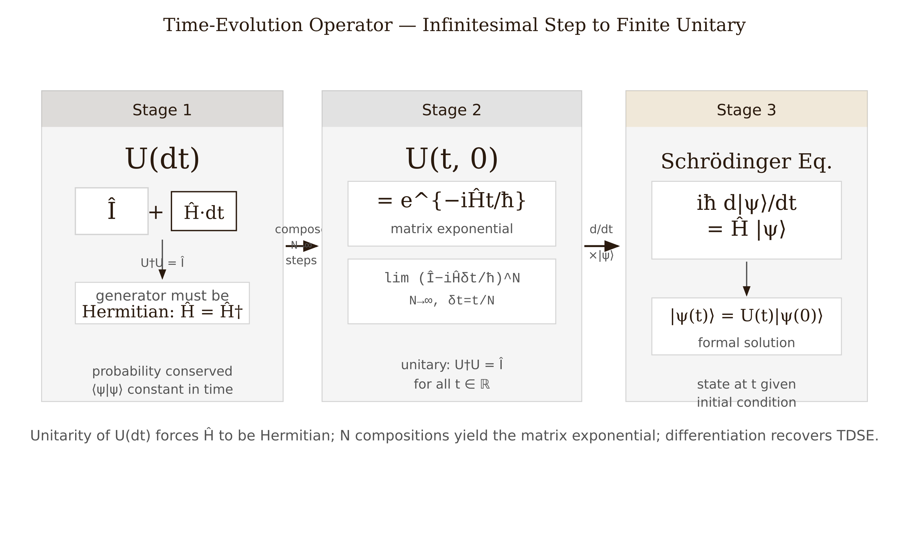
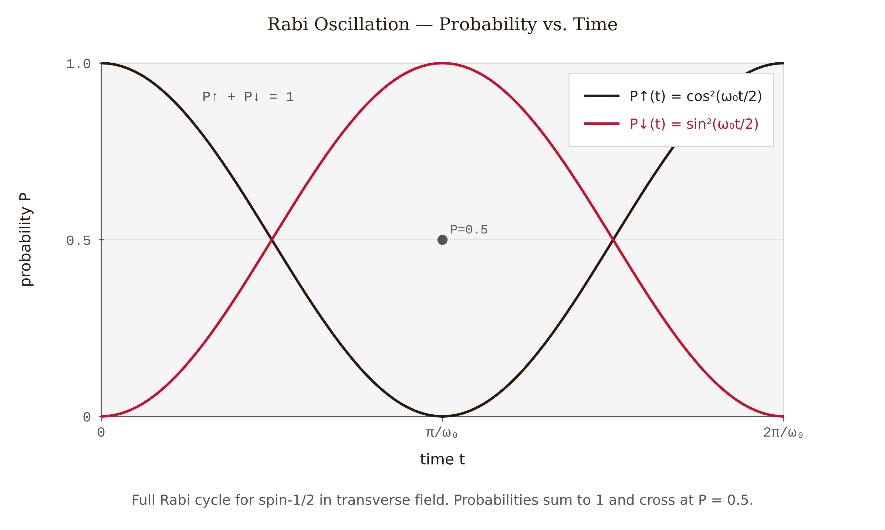
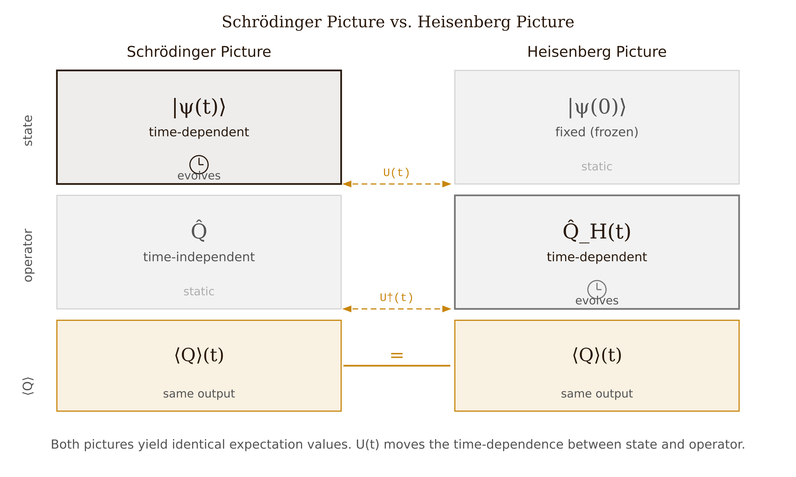

# Chapter 4 — Quantum Dynamics: Time Evolution and the Pictures

Quantum mechanics can describe time evolution in more than one way. In the Schrödinger picture, the state $|\psi(t)\rangle$ carries all the time dependence while operators remain fixed. In the Heisenberg picture, the state is frozen at its initial value and operators carry the time dependence. Both formulations are related by the unitary operator $\hat{U}(t) = e^{-i\hat{H}t/\hbar}$, and expectation values — the only quantities we can measure — come out the same in either picture.

This chapter derives the time-evolution operator from two physical requirements (probability conservation and continuity), shows how stationary states and general time evolution follow from the spectral theorem, and develops the Heisenberg equation of motion and Ehrenfest's theorem.

---

## Where the Schrödinger Equation Comes From

The time-evolution operator advances any state from $t = 0$ to time $t$:

$$|\psi(t)\rangle = \hat{U}(t)|\psi(0)\rangle.$$

Two requirements fix the form of $\hat{U}(t)$ completely.

**First, probability is conserved.** The norm of the state cannot change:

$$\langle\psi(t)|\psi(t)\rangle = \langle\psi(0)|\hat{U}^\dagger(t)\hat{U}(t)|\psi(0)\rangle = 1.$$

This must hold for every initial state, so $\hat{U}^\dagger(t)\hat{U}(t) = \hat{I}$: the time-evolution operator must be **unitary**.

**Second, time evolution is continuous.** For an infinitesimal step $dt$, the most general unitary operator that equals $\hat{I}$ at $t = 0$ is

$$\hat{U}(dt) = \hat{I} - \frac{i}{\hbar}\hat{H}\,dt,$$

where $\hat{H}$ is some operator. Unitarity to first order requires $\hat{H}^\dagger = \hat{H}$: the generator must be Hermitian. Physical dimensions require the factor $\hbar$; the operator $\hat{H}$ has units of energy and is the Hamiltonian. For time-independent $\hat{H}$, composing infinitesimal steps gives the matrix exponential:

$$\boxed{\hat{U}(t) = e^{-i\hat{H}t/\hbar}.}$$

The Schrödinger equation is not a separate postulate. Differentiate $|\psi(t)\rangle = \hat{U}(t)|\psi(0)\rangle$ with respect to $t$:

$$i\hbar\,\frac{d}{dt}|\psi(t)\rangle = \hat{H}|\psi(t)\rangle.$$

It is the statement that $\hat{U}(t)$ satisfies its own differential equation. The entire structure — the Schrödinger equation, stationary states, energy quantization — follows from unitarity plus the generator being Hermitian.

*Figure 4.1 — Deriving the time-evolution operator: unitarity forces a Hermitian generator, N-step composition yields the matrix exponential, and differentiation recovers the Schrödinger equation.*

---

## Stationary States and General Time Evolution

If $|\psi(0)\rangle = |E_n\rangle$ is an energy eigenstate with $\hat{H}|E_n\rangle = E_n|E_n\rangle$, then

$$e^{-i\hat{H}t/\hbar}|E_n\rangle = e^{-iE_n t/\hbar}|E_n\rangle.$$

The state picks up a phase but does not change. Every expectation value is constant. This is a stationary state — the same result we obtained in Chapter 3 by separation of variables, now derived from the operator structure.

For a general initial state $|\psi(0)\rangle = \sum_n c_n|E_n\rangle$:

$$|\psi(t)\rangle = \sum_n c_n\,e^{-iE_n t/\hbar}|E_n\rangle.$$

The procedure is: expand in energy eigenstates, attach a phase $e^{-iE_n t/\hbar}$ to each component, then reassemble. All dynamics live in the relative phases between energy eigenstates. A single eigenstate has no relative phase — that is why it is stationary. Two or more eigenstates produce a beat frequency $(E_m - E_n)/\hbar$ that drives oscillations in every observable.

---

## Worked Example — Rabi Oscillation

A spin-½ particle in a transverse magnetic field has Hamiltonian $\hat{H} = \omega_0\hat{S}_x = (\omega_0\hbar/2)\sigma_x$. Initial state: $|\!\uparrow\rangle$.

The eigenstates of $\hat{S}_x$ are $|x\pm\rangle = (|\!\uparrow\rangle \pm |\!\downarrow\rangle)/\sqrt{2}$ with eigenvalues $\pm\hbar\omega_0/2$. Expand the initial state:

$$|\!\uparrow\rangle = \frac{1}{\sqrt{2}}\bigl(|x+\rangle + |x-\rangle\bigr).$$

Attach phase factors and convert back to the $\hat{S}_z$ basis:

$$|\psi(t)\rangle = \cos\!\left(\frac{\omega_0 t}{2}\right)|\!\uparrow\rangle - i\sin\!\left(\frac{\omega_0 t}{2}\right)|\!\downarrow\rangle.$$

The expectation value of $\hat{S}_z$ oscillates:

$$\langle\hat{S}_z\rangle(t) = \frac{\hbar}{2}\cos(\omega_0 t).$$

The population starts in $|\!\uparrow\rangle$, transfers entirely to $|\!\downarrow\rangle$ at $t = \pi/\omega_0$, and returns. This is Rabi oscillation — the quantum dynamics at the heart of NMR: a spin driven by a resonant pulse oscillates between up and down at the Rabi frequency. The physics follows directly from the beat between two energy eigenstates.

*Figure 4.3 — Rabi oscillation: the spin-up (Sky Blue) and spin-down (Bluish Green) populations exchange completely over one period, with the two probabilities summing to 1 at all times.*

---

## The Heisenberg Picture

Both pictures must agree on every expectation value:

$$\langle\hat{A}\rangle(t) = \langle\psi(t)|\hat{A}|\psi(t)\rangle = \langle\psi(0)|\hat{U}^\dagger(t)\hat{A}\hat{U}(t)|\psi(0)\rangle.$$

The Schrödinger picture assigns all time dependence to the state: $|\psi(t)\rangle = \hat{U}(t)|\psi(0)\rangle$, operators fixed. The Heisenberg picture does the opposite: freeze the state at its $t = 0$ value and assign all time dependence to the operator.

**Definition.** The Heisenberg-picture operator is

$$\hat{A}_H(t) = \hat{U}^\dagger(t)\,\hat{A}\,\hat{U}(t).$$

The state in the Heisenberg picture is $|\psi(0)\rangle$, frozen. Then:

$$\langle\psi(0)|\hat{A}_H(t)|\psi(0)\rangle = \langle\psi(0)|\hat{U}^\dagger\hat{A}\hat{U}|\psi(0)\rangle = \langle\hat{A}\rangle(t). \checkmark$$

The two pictures are related by a unitary transformation — a change of basis in time. All algebraic relations are preserved. In particular:

$$[\hat{x}_H(t), \hat{p}_H(t)] = \hat{U}^\dagger[\hat{x}, \hat{p}]\hat{U} = i\hbar.$$

The canonical commutation relation holds at every time. Switching pictures cannot change the fundamental algebra.

*Figure 4.2 — Schrödinger picture (left) versus Heisenberg picture (right): one transfers all time dependence to the state, the other to the operators; both produce the same expectation values.*

---

## The Heisenberg Equation of Motion

Differentiate $\hat{A}_H(t) = \hat{U}^\dagger\hat{A}\hat{U}$ with respect to $t$. Using $d\hat{U}/dt = (-i\hat{H}/\hbar)\hat{U}$ and its adjoint:

$$\frac{d\hat{A}_H}{dt} = \frac{i}{\hbar}\hat{U}^\dagger[\hat{H}, \hat{A}]\hat{U} = \frac{i}{\hbar}[\hat{H}, \hat{A}_H],$$

where $\hat{H}_H = \hat{U}^\dagger\hat{H}\hat{U} = \hat{H}$ because $\hat{H}$ commutes with functions of itself. Therefore:

$$\boxed{i\hbar\,\frac{d\hat{A}_H}{dt} = [\hat{A}_H,\, \hat{H}].}$$

This is the **Heisenberg equation of motion** — an *operator* equation. Compare it to Hamilton's classical equations $\dot{x} = \{x, H\}$, $\dot{p} = \{p, H\}$, where $\{f,g\}$ is the Poisson bracket. The quantum equation is the classical one with the Poisson bracket replaced by the commutator divided by $i\hbar$:

$$\{f, g\}_\text{classical} \longleftrightarrow \frac{1}{i\hbar}[\hat{f}, \hat{g}]_\text{quantum}.$$

This is Dirac's quantization dictionary, and it works in both directions.

One immediate consequence: if $[\hat{H}, \hat{A}] = 0$, then $\hat{A}$ is a constant of motion. This is the quantum version of Noether's theorem — a symmetry of the Hamiltonian produces a conserved quantity.

*Figure 4.4 — Classical Hamilton equations (Poisson bracket, left) and the Heisenberg equation (commutator, right) share identical bilinear structure; replacing $\{\ ,\ \}$ with $[\ ,\ ]/i\hbar$ is Dirac's quantization rule.*

---

## Worked Example — Free Particle in the Heisenberg Picture

With $\hat{H} = \hat{p}^2/2m$, the equations of motion are:

$$i\hbar\,\frac{d\hat{p}_H}{dt} = [\hat{p}_H, \hat{p}_H^2/2m] = 0, \qquad \hat{p}_H(t) = \hat{p}.$$

Momentum is conserved. For position, using $[\hat{x}, \hat{p}^2] = 2i\hbar\hat{p}$:

$$\frac{d\hat{x}_H}{dt} = \frac{\hat{p}_H}{m} = \frac{\hat{p}}{m}.$$

Since $\hat{p}_H$ is constant, integrating directly:

$$\hat{x}_H(t) = \hat{x}(0) + \frac{\hat{p}}{m}\,t.$$

The position operator obeys Newton's first law exactly. The operator equation expresses the same content as $x = x_0 + v_0 t$, with operators taking the place of numbers.

In the Schrödinger picture, the wavepacket *spreads* — $\sigma_x$ grows with time. The Heisenberg picture says nothing about spreading; it describes the motion of the expectation value. The two pictures are complementary: one tracks where the center goes, the other shows how the distribution disperses.

---

## Worked Example — Harmonic Oscillator in the Heisenberg Picture

With $\hat{H} = \hat{p}^2/2m + m\omega^2\hat{x}^2/2$, the Heisenberg equations give:

$$\frac{d\hat{x}_H}{dt} = \frac{\hat{p}_H}{m}, \qquad \frac{d\hat{p}_H}{dt} = -m\omega^2\hat{x}_H.$$

These are exactly Hamilton's equations for the classical harmonic oscillator, with operators replacing classical variables. Eliminate $\hat{p}_H$:

$$\frac{d^2\hat{x}_H}{dt^2} = -\omega^2\hat{x}_H.$$

Solve with initial conditions $\hat{x}_H(0) = \hat{x}$, $\hat{p}_H(0) = \hat{p}$:

$$\hat{x}_H(t) = \hat{x}\cos(\omega t) + \frac{\hat{p}}{m\omega}\sin(\omega t),$$
$$\hat{p}_H(t) = \hat{p}\cos(\omega t) - m\omega\hat{x}\sin(\omega t).$$

The operators oscillate at frequency $\omega$ — identical to the classical result. The expectation values therefore oscillate classically regardless of the quantum state, which only determines the initial spread. The Heisenberg picture makes this transparent: classical dynamics lives in the operators; quantum mechanics lives in the initial state.

Verify $[\hat{x}_H(t), \hat{p}_H(t)] = i\hbar$ at all $t$: expanding using $[\hat{x},\hat{p}] = i\hbar$ and the trigonometric identity $\cos^2 + \sin^2 = 1$ gives exactly $i\hbar$. The commutation relation is preserved — as unitarity guarantees.

In terms of ladder operators $\hat{a} = (m\omega\hat{x} + i\hat{p})/\sqrt{2m\omega\hbar}$:

$$\hat{a}_H(t) = \hat{a}\,e^{-i\omega t}, \qquad \hat{a}^\dagger_H(t) = \hat{a}^\dagger\,e^{+i\omega t}.$$

The annihilation operator rotates clockwise in the complex plane at frequency $\omega$. Coherent states — eigenstates of $\hat{a}$ — therefore have expectation values that trace exact classical orbits. That is why coherent states are the most classical quantum states of the oscillator.

---

## Ehrenfest's Theorem

Take the expectation value of the Heisenberg equation:

$$\frac{d}{dt}\langle\hat{A}\rangle = \frac{i}{\hbar}\langle[\hat{H}, \hat{A}]\rangle.$$

Apply with $\hat{A} = \hat{x}$: since $[\hat{p}^2/2m, \hat{x}] = -i\hbar\hat{p}/m$,

$$\frac{d\langle\hat{x}\rangle}{dt} = \frac{\langle\hat{p}\rangle}{m}.$$

Apply with $\hat{A} = \hat{p}$: since $[V(\hat{x}), \hat{p}] = i\hbar\,\partial V/\partial x$,

$$\frac{d\langle\hat{p}\rangle}{dt} = -\left\langle\frac{\partial V}{\partial x}\right\rangle.$$

This resembles Newton's second law, but with an important distinction: the force is evaluated not at the *expectation value of position* but as the *expectation value of the force*. These two quantities are equal only when $\partial V/\partial x$ is linear in $x$ — the harmonic oscillator and the free particle. For a general potential:

$$-\left\langle\frac{\partial V}{\partial x}\right\rangle \neq -\frac{\partial V}{\partial\langle x\rangle}.$$

The difference is of order $(\Delta x)^2 V'''(\langle x\rangle)$. When the wavepacket is narrow relative to the scale on which the force varies, the approximation is good and quantum expectation values follow classical trajectories. When it fails — near a caustic, in a double well, anywhere the potential curves sharply — the quantum system departs from classical behavior.

For the harmonic oscillator, $V^{(n)} = 0$ for all $n \geq 3$: the potential is exactly quadratic. The Ehrenfest equation is exact; the expectation value follows the classical orbit precisely, regardless of the initial wavepacket shape. This is one reason the harmonic oscillator is ubiquitous in quantum mechanics — it is the unique potential where classical and quantum dynamics of expectation values are identical.

*Figure 4.5 — Ehrenfest's theorem breaks down in a double well: a narrow wavepacket tracks the classical force (left), but a wide wavepacket bifurcates while its expectation value stays at the center (right).*

---

## Which Picture to Use

The two pictures are not competing approaches — they are complementary tools suited to different purposes. The Schrödinger picture is natural when you want the wave function itself: bound-state problems, numerical simulation, anything involving $\psi(x,t)$ directly. The Heisenberg picture is natural when you want equations of motion for observables: it produces operator equations that look like classical mechanics, making the classical limit transparent and enabling clean algebraic solutions. Quantum field theory is almost exclusively Heisenberg picture — field operators at each spacetime point satisfy local dynamical equations; Schrödinger-picture wavefunctionals for fields are unwieldy.

A third option — the interaction picture — splits the Hamiltonian as $\hat{H} = \hat{H}_0 + \hat{H}_1$: operators evolve under $\hat{H}_0$ (Heisenberg style), states evolve under only $\hat{H}_1$ (Schrödinger style in the rotating frame of $\hat{H}_0$). This is the natural language for time-dependent perturbation theory and Fermi's golden rule, which appear later in this volume.

---

## References

- Heisenberg, W. (1925). Über quantentheoretische Umdeutung kinematischer und mechanischer Beziehungen. *Zeitschrift für Physik*, **33**, 879. https://doi.org/10.1007/BF01328377
- Born, M., & Jordan, P. (1925). Zur Quantenmechanik. *Zeitschrift für Physik*, **34**, 858. https://doi.org/10.1007/BF01328531
- Schrödinger, E. (1926). Über das Verhältnis der Heisenberg-Born-Jordanschen Quantenmechanik zu der meinen. *Annalen der Physik*, **384**(8), 734. https://doi.org/10.1002/andp.19263840804
- Townsend, J.S. (2012). *A Modern Approach to Quantum Mechanics*, 2nd ed. University Science Books. Ch. 4.
- Sakurai, J.J. and Napolitano, J. (2021). *Modern Quantum Mechanics*, 3rd ed. Cambridge University Press. Ch. 2.
- Griffiths, D.J. (2018). *Introduction to Quantum Mechanics*, 3rd ed. Cambridge University Press. §2.1–2.3, §3.6.
- Ehrenfest, P. (1927). Bemerkung über die angenäherte Gültigkeit der klassischen Mechanik innerhalb der Quantenmechanik. *Zeitschrift für Physik*, **45**, 455. https://doi.org/10.1007/BF01329203
- Cohen-Tannoudji, C., Diu, B., & Laloë, F. (1977). *Quantum Mechanics*, Vol. 1. Wiley. Ch. III.

