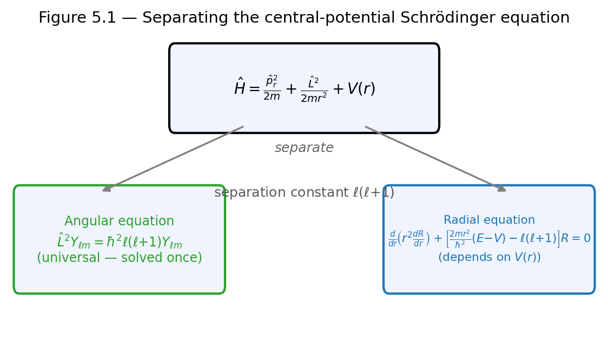
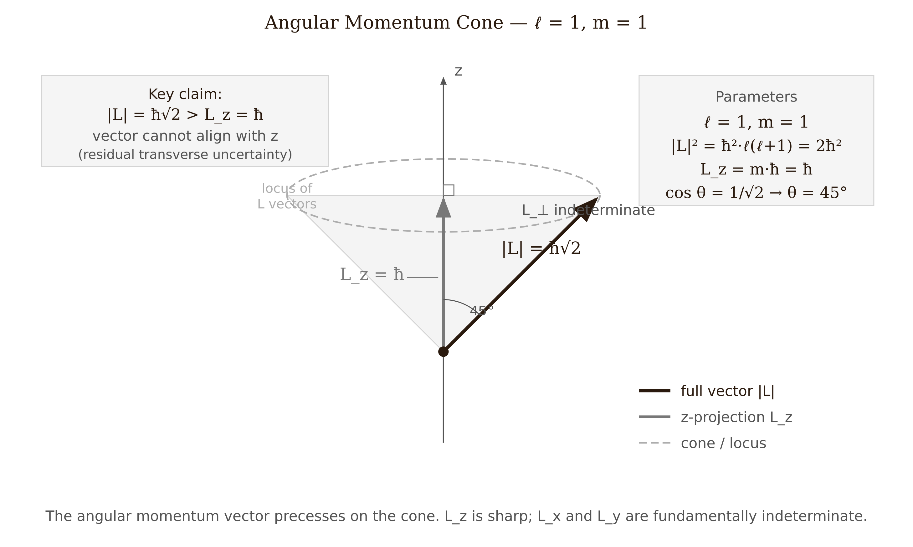
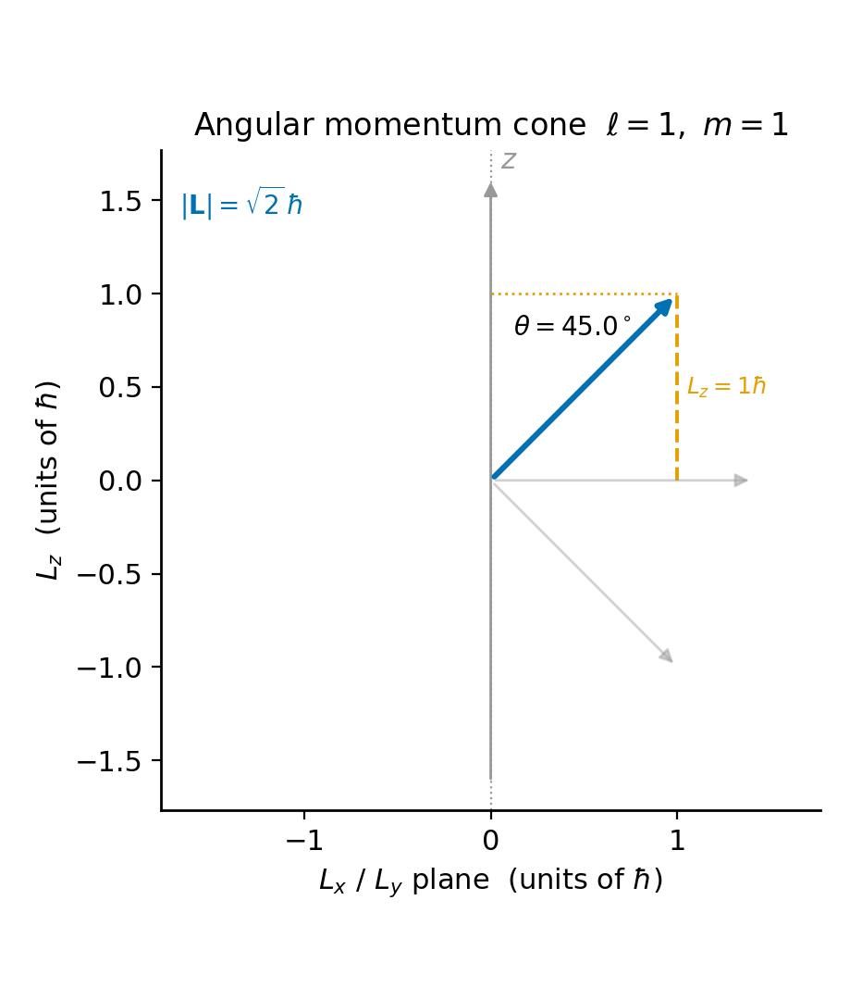
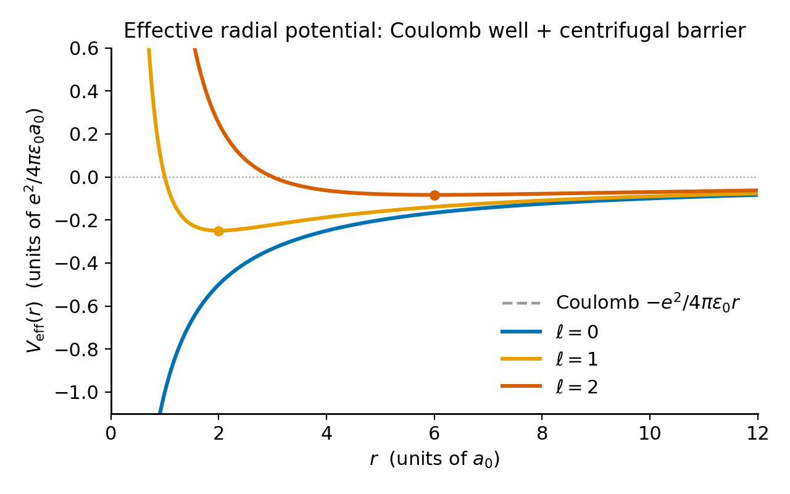
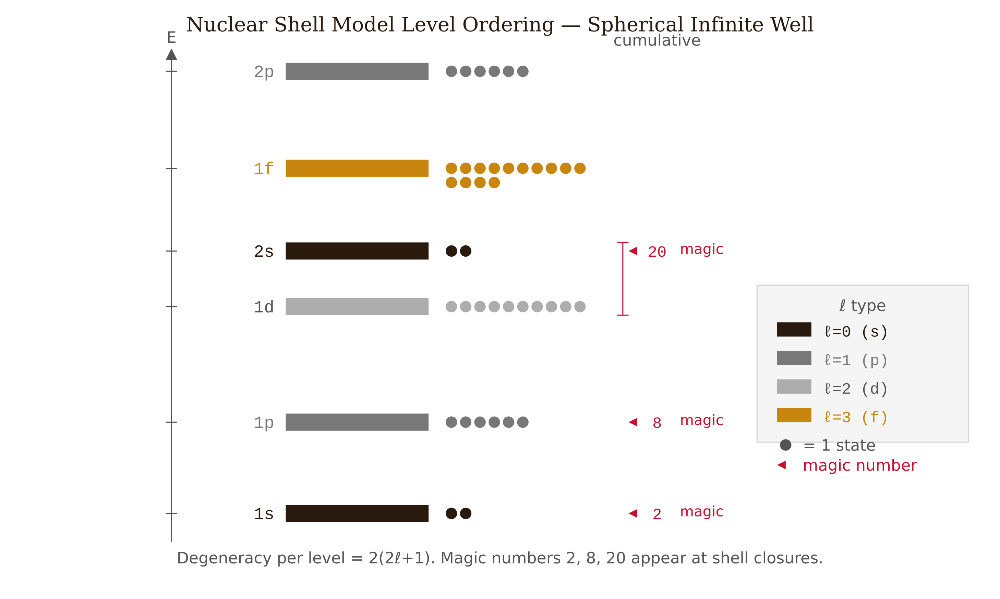

# Chapter 5 — Quantum Mechanics in Three Dimensions
*How the requirement that the wave function stay finite at the poles of a sphere forces angular momentum to be quantized.*

This chapter extends quantum mechanics from one dimension to three, solving the Schrödinger equation for any spherically symmetric potential. The central result is a separation of variables that splits the problem into a universal angular equation — solved once for all central potentials — and a one-dimensional radial equation whose form depends on the specific potential.

The angular solutions are the spherical harmonics $Y_\ell^m(\theta,\phi)$. These appear throughout physics and provide the basis for understanding atomic orbitals. A useful distinction worth keeping in mind: the orbital images common in chemistry textbooks display the angular probability density $|Y_\ell^m|^2$, and the "p-orbitals" shown there are real linear combinations of $Y_1^{\pm 1}$ and $Y_1^0$, chosen for their convenient alignment along the Cartesian axes. The complex spherical harmonics used in physics (eigenstates of $\hat{L}_z$) and the real combinations used in chemistry (not eigenstates of $\hat{L}_z$) span the same subspace but are genuinely different states. We will develop both clearly.

---

## Central Potentials

The three-dimensional time-independent Schrödinger equation is

$$-\frac{\hbar^2}{2m}\nabla^2\psi(\vec{r}) + V(\vec{r})\psi(\vec{r}) = E\psi(\vec{r}).$$

In Cartesian coordinates, three variables are tangled together in $\nabla^2 = \partial_x^2 + \partial_y^2 + \partial_z^2$. For a general potential $V(\vec{r})$, we cannot separate them.

The most physically important potentials depend only on the distance $r = |\vec{r}|$, not on direction. The Coulomb potential $-e^2/(4\pi\epsilon_0 r)$ in the hydrogen atom, the confining well in a nucleus, and the interatomic potential in a diatomic molecule are all **central potentials** — $V(\vec{r}) = V(r)$ — and for any central potential, the angular part of the Schrödinger equation has a universal solution. We derive it once in this chapter. For hydrogen, we then insert $V(r) = -e^2/(4\pi\epsilon_0 r)$ and solve a one-dimensional radial equation. For the nuclear shell model, we insert a different potential and solve a different one-dimensional equation. The angular structure is always the same.

The reason is symmetry. A central potential leaves the Hamiltonian unchanged under any rotation, which means $[\hat{H}, \hat{L}^2] = [\hat{H}, \hat{L}_z] = 0$. Commuting operators share a common set of eigenstates. So the energy eigenstates can simultaneously be eigenstates of $\hat{L}^2$ and $\hat{L}_z$ — and the separation of variables produces exactly those joint eigenstates.

---

## The Algebra of Separation

In spherical coordinates, the Laplacian takes the form

$$\nabla^2 = \frac{1}{r^2}\frac{\partial}{\partial r}\!\left(r^2\frac{\partial}{\partial r}\right) + \frac{1}{r^2\sin\theta}\frac{\partial}{\partial\theta}\!\left(\sin\theta\frac{\partial}{\partial\theta}\right) + \frac{1}{r^2\sin^2\theta}\frac{\partial^2}{\partial\phi^2}.$$

The first term is purely radial. The second and third depend only on the angles, and they appear divided by $r^2$. We define the **orbital angular momentum operator**:

$$\hat{L}^2 \equiv -\hbar^2\!\left[\frac{1}{\sin\theta}\frac{\partial}{\partial\theta}\!\left(\sin\theta\frac{\partial}{\partial\theta}\right) + \frac{1}{\sin^2\theta}\frac{\partial^2}{\partial\phi^2}\right].$$

The kinetic energy then splits cleanly:

$$-\frac{\hbar^2}{2m}\nabla^2 = -\frac{\hbar^2}{2m}\cdot\frac{1}{r^2}\frac{\partial}{\partial r}\!\left(r^2\frac{\partial}{\partial r}\right) + \frac{\hat{L}^2}{2mr^2}.$$

The second term, $\hat{L}^2/2mr^2$, is the quantum version of the classical rotational kinetic energy $L^2/2I$ with moment of inertia $I = mr^2$. The structures are identical — quantum mechanics recovers the classical kinetic energy decomposition into radial and rotational parts.

Now try the product ansatz $\psi(r,\theta,\phi) = R(r)\,Y(\theta,\phi)$. Substitute into the Schrödinger equation with $V = V(r)$, divide by $RY$, and multiply by $r^2$:

$$\underbrace{\frac{1}{R}\frac{d}{dr}\!\left(r^2\frac{dR}{dr}\right) - \frac{2mr^2}{\hbar^2}[V(r)-E]}_{\text{depends only on }r} = \underbrace{-\frac{1}{Y}\,\frac{\hat{L}^2 Y}{\hbar^2}}_{\text{depends only on }\theta,\phi}.$$

Each side must equal the same constant. Call it $\ell(\ell+1)$. The Schrödinger equation splits into two independent equations:

$$\hat{L}^2 Y(\theta,\phi) = \hbar^2\ell(\ell+1)\,Y(\theta,\phi), \qquad \text{(angular)}$$

$$\frac{1}{R}\frac{d}{dr}\!\left(r^2\frac{dR}{dr}\right) - \frac{2mr^2}{\hbar^2}[V(r)-E] = \ell(\ell+1). \qquad \text{(radial)}$$

The angular equation knows nothing about which central potential we have chosen. It is an eigenvalue equation for $\hat{L}^2$ on the unit sphere. The radial equation carries $V(r)$. That is where the specific physics lives.

<!-- → [FIGURE: schematic showing the separation into angular and radial equations — depicting the Hamiltonian split into (radial kinetic) + (L²/2mr²) + V(r), with an arrow pointing to "universal angular equation: solved once" and another to "potential-specific radial equation: solved for each V(r)"; this should visually convey why central potentials are so computationally powerful] -->

*Figure 5.1 — schematic showing the separation into angular and radial equations — depicting the Hamiltonian split into (radial kinetic) + (L²/2mr²) +…*

---

## Solving the Angular Equation

Separate once more: $Y(\theta,\phi) = \Theta(\theta)\Phi(\phi)$. The $\phi$-equation is immediate:

$$\Phi''(\phi) = -m^2\Phi(\phi), \qquad \Phi_m(\phi) = \frac{e^{im\phi}}{\sqrt{2\pi}}.$$

**Single-valuedness** — $\Phi(\phi + 2\pi) = \Phi(\phi)$ — forces $m$ to be an integer. This is the first quantization condition, and it comes from the geometry of the sphere, not from any imposed rule.

The $\theta$-equation, with $x = \cos\theta$, becomes the **associated Legendre equation**. Its physically acceptable solutions — those that stay finite at the poles $\theta = 0$ and $\theta = \pi$ (equivalently at $x = \pm 1$) — are the associated Legendre functions $P_\ell^m(\cos\theta)$. They exist only when $\ell$ is a non-negative integer and $|m| \leq \ell$. These constraints are not imposed by hand. They fall out of the regularity requirement at the poles. The quantization of angular momentum is forced by the boundary conditions on the sphere.

Stitch together with normalization:

$$Y_{\ell m}(\theta,\phi) = \sqrt{\frac{2\ell+1}{4\pi}\,\frac{(\ell-|m|)!}{(\ell+|m|)!}}\;P_\ell^m(\cos\theta)\,e^{im\phi}.$$

These are the **spherical harmonics**. They are orthonormal on the unit sphere:

$$\int_0^{2\pi}d\phi\int_0^\pi\sin\theta\,d\theta\;Y_{\ell'm'}^*\,Y_{\ell m} = \delta_{\ell\ell'}\delta_{mm'},$$

and they form a complete basis for functions on the sphere: any $f(\theta,\phi)$ expands as $f = \sum_{\ell m}c_{\ell m}Y_{\ell m}$.

The first few spherical harmonics are worth writing out, because they appear in everything from atomic orbitals to the cosmic microwave background:

$$Y_0^0 = \frac{1}{\sqrt{4\pi}}$$

A constant. The $s$-orbital has no angular structure whatsoever.

$$Y_1^0 = \sqrt{\frac{3}{4\pi}}\cos\theta, \qquad Y_1^{\pm 1} = \mp\sqrt{\frac{3}{8\pi}}\sin\theta\,e^{\pm i\phi}.$$

The minus sign for $m = +1$ is the **Condon–Shortley phase convention**. It is not an error. It is required to make ladder-operator matrix elements come out with consistent signs in Chapter 6.

$$Y_2^0 = \sqrt{\frac{5}{16\pi}}(3\cos^2\theta - 1).$$

This has nodal cones at $\cos\theta = \pm 1/\sqrt{3}$, about $54.7°$ from the $z$-axis — the familiar lobes of the $d_{z^2}$ orbital.

One structural fact to internalize before the pictures mislead us: $|Y_{\ell m}|^2$ is **independent of** $\phi$ — always. The $\phi$-dependence of $Y_{\ell m}$ lives entirely in the factor $e^{im\phi}$, whose modulus is exactly 1. The squared modulus kills it. Every spherical harmonic probability density is axially symmetric about the $z$-axis, for every value of $m$.

<!-- → [TABLE: the first nine spherical harmonics Y_ℓ^m for ℓ = 0, 1, 2 — showing the explicit formula, the angular quantum number ℓ, the magnetic quantum number m, and the associated orbital label (s, p_z, p±, d_z², d±₁, d±₂); include a note that |Y|² is φ-independent for all entries] -->

---

## Angular Momentum in Position Space

The classical angular momentum $\vec{L} = \vec{r}\times\vec{p}$ becomes quantum mechanically:

$$\hat{L}_z = \hat{x}\hat{p}_y - \hat{y}\hat{p}_x.$$

In spherical coordinates this simplifies to

$$\hat{L}_z = -i\hbar\frac{\partial}{\partial\phi}.$$

Act on $Y_{\ell m}$. The $\phi$-dependence is $e^{im\phi}$:

$$\hat{L}_z\,Y_{\ell m} = -i\hbar \cdot im \cdot Y_{\ell m} = m\hbar\,Y_{\ell m}.$$

The spherical harmonic $Y_{\ell m}$ is simultaneously an eigenstate of $\hat{L}^2$ with eigenvalue $\hbar^2\ell(\ell+1)$ and an eigenstate of $\hat{L}_z$ with eigenvalue $m\hbar$. The integer $m$ running from $-\ell$ to $+\ell$ is the **magnetic quantum number**.

The components of $\hat{L}$ satisfy the commutation relations

$$[\hat{L}_x, \hat{L}_y] = i\hbar\hat{L}_z, \quad [\hat{L}_y, \hat{L}_z] = i\hbar\hat{L}_x, \quad [\hat{L}_z, \hat{L}_x] = i\hbar\hat{L}_y,$$

and crucially $[\hat{L}^2, \hat{L}_i] = 0$ for $i = x, y, z$. This last relation is why $\hat{L}^2$ and one component can be simultaneously diagonalized. The other two components are then necessarily uncertain — a consequence of the nonzero commutators between them. The Robertson inequality applied to $\hat{L}_x$ and $\hat{L}_y$ gives $\sigma_{L_x}\sigma_{L_y} \geq \hbar|\langle\hat{L}_z\rangle|/2$. Measure $L_z$ sharply and $L_x$, $L_y$ become irreducibly uncertain.

---

## Why $\hbar^2\ell(\ell+1)$, Not $\hbar^2\ell^2$

Here is the fact that trips up almost everyone the first time. In the state $|\ell, m = \ell\rangle$ — maximum $z$-projection — the $z$-component of angular momentum is $L_z = \ell\hbar$. But the total magnitude is $\sqrt{\langle L^2\rangle} = \hbar\sqrt{\ell(\ell+1)}$, which is strictly *greater* than $\ell\hbar$ for any $\ell > 0$.

This means the angular momentum vector can never be fully aligned with the $z$-axis. Even in the state with maximum $L_z$, the vector has unavoidable transverse components. Geometrically, the angular momentum precesses on a cone. For $\ell = 1$, the cone half-angle is $\arccos(1/\sqrt{2}) = 45°$. For $\ell = 2, m = 2$, it is $\arccos(2/\sqrt{6}) \approx 35°$.

*Figure 5.5 — Angular momentum cone for ℓ=1, m=1: the full vector has magnitude ℏ√2 (Blue) while its z-projection is ℏ (Sky Blue), making a 45° half-angle; the vector can never align with z.*

We can see why the transverse components cannot vanish: if $L_z = \ell\hbar$ exactly and $L^2 = \hbar^2\ell(\ell+1)$, then $\langle L_x^2\rangle + \langle L_y^2\rangle = \hbar^2\ell(\ell+1) - \ell^2\hbar^2 = \hbar^2\ell$. Their expectation values are zero, but their variances are not. The Robertson inequality enforces minimum spread on $\hat{L}_x$ and $\hat{L}_y$ whenever $\langle\hat{L}_z\rangle \neq 0$.

This eliminates the Bohr-model picture of an electron orbiting in a definite plane. A definite orbital plane would require a definite direction for $\vec{L}$ — which the algebra forbids. There is no orbital plane. There is a cone.

<!-- → [FIGURE: angular momentum cone for ℓ = 1, m = 1 — showing the angular momentum vector of magnitude ℏ√2 precessing on a cone at 45° from the z-axis, with the z-component labeled ℏ and the total length labeled ℏ√2; label the transverse uncertainty Δ(Lx), ΔLy); the visual goal is to make viscerally clear that L_z = ℏ and |L| = ℏ√2 are compatible but L cannot point along z] -->

*Figure 5.2 — angular momentum cone for ℓ = 1, m = 1 — showing the angular momentum vector of magnitude ℏ√2 precessing on a cone at 45° from the z-axis,…*

---

## The Chemistry-Textbook Orbitals

The spherical harmonics $Y_1^{\pm 1}$ are eigenstates of $\hat{L}_z$ with eigenvalues $\pm\hbar$. Their probability densities $|Y_1^{\pm 1}|^2$ are axially symmetric about $z$ — rings. There is no preferred direction in these states other than the $z$-axis itself.

Chemistry prefers wave functions that point along the Cartesian axes. The real combinations are:

$$p_x \propto \sin\theta\cos\phi \propto -\tfrac{1}{\sqrt{2}}(Y_1^1 - Y_1^{-1}),$$
$$p_y \propto \sin\theta\sin\phi \propto \tfrac{i}{\sqrt{2}}(Y_1^1 + Y_1^{-1}),$$
$$p_z = Y_1^0 \propto \cos\theta.$$

These are real wave functions with the dumbbell shapes pointing along $x$, $y$, $z$. But when we act with $\hat{L}_z = -i\hbar\partial_\phi$ on $p_x \propto \sin\theta\cos\phi$:

$$\hat{L}_z(\sin\theta\cos\phi) = -i\hbar\frac{\partial}{\partial\phi}\cos\phi = i\hbar\sin\phi \propto ip_y.$$

The result is $ip_y$, not a multiple of $p_x$. The $p_x$ orbital is not an eigenstate of $\hat{L}_z$. It has a definite spatial direction but no definite $z$-component of angular momentum.

Both bases — the complex $\{Y_1^{-1}, Y_1^0, Y_1^1\}$ and the real $\{p_x, p_y, p_z\}$ — span the same three-dimensional subspace of states with $\ell = 1$. They describe the same physics. Chemistry picks the real basis because the pictures are intuitive for bonding. Physics picks the complex basis because $\hat{L}_z$ is diagonal. Neither is more "correct." The distinction to keep in mind is that the chemistry pictures are not the angular momentum eigenstates.

---

## The Radial Equation and the Centrifugal Barrier

With the angular part handled, the radial equation contains an awkward first-derivative term. The substitution $u(r) = rR(r)$ cleans it up. A short calculation shows:

$$\frac{1}{r^2}\frac{d}{dr}\!\left(r^2\frac{dR}{dr}\right) = \frac{1}{r}\frac{d^2u}{dr^2},$$

and the radial equation becomes

$$\boxed{-\frac{\hbar^2}{2m}\frac{d^2u}{dr^2} + \left[V(r) + \frac{\hbar^2\ell(\ell+1)}{2mr^2}\right]u(r) = E\,u(r).}$$

This is a one-dimensional Schrödinger equation on the half-line $r \in [0,\infty)$, with effective potential

$$V_{\text{eff}}(r) = V(r) + \frac{\hbar^2\ell(\ell+1)}{2mr^2}.$$

*Figure 5.4 — The effective potential: the attractive V(r) (Blue), centrifugal barrier (Orange), and their sum V_eff (Bluish Green) for ℓ=1, showing how the barrier pushes the bound-state minimum away from the origin.*

The extra term — positive, diverging at $r = 0$, falling off as $1/r^2$ — is the **centrifugal barrier**. For $\ell > 0$, it pushes probability away from the origin. For $\ell = 0$ (s-states), there is no barrier and the wave function can have finite amplitude at $r = 0$.

The centrifugal term is not a force pushing the electron outward. It is a kinetic energy contribution — specifically, the angular kinetic energy $\hat{L}^2/2mr^2$ evaluated in an eigenstate of $\hat{L}^2$ with eigenvalue $\hbar^2\ell(\ell+1)$. It sits where $V(r)$ sits in the equation, but it is kinetic. The distinction matters when asking where energy comes from in an atomic transition.

Boundary conditions: $u(0) = 0$ to keep $R = u/r$ finite at the origin; $u(r) \to 0$ as $r \to\infty$ for normalizability. The radial probability density is

$$P(r)\,dr = |u(r)|^2\,dr = r^2|R(r)|^2\,dr:$$

the probability of finding the particle between $r$ and $r + dr$, integrated over all angles.

The $u$-substitution does key work: a 3D central-force problem reduces exactly to a 1D Schrödinger equation with an $\ell$-dependent effective potential. Project onto an angular momentum eigenstate, pay with the centrifugal term. The angular degrees of freedom are gone.

<!-- → [FIGURE: effective potential plots for ℓ = 0, 1, 2 in a Coulomb-like potential — showing V(r) = -e²/r in dashed, and V_eff(r) for each ℓ; the centrifugal barrier creates a repulsive wall near r = 0 that grows with ℓ, and the minimum shifts outward; the visual goal is to show how ℓ controls the "hardness" of the inner wall and thus the characteristic orbital size] -->

*Figure 5.3 — effective potential plots for ℓ = 0, 1, 2 in a Coulomb-like potential — showing V(r) = -e²/r in dashed, and V_eff(r) for each ℓ*

---

## A Solvable Example: The Spherical Well

Take $V(r) = 0$ for $r < a$ and $V = \infty$ for $r \geq a$. Inside the well, the radial equation with $k = \sqrt{2mE/\hbar^2}$ and $\rho = kr$ reduces to the spherical Bessel equation whose regular solutions are the spherical Bessel functions $j_\ell(\rho)$. The boundary condition $u(a) = 0$ means $j_\ell(ka) = 0$, so $ka$ must equal the $n$-th zero $\beta_{n\ell}$ of $j_\ell$:

$$E_{n\ell} = \frac{\hbar^2\beta_{n\ell}^2}{2ma^2}.$$

For $\ell = 0$: $j_0(\rho) = \sin\rho/\rho$, with zeros at $\rho = n\pi$. So $E_{n,0} = n^2\pi^2\hbar^2/(2ma^2)$ — exactly the one-dimensional infinite-well spectrum. The $\ell = 0$ states of the spherical well, after the $u$-substitution, are literally the 1D infinite-well problem. There is no angular structure; the two problems are identical.

For $\ell = 1$: $j_1(\rho) = \sin\rho/\rho^2 - \cos\rho/\rho$. Its first zero is near $\rho \approx 4.493$. The first $p$-state energy is $E_{1,1} \approx (4.493/\pi)^2 E_{1,0} \approx 2.05\,E_{1,0}$. The centrifugal barrier raised it above the first $s$-state.

The level ordering — 1s, 1p, 1d, 2s, 1f, 2p, ... — is obtained by sorting the zeros of successive Bessel functions. This is the foundation of the nuclear shell model. Maria Goeppert Mayer and J. Hans D. Jensen showed in 1949 that adding a strong spin-orbit coupling to this potential reproduces the observed nuclear magic numbers 2, 8, 20, 28, 50, 82, 126 — the proton and neutron numbers at which nuclei are unusually stable — for which they shared the 1963 Nobel Prize in Physics. The angular machinery of this chapter, applied to a nucleus rather than an atom, predicts which configurations of nucleons are especially bound.

*Figure 5.6 — Nuclear shell model level ordering from the spherical infinite well: s-levels (Blue), p-levels (Sky Blue), d-levels (Bluish Green), and f-levels (Orange) fill in order, reproducing the first three magic numbers at cumulative counts 2, 8, and 20.*

One important distinction: higher $\ell$ does not universally mean higher energy. For the spherical well it does. For hydrogen, energies depend only on the principal quantum number $n$, with no $\ell$-dependence — an "accidental" degeneracy of the $1/r$ Coulomb potential, explained by a hidden SO(4) symmetry. For the 3D harmonic oscillator, energies depend on $2n_r + \ell$. The angular structure is universal; the level ordering is potential-specific.

---

## The Same Mathematics, Much Larger

The spherical harmonics $Y_{\ell m}(\theta,\phi)$ are the universal basis for functions on any sphere. They appear in the multipole expansion of any electromagnetic field (the $\ell = 1$ terms are the dipole, $\ell = 2$ the quadrupole), in the gravitational potential of any nearly-spherical body, and in the cosmic microwave background.

The Planck collaboration reports the CMB's temperature anisotropies — the tiny ripples in the temperature of the sky from 380,000 years after the Big Bang — as a power spectrum $C_\ell$, where $\ell$ is the spherical-harmonic index. The first acoustic peak at $\ell \approx 220$ corresponds to the sound horizon of the early universe at recombination. The same $\ell$ that distinguishes $s$, $p$, $d$, $f$ atomic orbitals labels the multipoles of the cosmos. The mathematics is identical; the scale differs by sixty orders of magnitude.

Learning spherical harmonics in this chapter is preparation for any problem that lives on a sphere.

---

## Exercises

**Warm-up**

1. *Difficulty: Warm-up — tests the separation of variables.*
   Write the 3D TISE in spherical coordinates for $V(r) = -e^2/(4\pi\epsilon_0 r)$. Without solving anything: (a) identify which terms depend only on $r$ and which only on $(\theta, \phi)$; (b) explain why the separation constant is written $\ell(\ell+1)$ rather than just $\lambda$; (c) state the two equations the separation produces.
   *Tests: ability to identify the angular operator and articulate why the separation constant takes this specific form.*

2. *Difficulty: Warm-up — tests normalization of spherical harmonics.*
   Verify $\int|Y_0^0|^2\,d\Omega = 1$ and $\int|Y_1^0|^2\,d\Omega = 1$ by explicit integration, using $\int_0^\pi\sin\theta\,d\theta = 2$ and $\int_0^\pi\cos^2\theta\sin\theta\,d\theta = 2/3$.
   *Tests: ability to carry out the solid-angle integration.*

3. *Difficulty: Warm-up — tests the* $\phi$-*independence of* $|Y_{\ell m}|^2$ *and the Condon–Shortley phase.*
   (a) Show that $|Y_{\ell m}(\theta,\phi)|^2$ is independent of $\phi$ for any $\ell, m$. (b) Evaluate $Y_1^1$ at $(\theta = \pi/2, \phi = 0)$ and confirm the value is $-\sqrt{3/(8\pi)}$. What goes wrong if you omit the Condon–Shortley phase?
   *Tests: algebraic demonstration of axial symmetry; awareness of the sign convention and its consequences.*

**Application**

4. *Difficulty: Application — tests the* $\hat{L}_z$ *eigenvalue equation and the physics vs. chemistry basis.*
   Verify $\hat{L}_z Y_1^1 = \hbar Y_1^1$ by writing out $Y_1^1 = -\sqrt{3/(8\pi)}\sin\theta\,e^{i\phi}$ and applying $\hat{L}_z = -i\hbar\partial_\phi$. Then compute $\hat{L}_z(p_x)$ where $p_x \propto \sin\theta\cos\phi$ and confirm that $p_x$ is not an eigenstate of $\hat{L}_z$.
   *Tests: direct application of the differential operator; demonstrates that the chemistry orbital is a superposition of* $\hat{L}_z$ *eigenstates.*

5. *Difficulty: Application — tests the* $u$-*substitution and the centrifugal barrier.*
   Starting from the radial equation for $R(r)$, apply $u(r) = rR(r)$ and show explicitly that the result is the 1D Schrödinger equation with $V_\text{eff} = V(r) + \hbar^2\ell(\ell+1)/(2mr^2)$. Identify which step of the derivative computation produces the centrifugal term. In one sentence, explain why the centrifugal term is kinetic, not potential, energy.
   *Tests: algebraic command of the substitution; physical interpretation of the effective potential.*

6. *Difficulty: Application — tests the spherical well spectrum and its connection to 1D well.*
   For the 3D infinite spherical well of radius $a$: (a) show that the 1s ground-state energy equals the 1D infinite-well energy $\pi^2\hbar^2/(2ma^2)$; (b) find the first 1p state energy using $\beta_{1,1} \approx 4.493$ and express it as a multiple of $E_{1,0}$; (c) explain why the $\ell = 0$ and 1D problems are identical but the $\ell = 1$ problem has no 1D analog.
   *Tests: application of the spherical well formula; connection between the* $u$-*substitution and the 1D problem.*

7. *Difficulty: Application — tests the cone geometry of angular momentum.*
   For the state $|\ell = 2, m = 2\rangle$: (a) compute $\sqrt{\langle L^2\rangle}$ and $L_z$; (b) find the half-angle of the angular momentum cone; (c) compute $\sqrt{\langle L_x^2 + L_y^2\rangle}$ in this state; (d) explain why this quantity cannot be zero using the Robertson inequality for $\hat{L}_x$ and $\hat{L}_y$.
   *Tests: distinguishes* $\hbar^2\ell(\ell+1)$ *from* $\hbar^2\ell^2$; *connects the transverse angular momentum to the uncertainty principle.*

**Synthesis**

8. *Difficulty: Synthesis — requires expressing a chemistry orbital in the physics basis and applying the Born rule.*
   Consider the $p_x$ orbital, proportional to $\sin\theta\cos\phi$. (a) Express $p_x$ as a linear combination of $Y_1^{-1}$, $Y_1^0$, $Y_1^1$ with explicit coefficients. (b) If $\hat{L}_z$ is measured on an ensemble of particles in state $p_x$, what are the possible outcomes and their probabilities? (c) What is $\langle\hat{L}_z\rangle$ for $p_x$? Does zero expectation value imply the state is an eigenstate of $\hat{L}_z$ with eigenvalue zero? Explain.
   *Tests: ability to decompose a real orbital in the complex basis; Born rule in angular momentum space; distinction between zero expectation value and eigenvalue.*

9. *Difficulty: Synthesis — connects the spherical well spectrum to the nuclear shell model.*
   The nuclear magic numbers 2, 8, 20 correspond to filled shells in a spherical well without spin-orbit coupling. Using the level ordering 1s, 1p, 1d, 2s, ... and degeneracy $2(2\ell+1)$ per level (including both spin orientations): (a) fill the levels in order and show that cumulative counts 2, 8, 20 reproduce the first three magic numbers; (b) explain why the higher magic numbers (28, 50, ...) require a spin-orbit term not present in the simple spherical well; (c) state what physical mechanism the spin-orbit term introduces and how it reorders the levels.
   *Tests: ability to apply the angular momentum formalism to a nuclear context; identifies the limitation of the simple central-potential model.*

**Challenge**

9. *Difficulty: Challenge — ladder operators and the algebraic derivation of the spectrum.*
   Define $\hat{L}_\pm = \hat{L}_x \pm i\hat{L}_y$. (a) Show $[\hat{L}_z, \hat{L}_+] = \hbar\hat{L}_+$ using $[\hat{L}_i, \hat{L}_j] = i\hbar\epsilon_{ijk}\hat{L}_k$. (b) Use this to argue that if $|\ell, m\rangle$ is an eigenstate of $\hat{L}_z$ with eigenvalue $m\hbar$, then $\hat{L}_+|\ell, m\rangle$ is an eigenstate with eigenvalue $(m+1)\hbar$. (c) The raising must terminate at some maximum $m$. Apply the termination condition $\hat{L}_+|\ell, m_\text{max}\rangle = 0$, compute $\langle\hat{L}^2\rangle$ using $\hat{L}^2 = \hat{L}_-\hat{L}_+ + \hat{L}_z^2 + \hbar\hat{L}_z$, and show that the eigenvalue must be $\hbar^2\ell(\ell+1)$ with $\ell = m_\text{max}$ a non-negative integer. This is the algebraic derivation of the spectrum — the one Chapter 6 uses to extend immediately to spin.
   *Tests: ladder operator commutator algebra; derivation of the* $\ell(\ell+1)$ *spectrum without the Legendre equation.*

---

## References

Griffiths, D. J., & Schroeter, D. F. (2018). *Introduction to Quantum Mechanics* (3rd ed.). Cambridge University Press. Chapter 4.

Townsend, J. S. (2012). *A Modern Approach to Quantum Mechanics* (2nd ed.). University Science Books. Chapters 9–10.

Goeppert Mayer, M. (1948). On closed shells in nuclei. *Physical Review*, 74, 235.

Jensen, J. H. D., Suess, H. E., & Haxel, O. (1949). Modellmäßige Deutung der ausgezeichneten Nucleonenzahlen im Kernbau. *Die Naturwissenschaften*, 36, 155.

Planck Collaboration. (2020). Planck 2018 results. V. CMB power spectra and likelihoods. *Astronomy and Astrophysics*, 641, A5.

Condon, E. U., & Shortley, G. H. (1935). *The Theory of Atomic Spectra*. Cambridge University Press. (Original source for the Condon–Shortley phase convention.)

