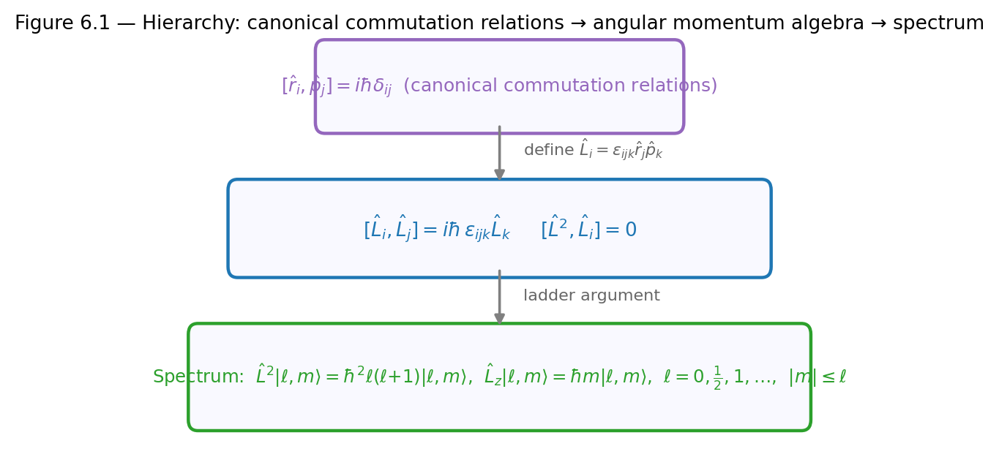
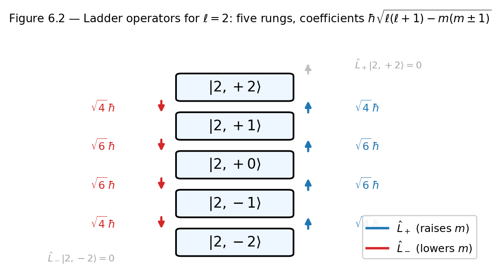
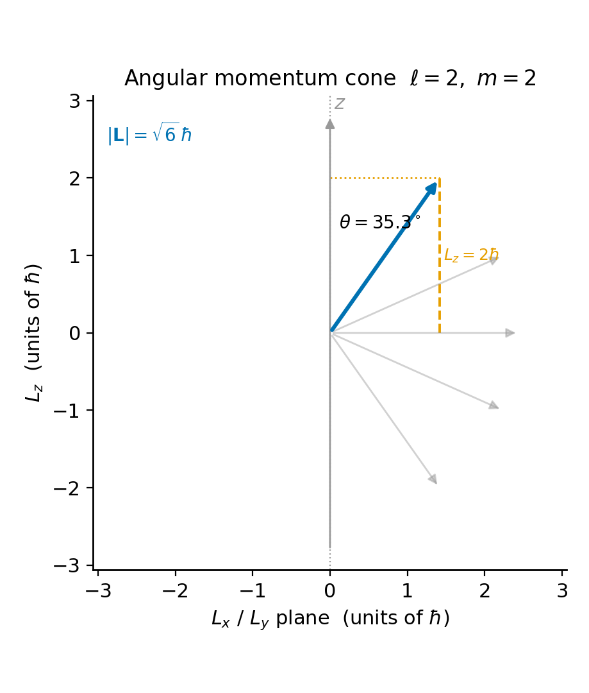

# Chapter 6 — Angular Momentum
*How three commutation relations determine an entire spectrum, without solving a single differential equation.*

This chapter derives the complete spectrum of angular momentum from algebra alone. The entire set of eigenvalues of $\hat{L}^2$ and $\hat{L}_z$ follows from three commutation relations and one inequality. The values $\hbar^2\ell(\ell+1)$ and $m\hbar$, with $m$ running from $-\ell$ to $\ell$ in integer steps, are consequences of:

$$[\hat{L}_x, \hat{L}_y] = i\hbar\hat{L}_z, \qquad [\hat{L}_y, \hat{L}_z] = i\hbar\hat{L}_x, \qquad [\hat{L}_z, \hat{L}_x] = i\hbar\hat{L}_y.$$

Any object satisfying these three relations — whether it lives in position space, spin space, or somewhere more abstract — must have exactly this spectrum.

The significance of the algebraic approach is that it allows $\ell$ to be a half-integer. Orbital angular momentum is restricted to integers by an additional physical requirement — the single-valuedness of the wave function $e^{im\phi}$ under $\phi \to \phi + 2\pi$. Spin angular momentum has no wave function in position space and no such restriction. Half-integer $\ell$ is realized by every electron in the universe, and the algebraic derivation tells us why.

---

## The Commutation Relations from First Principles

The classical angular momentum $\vec{L} = \vec{r}\times\vec{p}$ becomes, in quantum mechanics, $\hat{\vec{L}} = \hat{\vec{r}}\times\hat{\vec{p}}$, with components:

$$\hat{L}_x = \hat{y}\hat{p}_z - \hat{z}\hat{p}_y, \qquad \hat{L}_y = \hat{z}\hat{p}_x - \hat{x}\hat{p}_z, \qquad \hat{L}_z = \hat{x}\hat{p}_y - \hat{y}\hat{p}_x.$$

The canonical commutation relations $[\hat{r}_i, \hat{p}_j] = i\hbar\delta_{ij}$ and $[\hat{r}_i, \hat{r}_j] = [\hat{p}_i, \hat{p}_j] = 0$ are the only inputs. Computing $[\hat{L}_x, \hat{L}_y]$ by expanding into four terms and keeping only those that involve one position and one conjugate momentum of the same coordinate:

$$[\hat{L}_x, \hat{L}_y] = [\hat{y}\hat{p}_z - \hat{z}\hat{p}_y,\; \hat{z}\hat{p}_x - \hat{x}\hat{p}_z] = \hat{y}\hat{p}_x[\hat{p}_z, \hat{z}] + \hat{p}_y\hat{x}[\hat{z}, \hat{p}_z].$$

Since $[\hat{p}_z, \hat{z}] = -i\hbar$ and $[\hat{z},\hat{p}_z] = i\hbar$:

$$= -i\hbar\hat{y}\hat{p}_x + i\hbar\hat{x}\hat{p}_y = i\hbar(\hat{x}\hat{p}_y - \hat{y}\hat{p}_x) = i\hbar\hat{L}_z.$$

The other two relations follow by cyclic permutation $x \to y \to z \to x$. In compact form:

$$\boxed{[\hat{L}_i, \hat{L}_j] = i\hbar\epsilon_{ijk}\hat{L}_k,}$$

where $\epsilon_{ijk}$ is the Levi-Civita symbol ($\epsilon_{xyz} = 1$, antisymmetric under exchange of any two indices).

Now form $\hat{L}^2 = \hat{L}_x^2 + \hat{L}_y^2 + \hat{L}_z^2$ and compute $[\hat{L}^2, \hat{L}_z]$. The $[\hat{L}_z^2, \hat{L}_z]$ term is zero. For the $x$ term, use $[\hat{A}^2, \hat{B}] = \hat{A}[\hat{A},\hat{B}] + [\hat{A},\hat{B}]\hat{A}$:

$$[\hat{L}_x^2, \hat{L}_z] = -i\hbar(\hat{L}_x\hat{L}_y + \hat{L}_y\hat{L}_x), \qquad [\hat{L}_y^2, \hat{L}_z] = +i\hbar(\hat{L}_x\hat{L}_y + \hat{L}_y\hat{L}_x).$$

They cancel exactly. By the same argument:

$$\boxed{[\hat{L}^2, \hat{L}_i] = 0 \quad \text{for } i = x, y, z.}$$

<!-- → [DIAGRAM: three-level hierarchy showing: (1) canonical commutation relations [r_i, p_j]=iℏδ_ij at the top, (2) angular momentum commutation relations [L_i,L_j]=iℏε_ijk L_k in the middle, (3) the derived results [L²,L_i]=0 and the spectrum at the bottom — arrows showing what implies what] -->

*Figure 6.1 — three-level hierarchy showing: (1) canonical commutation relations (r_i, p_j)=iℏδ_ij at the top, (2) angular momentum commutation relations…*

These two boxed results carry a direct physical meaning. $\hat{L}^2$ and $\hat{L}_z$ can be simultaneously diagonalized — they share a complete eigenbasis. But $\hat{L}_x$, $\hat{L}_y$, $\hat{L}_z$ cannot be simultaneously sharp, because they do not commute with each other. This is a structural consequence of the algebra, not a choice about how to measure. We label states by their $\hat{L}^2$ and $\hat{L}_z$ eigenvalues because those operators commute. We could equally well use $\hat{L}^2$ and $\hat{L}_x$, or $\hat{L}^2$ and any linear combination. The $z$-axis is not special — it is convention.

---

## Raising and Lowering Operators

We define:

$$\hat{L}_+ = \hat{L}_x + i\hat{L}_y, \qquad \hat{L}_- = \hat{L}_x - i\hat{L}_y = \hat{L}_+^\dagger.$$

Three commutators follow from the fundamental relations:

$$[\hat{L}_z, \hat{L}_+] = \hbar\hat{L}_+, \qquad [\hat{L}_z, \hat{L}_-] = -\hbar\hat{L}_-, \qquad [\hat{L}_+, \hat{L}_-] = 2\hbar\hat{L}_z.$$

The first of these is the engine of the derivation. Suppose $|\ell, m\rangle$ is a simultaneous eigenstate of $\hat{L}^2$ and $\hat{L}_z$ with eigenvalues $\lambda$ and $\hbar m$. We ask: what is $\hat{L}_z(\hat{L}_+|\ell, m\rangle)$? Using the commutator $\hat{L}_z\hat{L}_+ = \hat{L}_+\hat{L}_z + \hbar\hat{L}_+$:

$$\hat{L}_z(\hat{L}_+|\ell,m\rangle) = (\hat{L}_+\hat{L}_z + \hbar\hat{L}_+)|\ell,m\rangle = \hbar m(\hat{L}_+|\ell,m\rangle) + \hbar(\hat{L}_+|\ell,m\rangle) = \hbar(m+1)(\hat{L}_+|\ell,m\rangle).$$

So $\hat{L}_+|\ell,m\rangle$ is an eigenstate of $\hat{L}_z$ with eigenvalue $\hbar(m+1)$: the raising operator steps $m$ up by one. Since $[\hat{L}^2, \hat{L}_\pm] = 0$, the eigenvalue $\lambda$ of $\hat{L}^2$ does not change. The same argument for $\hat{L}_-$ steps $m$ down by one.

We can picture this as a ladder of states all sharing the same $\hat{L}^2$ eigenvalue $\lambda$, with $m$ running in integer steps. $\hat{L}_+$ climbs the ladder; $\hat{L}_-$ descends.

<!-- → [FIGURE: vertical ladder diagram for ℓ=2 showing five rungs labeled |2,-2⟩ through |2,2⟩, with upward blue arrows labeled L₊ and downward red arrows labeled L₋, coefficients shown on each arrow, and grayed-out arrows at the top and bottom rungs] -->

*Figure 6.2 — vertical ladder diagram for ℓ=2 showing five rungs labeled |2,-2⟩ through |2,2⟩, with upward blue arrows labeled L₊ and downward red arrows…*

---

## Deriving the Spectrum

The ladder cannot go on forever. Consider $\hat{L}_x^2 + \hat{L}_y^2 = \hat{L}^2 - \hat{L}_z^2$. As a sum of squares of Hermitian operators, its expectation value in any state is non-negative:

$$\langle\hat{L}^2 - \hat{L}_z^2\rangle = \lambda - \hbar^2 m^2 \geq 0.$$

So $m^2 \leq \lambda/\hbar^2$: for fixed $\lambda$, there is a maximum value of $m$ (call it $m_\text{max}$) and a minimum (call it $m_\text{min}$). At the maximum, the raising operator must annihilate the state:

$$\hat{L}_+|\ell, m_\text{max}\rangle = 0.$$

Apply $\hat{L}_-$ to both sides and use $\hat{L}^2 = \hat{L}_-\hat{L}_+ + \hat{L}_z^2 + \hbar\hat{L}_z$ (which follows from $[\hat{L}_+,\hat{L}_-] = 2\hbar\hat{L}_z$):

$$\hat{L}^2|\ell, m_\text{max}\rangle = (\hat{L}_-\hat{L}_+ + \hat{L}_z^2 + \hbar\hat{L}_z)|\ell, m_\text{max}\rangle = (0 + \hbar^2 m_\text{max}^2 + \hbar^2 m_\text{max})|\ell, m_\text{max}\rangle.$$

So $\lambda = \hbar^2 m_\text{max}(m_\text{max}+1)$. Define $\ell \equiv m_\text{max}$. Then:

$$\lambda = \hbar^2\ell(\ell+1).$$

The same argument at $m_\text{min}$ gives $\lambda = \hbar^2 m_\text{min}(m_\text{min}-1)$. Equating the two expressions for $\lambda$ and solving: $m_\text{min} = -\ell$ (the other solution $m_\text{min} = \ell+1$ is rejected since $m_\text{min} \leq m_\text{max}$). So $m$ runs from $-\ell$ to $+\ell$ in integer steps.

Starting from $m_\text{min} = -\ell$ and stepping up to $m_\text{max} = \ell$ requires exactly $2\ell$ steps, each of which adds $1$ to $m$. So $2\ell$ must be a non-negative integer: $\ell = 0, \tfrac{1}{2}, 1, \tfrac{3}{2}, 2, \ldots$

$$\boxed{\hat{L}^2|\ell, m\rangle = \hbar^2\ell(\ell+1)|\ell,m\rangle, \qquad \hat{L}_z|\ell, m\rangle = \hbar m|\ell,m\rangle, \qquad m = -\ell, -\ell+1, \ldots, \ell.}$$

**The integer restriction for orbital angular momentum.** In coordinate space, $\hat{L}_z = -i\hbar\partial_\phi$ and the azimuthal eigenfunction is $e^{im\phi}/\sqrt{2\pi}$. Single-valuedness — $e^{im(\phi+2\pi)} = e^{im\phi}$ — requires $e^{2\pi im} = 1$, so $m$ must be an integer and $\ell$ must be a non-negative integer. For spin angular momentum, there is no wave function in position space and no single-valuedness condition to impose. Nothing prevents $\ell = \tfrac{1}{2}$. The algebra is more general than the orbital case; the sphere has added a constraint that the algebra itself does not require.

---

## Normalization of the Ladder Operators

$\hat{L}_+|\ell, m\rangle$ is proportional to $|\ell, m+1\rangle$, but we need the proportionality constant. Compute the norm by noting that $\hat{L}_-\hat{L}_+ = \hat{L}^2 - \hat{L}_z^2 - \hbar\hat{L}_z$:

$$\|\hat{L}_+|\ell,m\rangle\|^2 = \langle\ell,m|\hat{L}_-\hat{L}_+|\ell,m\rangle = \hbar^2[\ell(\ell+1) - m^2 - m] = \hbar^2(\ell-m)(\ell+m+1).$$

Choosing the phase to be real and positive:

$$\hat{L}_+|\ell, m\rangle = \hbar\sqrt{(\ell-m)(\ell+m+1)}\;|\ell, m+1\rangle.$$

Taking the Hermitian conjugate:

$$\hat{L}_-|\ell, m\rangle = \hbar\sqrt{(\ell+m)(\ell-m+1)}\;|\ell, m-1\rangle.$$

Check the termination conditions. At $m = \ell$: the coefficient of $\hat{L}_+|\ell,\ell\rangle$ is $\sqrt{(\ell-\ell)(2\ell+1)} = 0$. The state is annihilated exactly — not "too large to normalize," but the zero vector. At $m = -\ell$: $\hat{L}_-|\ell,-\ell\rangle$ has coefficient $\sqrt{(0)(2\ell+1)} = 0$. Both termination conditions follow automatically from the normalization formula.

<!-- → [TABLE: normalization coefficients for all states in the ℓ=1 and ℓ=3/2 subspaces — rows: (ℓ, m), coefficient for L₊, coefficient for L₋; highlights the zero entries at top and bottom rungs] -->

---

## The $\ell = 1$ Matrices

For $\ell = 1$, order the basis as $|1,-1\rangle$, $|1,0\rangle$, $|1,1\rangle$. The matrices follow directly from the normalization formula. $\hat{L}_z$ is diagonal:

$$\hat{L}_z = \hbar\begin{pmatrix}-1 & 0 & 0 \\ 0 & 0 & 0 \\ 0 & 0 & 1\end{pmatrix}.$$

For $\hat{L}_+$: the nonzero entries are $\hat{L}_+|1,-1\rangle = \hbar\sqrt{2}|1,0\rangle$ and $\hat{L}_+|1,0\rangle = \hbar\sqrt{2}|1,1\rangle$:

$$\hat{L}_+ = \hbar\sqrt{2}\begin{pmatrix}0 & 0 & 0 \\ 1 & 0 & 0 \\ 0 & 1 & 0\end{pmatrix}, \qquad \hat{L}_- = \hat{L}_+^\dagger = \hbar\sqrt{2}\begin{pmatrix}0 & 1 & 0 \\ 0 & 0 & 1 \\ 0 & 0 & 0\end{pmatrix}.$$

From these, recover $\hat{L}_x = (\hat{L}_++\hat{L}_-)/2$ and $\hat{L}_y = (\hat{L}_+-\hat{L}_-)/(2i)$:

$$\hat{L}_x = \frac{\hbar}{\sqrt{2}}\begin{pmatrix}0 & 1 & 0 \\ 1 & 0 & 1 \\ 0 & 1 & 0\end{pmatrix}, \qquad \hat{L}_y = \frac{\hbar}{\sqrt{2}}\begin{pmatrix}0 & i & 0 \\ -i & 0 & i \\ 0 & -i & 0\end{pmatrix}.$$

Verify $\hat{L}^2 = \hat{L}_-\hat{L}_+ + \hat{L}_z^2 + \hbar\hat{L}_z$. Computing $\hat{L}_-\hat{L}_+$ and adding the diagonal terms:

$$\hat{L}^2 = 2\hbar^2\begin{pmatrix}1&0&0\\0&1&0\\0&0&1\end{pmatrix} = \hbar^2\ell(\ell+1)\mathbf{I}\Big|_{\ell=1}. \checkmark$$

---

## Why the Angular Momentum Vector Cannot Fully Align

In the state $|\ell, \ell\rangle$ — the top rung — $\langle\hat{L}_z\rangle = \hbar\ell$ and $\langle\hat{L}^2\rangle = \hbar^2\ell(\ell+1)$. The deficit is $\langle\hat{L}^2\rangle - \langle\hat{L}_z\rangle^2 = \hbar^2\ell$. Since $\hat{L}^2 = \hat{L}_x^2 + \hat{L}_y^2 + \hat{L}_z^2$, symmetry gives $\langle\hat{L}_x^2\rangle = \langle\hat{L}_y^2\rangle = \hbar^2\ell/2$.

Meanwhile $\langle\hat{L}_x\rangle = \langle\hat{L}_y\rangle = 0$ in any eigenstate of $\hat{L}_z$ (the matrix elements of $\hat{L}_x$ and $\hat{L}_y$ connect states with $\Delta m = \pm 1$, so diagonal elements vanish). Therefore $\sigma_{L_x} = \sigma_{L_y} = \hbar\sqrt{\ell/2}$.

The Robertson inequality for $\hat{L}_x$ and $\hat{L}_y$:

$$\sigma_{L_x}\sigma_{L_y} \geq \frac{\hbar}{2}|\langle\hat{L}_z\rangle| = \frac{\hbar^2\ell}{2}.$$

The actual product is $\hbar^2\ell/2$. The bound is exactly saturated: $|\ell,\ell\rangle$ is a minimum-uncertainty state for the transverse components. Geometrically, we can picture a cone of half-angle $\arccos(\ell/\sqrt{\ell(\ell+1)})$ — the angular momentum points partly in the $z$-direction, partly in the transverse plane, and the transverse components cannot both be zero. As $\ell \to \infty$, the half-angle approaches zero and the cone narrows: this is the classical limit, where angular momentum can point in a definite direction.

<!-- → [FIGURE: angular momentum cone diagram for ℓ=2, m=2 — showing the cone half-angle arccos(2/√6)≈35.3°, the angular momentum vector precessing on the cone, and the transverse spread σ_{Lx}=σ_{Ly}=ℏ/√2 illustrated as a "smear" around the cone's base] -->

*Figure 6.3 — angular momentum cone diagram for ℓ=2, m=2 — showing the cone half-angle arccos(2/√6)≈35.3°, the angular momentum vector precessing on the…*

---

## Connecting Back to the Spherical Harmonics

Chapter 5 derived the spherical harmonics $Y_\ell^m(\theta,\phi)$ as solutions to $\hat{L}^2 Y = \hbar^2\ell(\ell+1)Y$. The algebraic approach of this chapter produces the same eigenvalue structure — and now we can see exactly how the spherical harmonics are generated by the algebra.

In coordinate space, the ladder operators are:

$$\hat{L}_\pm = \pm\hbar e^{\pm i\phi}\!\left(\frac{\partial}{\partial\theta} \pm i\cot\theta\,\frac{\partial}{\partial\phi}\right).$$

Acting on the highest-weight harmonic $Y_\ell^\ell \propto \sin^\ell\theta\,e^{i\ell\phi}$ with $\hat{L}_-$ repeatedly generates all lower harmonics. For example:

$$\hat{L}_- Y_1^1 = \hbar\sqrt{2}\,Y_1^0 \implies Y_1^0 = \frac{1}{\hbar\sqrt{2}}\hat{L}_-Y_1^1 = \sqrt{\frac{3}{4\pi}}\cos\theta. \checkmark$$

The associated Legendre functions emerge from applying $\hat{L}_-$ to $\sin^\ell\theta\,e^{i\ell\phi}$ a total of $\ell - m$ times. The analytic and algebraic approaches are complementary. The analytic approach gives explicit wave functions. The algebraic approach reveals that the eigenvalue structure is a consequence of the commutation relations alone — independent of the position-space realization. The algebra works for $\text{spin-}\tfrac{1}{2}$ because the commutation relations $[\hat{S}_i, \hat{S}_j] = i\hbar\epsilon_{ijk}\hat{S}_k$ are identical to $[\hat{L}_i, \hat{L}_j] = i\hbar\epsilon_{ijk}\hat{L}_k$, and the entire derivation applies without modification.

---

## A Worked Calculation: The $\ell = 1$ Ladder and Commutator Verification

For the $\ell = 1$ subspace, verify the commutation relation $[\hat{L}_z, \hat{L}_+] = \hbar\hat{L}_+$ by acting on $|1,0\rangle$:

$$\hat{L}_z(\hat{L}_+|1,0\rangle) - \hat{L}_+(\hat{L}_z|1,0\rangle) = \hat{L}_z(\hbar\sqrt{2}|1,1\rangle) - \hat{L}_+(0) = \hbar^2\sqrt{2}|1,1\rangle.$$

And $\hbar\hat{L}_+|1,0\rangle = \hbar\cdot\hbar\sqrt{2}|1,1\rangle = \hbar^2\sqrt{2}|1,1\rangle$. They agree. $\checkmark$

Verify $\hat{L}^2$ on the middle state using $\hat{L}^2 = \hat{L}_+\hat{L}_- + \hat{L}_z^2 - \hbar\hat{L}_z$:

$$\hat{L}^2|1,0\rangle = \hat{L}_+(\hat{L}_-|1,0\rangle) + 0 - 0 = \hat{L}_+(\hbar\sqrt{2}|1,-1\rangle) = \hbar\sqrt{2}\cdot\hbar\sqrt{2}|1,0\rangle = 2\hbar^2|1,0\rangle.$$

$\hbar^2\ell(\ell+1)|_{\ell=1} = 2\hbar^2$. $\checkmark$

The $\ell = \tfrac{1}{2}$ case deserves a moment. The two-state subspace has basis $|{+}\tfrac{1}{2}\rangle$ and $|{-}\tfrac{1}{2}\rangle$. The normalization formula gives:

$$\hat{L}_+|{-\tfrac{1}{2}}\rangle = \hbar\sqrt{1\cdot 1}|{+\tfrac{1}{2}}\rangle = \hbar|{+\tfrac{1}{2}}\rangle, \qquad \hat{L}_-|{+\tfrac{1}{2}}\rangle = \hbar|{-\tfrac{1}{2}}\rangle.$$

In matrix form: $\hat{L}_z = (\hbar/2)\sigma_z$, $\hat{L}_+ = \hbar\sigma_+$, $\hat{L}_- = \hbar\sigma_-$, where $\sigma_\pm = (\sigma_x \pm i\sigma_y)/2$. The $2\times 2$ angular momentum matrices are $\hat{L}_i = (\hbar/2)\sigma_i$ — the Pauli matrices, which we will use throughout Chapter 7. The connection is not a definition; it is the $\ell = \tfrac{1}{2}$ case of the algebra derived here.

---

## Exercises

**Warm-up**

1. *[Derivation from canonical commutation relations]* Derive $[\hat{L}_x, \hat{L}_y] = i\hbar\hat{L}_z$ from $\hat{L}_x = \hat{y}\hat{p}_z - \hat{z}\hat{p}_y$ and $\hat{L}_y = \hat{z}\hat{p}_x - \hat{x}\hat{p}_z$. Expand the commutator into four terms and use $[\hat{r}_i, \hat{p}_j] = i\hbar\delta_{ij}$. The calculation should take four to six lines.
*What this tests: deriving the angular momentum algebra from first principles, tracking which cross-terms survive.*

2. *[Ladder stepping argument]* From $[\hat{L}_z, \hat{L}_+] = \hbar\hat{L}_+$, show that if $\hat{L}_z|\psi\rangle = \hbar m|\psi\rangle$ then $\hat{L}_z(\hat{L}_+|\psi\rangle) = \hbar(m+1)(\hat{L}_+|\psi\rangle)$. State in words what this means physically.
*What this tests: extracting the spectrum from the commutator without computing eigenvalues directly.*

3. *[Ladder normalization and termination]* Compute $\hat{L}_+|2,1\rangle$ and $\hat{L}_-|2,1\rangle$ explicitly. Verify: (a) $\hat{L}_+|2,2\rangle = 0$; (b) $\hat{L}_-|2,-2\rangle = 0$; (c) $\langle 2,1|\hat{L}_+^\dagger\hat{L}_+|2,1\rangle = \hbar^2[\ell(\ell+1)-m(m+1)]$.
*What this tests: facility with the normalization formula and confirming that termination is exact, not approximate.*

**Application**

4. [$\ell=1$ *matrix representation]* Write down the $3\times 3$ matrices for $\hat{L}_z$, $\hat{L}_+$, $\hat{L}_-$ in the basis $\{|1,-1\rangle, |1,0\rangle, |1,1\rangle\}$. Construct $\hat{L}_x$ and $\hat{L}_y$. Verify $[\hat{L}_x, \hat{L}_y] = i\hbar\hat{L}_z$ by matrix multiplication.
*What this tests: translating the abstract algebra into explicit matrices and verifying the commutation relation survives the translation.*

5. *[Expectation values in a superposition]* For $|\psi\rangle = \tfrac{1}{\sqrt{2}}|1,-1\rangle + \tfrac{1}{\sqrt{2}}|1,1\rangle$: (a) compute $\langle\hat{L}_z\rangle$; (b) compute $\langle\hat{L}_z^2\rangle$; (c) compute $\sigma_{L_z}$; (d) compute $\langle\hat{L}^2\rangle$ and confirm it equals $2\hbar^2$.
*What this tests: applying the Born rule in the angular momentum basis and distinguishing* $\langle\hat{L}_z\rangle$ *from* $\sqrt{\langle\hat{L}^2\rangle}$.

6. *[Transverse components and Robertson]* For $|\ell=2, m=1\rangle$: (a) argue from matrix element structure why $\langle\hat{L}_x\rangle = \langle\hat{L}_y\rangle = 0$; (b) compute $\langle\hat{L}_x^2\rangle$ using $\hat{L}_x = (\hat{L}_++\hat{L}_-)/2$; (c) verify the Robertson inequality $\sigma_{L_x}\sigma_{L_y} \geq (\hbar/2)|\langle\hat{L}_z\rangle|$.
*What this tests: understanding that zero mean does not imply zero variance, and connecting the algebra to the Robertson bound.*

7. *[Minimum-uncertainty state]* For $|\ell, \ell\rangle$: (a) compute $\sigma_{L_x}$ and $\sigma_{L_y}$; (b) show $\sigma_{L_x}\sigma_{L_y} = \hbar^2\ell/2$; (c) confirm the Robertson bound equals $\hbar^2\ell/2$ and is saturated. In one sentence, state what "saturated" means geometrically for the angular momentum cone.
*What this tests: connecting the algebraic saturation condition to the cone geometry — the top-rung state minimizes transverse spread.*

**Synthesis**

8. *[Extension to spin-½]* The commutation relations $[\hat{J}_i, \hat{J}_j] = i\hbar\epsilon_{ijk}\hat{J}_k$ apply for $\ell = \tfrac{1}{2}$. (a) Write down the $2\times 2$ matrices $\hat{J}_z$, $\hat{J}_+$, $\hat{J}_-$ for $\ell = \tfrac{1}{2}$ from the normalization formula. (b) Verify $[\hat{J}_z, \hat{J}_+] = \hbar\hat{J}_+$ by matrix multiplication. (c) Identify these as $\hat{J}_i = (\hbar/2)\sigma_i$ and confirm the Pauli matrices $\sigma_z$, $\sigma_+$, $\sigma_-$ match the standard forms.
*What this tests: carrying the algebra into the half-integer case and establishing the Pauli-matrix connection before Chapter 7.*

9. *[Spherical harmonic from the ladder]* Use the coordinate-space expression $\hat{L}_- = -\hbar e^{-i\phi}(\partial_\theta - i\cot\theta\,\partial_\phi)$ to verify $\hat{L}_- Y_1^1 = \hbar\sqrt{2}\,Y_1^0$, where $Y_1^1 = -\sqrt{3/(8\pi)}\sin\theta\,e^{i\phi}$ and $Y_1^0 = \sqrt{3/(4\pi)}\cos\theta$. This connects the abstract normalization formula to explicit spherical-harmonic wave functions.
*What this tests: bridging the algebraic and analytic approaches — showing the ladder operator in position space produces the correct spherical harmonic.*

**Challenge**

10. [$\ell=2$ *full construction]* The $\ell=2$ subspace has five basis states. (a) Write the $5\times 5$ matrix for $\hat{L}_z$. (b) Construct $\hat{L}_+$ from the normalization formula. (c) Compute $\hat{L}^2 = \hat{L}_-\hat{L}_+ + \hat{L}_z^2 + \hbar\hat{L}_z$ and verify it equals $6\hbar^2 I$. (d) For $|2,2\rangle$: compute the cone half-angle, $\sigma_{L_x}$, $\sigma_{L_y}$, and verify the Robertson bound is saturated.
*What this tests: full matrix construction at the next level, verifying* $\hat{L}^2 \propto I$ *from the matrices, and generalizing the saturation argument to* $\ell=2$.

---

## References

Townsend, J. S. (2012). *A Modern Approach to Quantum Mechanics* (2nd ed.). University Science Books. Chapter 3.

Sakurai, J. J., & Napolitano, J. (2021). *Modern Quantum Mechanics* (3rd ed.). Cambridge University Press. Chapter 3.

Shankar, R. (1994). *Principles of Quantum Mechanics* (2nd ed.). Springer. Chapter 12.

Cohen-Tannoudji, C., Diu, B., & Laloë, F. (1977). *Quantum Mechanics*, Vol. I. Wiley. Chapter VI.

Condon, E. U., & Shortley, G. H. (1935). *The Theory of Atomic Spectra*. Cambridge University Press. Original source for the phase convention in the normalization of $Y_\ell^m$ and the matrix elements of $\hat{L}_\pm$.

