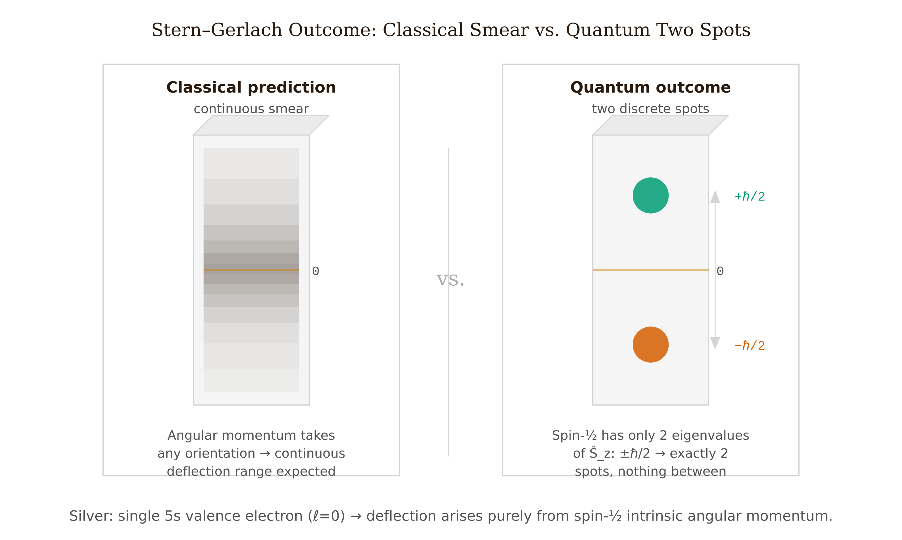
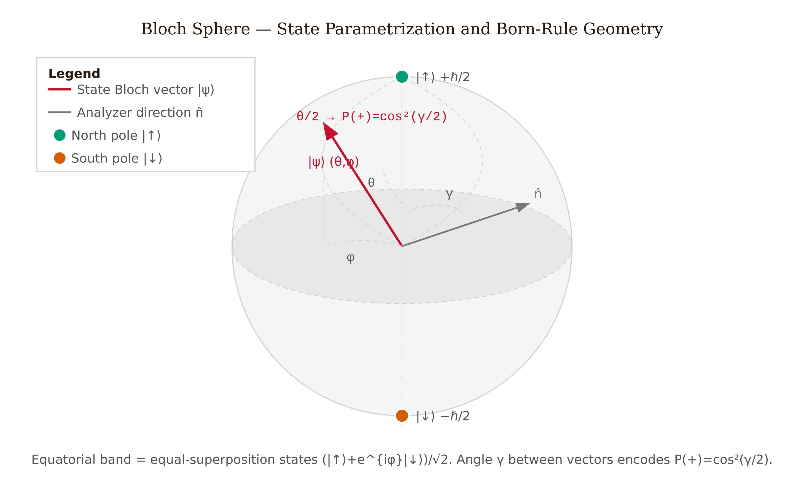
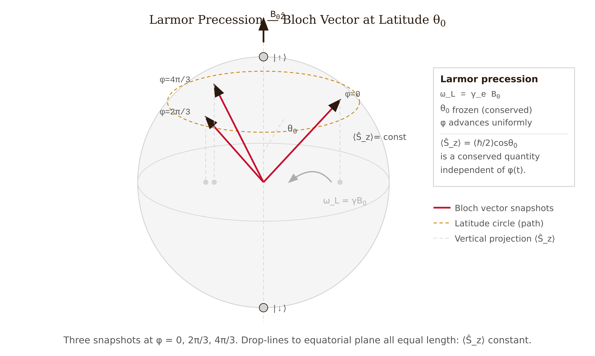
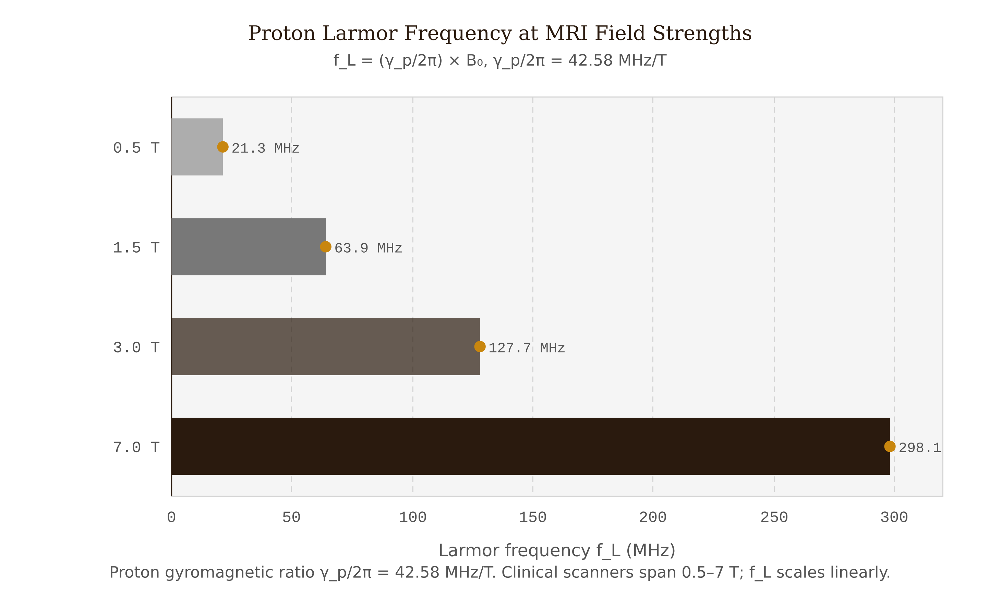
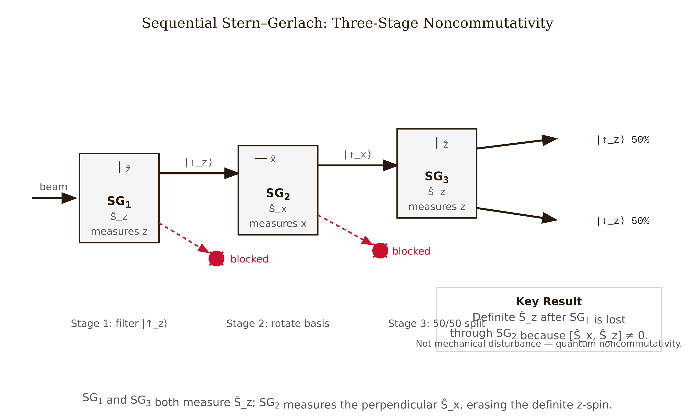

# Chapter 7 — Spin and the Bloch Sphere

In February 1922, Otto Stern and Walther Gerlach sent a beam of neutral silver atoms through an inhomogeneous magnetic field and collected them on a glass plate. The field gradient exerts a force proportional to the magnetic moment component along the field axis. Classical physics predicts that the moments can point in any direction, so the deposit on the plate should form a continuous smear. Instead, the plate showed two distinct spots with nothing in between.

*Figure 7.4 — Two discrete spots on the detector plate (right) versus the classical continuous smear (left), demonstrating that the magnetic moment component takes only two discrete values.*

The component of the magnetic moment along the field axis takes exactly two values. This result holds for any axis along which the apparatus is oriented: two spots, always. The experiment was clear, and it went unexplained for three years — partly because Stern and Gerlach believed they were confirming the old Bohr-Sommerfeld orbital quantization. Silver's valence electron is in an $s$ orbital, which carries zero orbital angular momentum. The two spots arose from something that had not yet been proposed: the intrinsic spin of the electron, hypothesized by Uhlenbeck and Goudsmit in 1925. Stern and Gerlach had found the right answer before the right question existed.

---

## Two Values Forces Two Dimensions

We can turn the experimental result — two values, along any axis — straight into a statement about the Hilbert space. Whatever space spin occupies, it has to let every spin-component operator carry exactly two eigenvalues. The smallest complex vector space able to do that is $\mathbb{C}^2$. We are not guessing here; this is simply the least structure that "two and only two" allows.

We take the eigenstates of the $z$-component as our basis:

$$|\!\uparrow\rangle = \begin{pmatrix}1\\0\end{pmatrix}, \qquad |\!\downarrow\rangle = \begin{pmatrix}0\\1\end{pmatrix}.$$

The spin operators are $\hat{S}_i = (\hbar/2)\sigma_i$, where $\sigma_x, \sigma_y, \sigma_z$ are the Pauli matrices:

$$\sigma_x = \begin{pmatrix}0&1\\1&0\end{pmatrix}, \qquad \sigma_y = \begin{pmatrix}0&-i\\i&0\end{pmatrix}, \qquad \sigma_z = \begin{pmatrix}1&0\\0&-1\end{pmatrix}.$$

These matrices have four properties, and we can confirm each one just by multiplying them out. Every one squares to the identity: $\sigma_i^2 = I$. Every one is traceless. Two different Pauli matrices anticommute: $\sigma_i\sigma_j + \sigma_j\sigma_i = 0$ for $i \neq j$. And together they obey the angular-momentum commutation relations: $[\sigma_i, \sigma_j] = 2i\epsilon_{ijk}\sigma_k$, which gives $[\hat{S}_i, \hat{S}_j] = i\hbar\epsilon_{ijk}\hat{S}_k$ — exactly the algebra that orbital angular momentum $\hat{L}$ obeys. Because the algebra matches, we are justified in calling spin a form of angular momentum.

All four properties collapse into a single multiplication rule:

$$\boxed{\sigma_i\sigma_j = \delta_{ij}I + i\epsilon_{ijk}\sigma_k.}$$

This one equation contains the entire Pauli algebra, and it is worth committing to memory.

---

## Why Spin Is Not Rotation

Many of us first meet spin imagining a tiny ball turning on its axis, the way a top spins. We can retire that image with a single calculation.

Suppose the electron really does carry angular momentum $\hbar/2$ by physically spinning. Give it the largest radius we can reasonably justify — the classical electron radius $r_e \approx 2.82\times10^{-15}$ m. (Experiments actually constrain the electron to be smaller than $10^{-18}$ m, and a smaller radius only makes the conclusion below more severe.) For a uniform solid sphere, $I = \frac{2}{5}m_e r_e^2$, and $L = I\omega$ gives the speed at the equator:

$$v = \omega r_e = \frac{5\hbar}{4m_e r_e} \approx \frac{5\times1.055\times10^{-34}}{4\times9.11\times10^{-31}\times2.82\times10^{-15}} \approx 5.1\times10^{10}\ \text{m/s}.$$

Light travels at $c \approx 3.0\times10^8$ m/s, so the equator would need to move at roughly $170c$. This is not a small discrepancy we might patch up; the spinning-ball picture misses by two full orders of magnitude.

So what is spin, if not rotation? It is an internal degree of freedom that transforms as a representation of $\mathrm{SU}(2)$ — the group of $2\times2$ unitary matrices with determinant 1 — when we rotate our frame. It corresponds to no motion through physical space. In 1928, Dirac showed that spin-½ emerges automatically once we demand a wave equation that is both Lorentz-covariant and first-order in time. We never insert spin by hand; it is already present the moment we impose the correct symmetries.

So when we call spin **intrinsic**, we mean three things together: its algebra is that of angular momentum, its carrier is an $\mathrm{SU}(2)$ representation, and the degree of freedom underneath corresponds to no motion in space.

---

## Spin Along Any Axis

Choose a unit vector $\hat{n} = (\sin\theta\cos\phi,\,\sin\theta\sin\phi,\,\cos\theta)$. The spin operator measured along $\hat{n}$ is

$$\hat{S}_{\hat{n}} = \frac{\hbar}{2}\hat{n}\cdot\vec{\sigma} = \frac{\hbar}{2}\begin{pmatrix}\cos\theta & \sin\theta\,e^{-i\phi}\\\sin\theta\,e^{i\phi} & -\cos\theta\end{pmatrix}.$$

This matrix has trace zero and determinant $-(\hbar/2)^2$, which forces its eigenvalues to be $\pm\hbar/2$ for any direction $\hat{n}$ we choose. The formalism reproduces precisely what the 1922 experiment showed: two values, every axis.

The $+\hbar/2$ eigenvector, normalized with the half-angle identities, is

$$|\hat{n},+\rangle = \cos\!\tfrac{\theta}{2}|\!\uparrow\rangle + e^{i\phi}\sin\!\tfrac{\theta}{2}|\!\downarrow\rangle.$$

Every pure spin-½ state takes this form for some pair $(\theta, \phi)$. To see why, count the freedom in a normalized state: two complex components, minus one constraint from normalization, minus one unobservable global phase, leaves two real parameters. And two real parameters are exactly what we need to label points on a sphere.

---

## The Bloch Sphere

*Figure 7.1 — The Bloch sphere: state Bloch vector (blue) at angles $(\theta, \phi)$ and analyzer direction (orange) with angle $\gamma$ between them; Born-rule probability $P(+) = \cos^2(\gamma/2)$ is encoded in the half-angle.*

The labels $(\theta, \phi)$ send each pure spin-½ state to a point on a unit sphere, which we call the **Bloch sphere**. The north pole ($\theta = 0$) is $|\!\uparrow\rangle$; the south pole ($\theta = \pi$) is $|\!\downarrow\rangle$; the equator ($\theta = \pi/2$) holds the equal superpositions $(|\!\uparrow\rangle + e^{i\phi}|\!\downarrow\rangle)/\sqrt{2}$, with $\phi$ sweeping around it. Every point names a state, and every state names a point.

The Born rule becomes a clean geometric statement on this sphere. Suppose the state's Bloch vector points toward $(\theta_\psi, \phi_\psi)$ and the analyzer points toward $(\theta_n, \phi_n)$. Letting $\gamma$ be the angle between them,

$$\cos\gamma = \cos\theta_\psi\cos\theta_n + \sin\theta_\psi\sin\theta_n\cos(\phi_\psi - \phi_n).$$

The probability of the outcome $+\hbar/2$ is then

$$\boxed{P(+) = \cos^2\!\tfrac{\gamma}{2}, \qquad P(-) = \sin^2\!\tfrac{\gamma}{2}.}$$

We can test this against three cases we already understand. When the vectors are aligned ($\gamma = 0$), $P(+) = 1$. When they are anti-aligned ($\gamma = \pi$), $P(+) = 0$. When they are perpendicular ($\gamma = \pi/2$), $P(+) = 1/2$. One formula gives all three correctly.

The half-angle $\gamma/2$ is doing essential work. At $\gamma = \pi/2$ we have $\cos^2(\pi/2) = 0$ but $\cos^2(\pi/4) = 1/2$. If we mistakenly wrote $\cos^2\gamma$ in place of $\cos^2(\gamma/2)$, we would predict zero probability at the perpendicular, which contradicts experiment.

The half-angle also carries a deeper meaning. Suppose we rotate the analyzer by $2\pi$ — one complete turn in physical space. Then $\theta$ advances to $\theta + 2\pi$, and $\cos(\theta/2)$ becomes $\cos(\theta/2 + \pi) = -\cos(\theta/2)$, so the spin state picks up an overall minus sign. Only after a full $4\pi$ rotation does the state come back to itself. This is the **spinor double cover**: spin states live in $\mathrm{SU}(2)$, which wraps around the ordinary rotation group $\mathrm{SO}(3)$ twice. A $2\pi$ rotation that returns every ordinary vector to where it started sends a spinor to its negative. Rauch et al. (1975) and Werner et al. (1975) confirmed this directly with neutron interferometry.

---

## Larmor Precession

A spin sitting in a uniform field $\vec{B} = B_0\hat{z}$ has Hamiltonian

$$\hat{H} = -\vec{\mu}\cdot\vec{B} = \frac{\gamma B_0\hbar}{2}\sigma_z,$$

where $\gamma$ is the gyromagnetic ratio: $\gamma_e/(2\pi) \approx 28.025$ GHz/T for the electron, $\gamma_p/(2\pi) \approx 42.58$ MHz/T for the proton. This Hamiltonian is already diagonal in the $\hat{S}_z$ basis, so the time-evolution operator is simply

$$\hat{U}(t) = \begin{pmatrix}e^{-i\omega_L t/2}&0\\0&e^{+i\omega_L t/2}\end{pmatrix}, \qquad \omega_L = \gamma B_0.$$

Starting from polar angle $\theta_0$ and azimuth $\phi_0 = 0$, the state evolves as

$$|\psi(t)\rangle = \cos\!\tfrac{\theta_0}{2}|\!\uparrow\rangle + e^{i\omega_L t}\sin\!\tfrac{\theta_0}{2}|\!\downarrow\rangle.$$

The polar angle never changes. Only the azimuth moves, advancing at the Larmor frequency: $\phi(t) = \omega_L t$. On the Bloch sphere, the state runs around a circle of constant latitude $\theta_0$, precessing about $\hat{z}$. The expectation values follow:

$$\langle\hat{S}_x\rangle = \tfrac{\hbar}{2}\sin\theta_0\cos(\omega_L t), \qquad \langle\hat{S}_y\rangle = \tfrac{\hbar}{2}\sin\theta_0\sin(\omega_L t), \qquad \langle\hat{S}_z\rangle = \tfrac{\hbar}{2}\cos\theta_0.$$

The spin vector circles in the $xy$-plane at $\omega_L$ while its $z$-component stays fixed. We call this Larmor precession. It looks formally identical to the classical precession of a magnetic moment, with one important difference: what precesses here is the probability distribution over measurement outcomes, not a physical needle.

*Figure 7.3 — Bloch vector at fixed polar angle $\theta_0$ sweeping three equally spaced azimuthal positions; the latitude circle (dashed) is the precession path, and vertical drop-lines show that $\langle \hat{S}_z \rangle$ is constant throughout.*

These numbers show up in everyday medicine. For a proton ($\gamma_p/(2\pi) = 42.58$ MHz/T):

<!-- → [TABLE: Proton Larmor frequencies at standard MRI field strengths — 0.5 T open MRI 21.3 MHz; 1.5 T clinical MRI 63.9 MHz; 3.0 T research MRI 127.7 MHz; 7.0 T ultra-high-field 298.1 MHz] -->

The relation $\omega_L = \gamma B_0$ is the equation that every MRI scanner runs on, applied to millions of patients each year.

*Figure 7.5 — Proton Larmor frequency at four clinical MRI field strengths (0.5 T through 7.0 T), showing the linear $f_L \propto B_0$ relationship with operating points from 21 MHz to 298 MHz.*

---

## What the Sequential Experiment Is Really Saying

Let us prepare a beam of silver atoms and send it through an $\mathrm{SG}_z$ apparatus, blocking the lower output. The atoms that survive are in the state $|\!\uparrow\rangle$. Now send them through an $\mathrm{SG}_x$ apparatus. The $\hat{S}_x$ eigenstates are $|\hat{x},\pm\rangle = (|\!\uparrow\rangle \pm |\!\downarrow\rangle)/\sqrt{2}$, and since $|\!\uparrow\rangle = (|\hat{x},+\rangle + |\hat{x},-\rangle)/\sqrt{2}$, the Born rule gives $P(\hat{x},\pm) = 1/2$. Block the $|\hat{x},-\rangle$ output, leaving atoms in $|\hat{x},+\rangle = (|\!\uparrow\rangle + |\!\downarrow\rangle)/\sqrt{2}$. Feed these into a second $\mathrm{SG}_z$. The result splits 50/50.

The atoms began with a definite spin-up along $\hat{z}$. After we measured $\hat{x}$ in between, they came out 50/50 along $\hat{z}$ once more.

It is tempting to say the $\mathrm{SG}_x$ device jostled the atoms and scrambled their $z$-component. That explanation is mistaken.

The operators $\hat{S}_x$ and $\hat{S}_z$ do not commute: $[\hat{S}_x, \hat{S}_z] = -i\hbar\hat{S}_y \neq 0$. No state can be an eigenstate of both at once. Once the $\mathrm{SG}_x$ measurement selects $|\hat{x},+\rangle$, that state simply is not an eigenstate of $\hat{S}_z$ — it carries no definite $z$-component at all, rather than a definite value that the apparatus disturbed. There was nothing to scramble in the first place. The 50/50 split at the third stage is just the Born rule acting on a state that genuinely has no definite $\hat{S}_z$.

Consider the alternative, a naive hidden-variable account in which every atom carries pre-set values $(\mu_x, \mu_z)$ that the apparatuses merely read off. It would predict that selecting $\mu_z = +$ at stage one and then $\mu_x = +$ at stage two leaves $\mu_z$ untouched, so stage three should return $\mu_z = +$ with certainty. Experiment gives 50/50 instead. Pre-existing definite values for observables that do not commute simply cannot match the data, and the algebra makes that unavoidable.

*Figure 7.2 — Three sequential Stern–Gerlach apparatuses: $\mathrm{SG}_z$ selects spin-up, $\mathrm{SG}_x$ (perpendicular) then selects one output, and a second $\mathrm{SG}_z$ produces two equal-intensity beams — demonstrating operator noncommutativity.*

---

## Worked Example — Bloch Vector and Precession

Here we prepare a spin at Bloch angles $\theta_0 = \pi/3$, $\phi_0 = \pi/4$, compute the Born-rule probability for $+\hbar/2$ along $\hat{z}$, and then place this proton in a field $B_0 = 1.5$ T to follow its precession.

**The state:**

$$|\psi\rangle = \cos(\pi/6)|\!\uparrow\rangle + e^{i\pi/4}\sin(\pi/6)|\!\downarrow\rangle = \frac{\sqrt{3}}{2}|\!\uparrow\rangle + \frac{e^{i\pi/4}}{2}|\!\downarrow\rangle.$$

**Bloch vector:** $\hat{n}_\psi = (\sin\theta_0\cos\phi_0,\,\sin\theta_0\sin\phi_0,\,\cos\theta_0) = (\sqrt{6}/4,\,\sqrt{6}/4,\,1/2)$. Check: $6/16 + 6/16 + 1/4 = 1$. ✓

**Born-rule probability along** $\hat{z}$: The analyzer is at $(\theta_n, \phi_n) = (0, 0)$, so $\cos\gamma = \cos\theta_0\cdot 1 = 1/2$, giving $\gamma = \pi/3$. Then

$$P(+) = \cos^2(\pi/6) = 3/4.$$

Verify directly: $|\langle\!\uparrow|\psi\rangle|^2 = |\cos(\pi/6)|^2 = 3/4$. ✓

**Larmor precession:** For a proton at $B_0 = 1.5$ T,

$$f_L = \frac{\gamma_p}{2\pi}\cdot B_0 = 42.58\ \text{MHz/T}\times 1.5\ \text{T} = 63.87\ \text{MHz}, \qquad T_L = 15.66\ \text{ns}.$$

The time-evolved state is $|\psi(t)\rangle = \cos(\pi/6)|\!\uparrow\rangle + e^{i(\pi/4 + \omega_L t)}\sin(\pi/6)|\!\downarrow\rangle$. The polar angle holds at $\theta_0 = \pi/3$ while the azimuth advances at $\omega_L$. The probability $P(+)$ along $\hat{z}$ stays at $|\cos(\pi/6)|^2 = 3/4$ for all time, which tells us that $\langle\hat{S}_z\rangle$ is a constant of motion.

Two limiting cases are worth noting. If $\theta_0 = 0$, the state is already an eigenstate of $\hat{H}$, so the phase $e^{i\omega_L t}$ multiplies a coefficient that is zero and nothing precesses. The equatorial case $\theta_0 = \pi/2$ gives the strongest precession: $\langle\hat{S}_z\rangle = 0$ at every instant, while $\langle\hat{S}_x\rangle$ and $\langle\hat{S}_y\rangle$ swing through their full amplitude $\hbar/2$ — the Bloch vector runs around the equator at 63.87 MHz.

---

## The *g*-Factor

The Dirac equation predicts $g_e = 2$ exactly, while the measured value is $g_e \approx 2.00232$. We should not read the gap $a_e = (g_e - 2)/2 \approx 0.00116$ as a flaw in Dirac's theory. It is the leading QED radiative correction, produced by virtual photons that dress the bare electron: $a_e \approx \alpha/(2\pi)$, where $\alpha \approx 1/137$ is the fine-structure constant. QED and experiment agree out to thirteen significant figures here, which makes this one of the most precisely confirmed predictions anywhere in physics.

When we write $\hat{H} = \gamma B_0\hat{S}_z$, we should use the experimental $\gamma$, since it already contains the anomalous correction. The departure from $g = 2$ is not a mistake to be cleaned up; it is a direct view into the virtual-photon structure of QED.

---

## References

- Gerlach, W. and Stern, O. (1922). "Der experimentelle Nachweis der Richtungsquantelung im Magnetfeld." *Zeitschrift für Physik*, 9(1), 349–352.
- Uhlenbeck, G.E. and Goudsmit, S. (1925). "Ersetzung der Hypothese vom unmechanischen Zwang durch eine Forderung bezüglich des inneren Verhaltens jedes einzelnen Elektrons." *Naturwissenschaften*, 13(47), 953–954.
- Dirac, P.A.M. (1928). "The quantum theory of the electron." *Proceedings of the Royal Society A*, 117(778), 610–624.
- Rauch, H. et al. (1975). "Verification of coherent spinor rotation of fermions." *Physics Letters A*, 54(6), 425–427.
- Werner, S.A. et al. (1975). "Observation of the phase shift of a neutron due to precession in a magnetic field." *Physical Review Letters*, 35(16), 1053–1055.
- Townsend, J.S. (2012). *A Modern Approach to Quantum Mechanics*, 2nd ed. University Science Books. Chapters 3–4.
- Griffiths, D.J. and Schroeter, D.F. (2018). *Introduction to Quantum Mechanics*, 3rd ed. Cambridge University Press. §4.4.
- Sakurai, J.J. and Napolitano, J. (2021). *Modern Quantum Mechanics*, 3rd ed. Cambridge University Press. Chapter 1.

