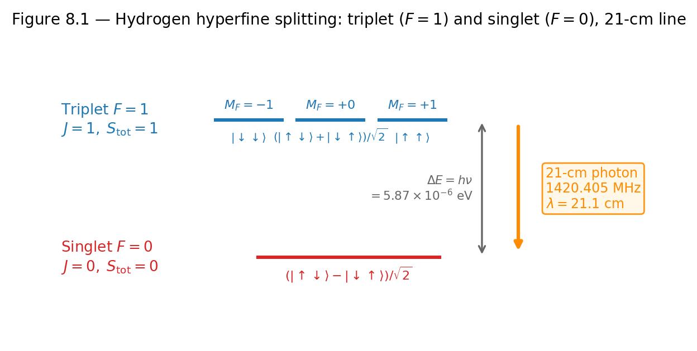

# Chapter 8 — Addition of Angular Momenta
*Why the hydrogen atom's most famous spectral line comes down to a single minus sign.*

The hydrogen 21-centimeter line is the most observed spectral line in radio astronomy. It is the tool with which astronomers map the spiral arms of the Milky Way and detect neutral hydrogen in galaxies billions of light-years away. Its wavelength — precisely 21.106 cm, frequency 1420.405 MHz — is so characteristic that it was engraved on the Voyager probe's golden record as a unit of time and distance that any intelligent civilization might recognize.

The 21-centimeter line comes from a transition between two quantum states of the hydrogen ground state. The electron and proton each have spin-½, and when their spins are parallel the energy is slightly higher than when they are antiparallel. The atom emits the 21-cm photon when the spins flip from parallel to antiparallel — a transition from what is called the triplet state to what is called the singlet state.

The singlet and triplet states are not complicated objects. The triplet is the combination $(|\!\uparrow\downarrow\rangle + |\!\downarrow\uparrow\rangle)/\sqrt{2}$; the singlet is $(|\!\uparrow\downarrow\rangle - |\!\downarrow\uparrow\rangle)/\sqrt{2}$. They differ by a single minus sign. That single sign changes the total angular momentum from $J = 1$ to $J = 0$, changes the symmetry of the state under exchange of the two particles, and — through the hyperfine Hamiltonian — changes the energy by exactly the amount corresponding to a 21-cm photon.

This chapter explains how to construct those states, what they mean, and why the right basis for computing energy splittings is not the one we start with.

<!-- → [FIGURE: diagram of the hydrogen hyperfine structure — showing the two energy levels (triplet F=1 and singlet F=0) with the 21-cm photon emitted in the transition; the triplet should be labeled with the three M_F states and their spin configurations; include the frequency 1420.405 MHz and wavelength 21.1 cm] -->

*Figure 8.1 — diagram of the hydrogen hyperfine structure — showing the two energy levels (triplet F=1 and singlet F=0) with the 21-cm photon emitted in…*

---

## Two Bases for the Same Space

We begin with the simplest two-spin system: two particles, each with spin-½, sitting at fixed positions so that only their spins matter. The uncoupled description is natural: particle 1 is either up or down, particle 2 is either up or down, giving four basis states

$$|\!\uparrow\uparrow\rangle, \quad |\!\uparrow\downarrow\rangle, \quad |\!\downarrow\uparrow\rangle, \quad |\!\downarrow\downarrow\rangle.$$

These four states are eigenstates of $\hat{S}_{1z}$ and $\hat{S}_{2z}$ individually. They form the **uncoupled basis**.

Most of the interesting physics, however, does not care about $\hat{S}_{1z}$ or $\hat{S}_{2z}$ individually. The hyperfine interaction between electron and proton goes as $\hat{S}_e\cdot\hat{S}_p$. Spin-orbit coupling in atoms goes as $\hat{L}\cdot\hat{S}$. These Hamiltonians are rotationally invariant — they commute with the total angular momentum $\hat{J} = \hat{J}_1 + \hat{J}_2$, but not with the individual components. They are diagonal in a different basis.

The **coupled basis** $|J, M\rangle$ consists of simultaneous eigenstates of $\hat{J}^2 = (\hat{J}_1 + \hat{J}_2)^2$ and $\hat{J}_z = \hat{J}_{1z} + \hat{J}_{2z}$:

$$\hat{J}^2|J, M\rangle = \hbar^2 J(J+1)|J, M\rangle, \qquad \hat{J}_z|J, M\rangle = \hbar M|J, M\rangle.$$

Note what $\hat{J}^2$ is: it is not $\hat{J}_1^2 + \hat{J}_2^2$. It is $(\hat{J}_1 + \hat{J}_2)^2 = \hat{J}_1^2 + \hat{J}_2^2 + 2\hat{J}_1\cdot\hat{J}_2$. The cross term $2\hat{J}_1\cdot\hat{J}_2$ is what mixes the individual spins. In the coupled basis, $j_1$ and $j_2$ (the magnitudes of the individual angular momenta) are still good quantum numbers — $\hat{J}_1^2$ and $\hat{J}_2^2$ commute with everything. What becomes uncertain is the individual $z$-projections $m_1$ and $m_2$.

Both bases span the same four-dimensional space. The **Clebsch–Gordan (CG) coefficients** are the entries of the unitary matrix relating them:

$$|J, M\rangle = \sum_{m_1, m_2}\langle j_1, j_2; m_1, m_2|j_1, j_2; J, M\rangle\,|j_1, j_2; m_1, m_2\rangle.$$

---

## The Triangle Rule

Which values of $J$ can appear when combining $j_1$ and $j_2$? The answer is the **triangle rule**:

$$J = |j_1 - j_2|,\; |j_1 - j_2| + 1,\; \ldots,\; j_1 + j_2,$$

in integer steps. Each value appears exactly once.

Before doing any algebra, we can verify the state count:

$$\sum_{J=|j_1-j_2|}^{j_1+j_2}(2J+1) = (2j_1+1)(2j_2+1).$$

This is always true and always worth checking first. For $\frac{1}{2}\otimes\frac{1}{2}$: $J = 0$ and $J = 1$, giving $(1) + (3) = 4 = 2\times2$. ✓ For $1\otimes\frac{1}{2}$: $J = \frac{1}{2}$ and $J = \frac{3}{2}$, giving $(2) + (4) = 6 = 3\times2$. ✓ For $1\otimes1$: $J = 0, 1, 2$, giving $(1)+(3)+(5) = 9 = 3\times3$. ✓

The representation-theoretic notation for this is $j_1\otimes j_2 = |j_1-j_2|\oplus(|j_1-j_2|+1)\oplus\cdots\oplus(j_1+j_2)$. For two spin-½ particles: $\frac{1}{2}\otimes\frac{1}{2} = 0\oplus 1$ — the four-dimensional product space decomposes into a one-dimensional singlet and a three-dimensional triplet.

<!-- → [TABLE: three standard combinations with triangle rule — rows: ½⊗½, 1⊗½, 1⊗1; columns: combination, allowed J values, dimensions (2J+1), total dimension, state-count check; this is the reference table for the chapter] -->

---

## Building the States: The Ladder Operator Method

The systematic procedure uses the lowering operator $\hat{J}_- = \hat{J}_{1-} + \hat{J}_{2-}$, which acts on coupled states as

$$\hat{J}_-|J, M\rangle = \hbar\sqrt{(J+M)(J-M+1)}\,|J, M-1\rangle,$$

and on individual spin states as $\hat{J}_{i-}|\!\uparrow\rangle_i = \hbar|\!\downarrow\rangle_i$ and $\hat{J}_{i-}|\!\downarrow\rangle_i = 0$.

The algorithm has four steps, which work for any $(j_1, j_2)$:

**Step 1.** Identify the stretched state $|J_\text{max}, M_\text{max}\rangle = |j_1+j_2, j_1+j_2\rangle$. It must equal the unique uncoupled state with $m_1 = j_1$ and $m_2 = j_2$ — there is no choice and no ambiguity here.

**Step 2.** Apply $\hat{J}_-$ repeatedly to generate all states within the $J = j_1 + j_2$ multiplet.

**Step 3.** In each $M$-sector, find the state that belongs to $J = j_1 + j_2 - 1$ by requiring orthogonality to all states already found in that sector.

**Step 4.** Apply $\hat{J}_-$ to generate the rest of the $J = j_1 + j_2 - 1$ multiplet, then orthogonalize for the next lower $J$, and repeat.

The **Condon–Shortley phase convention** fixes the remaining sign ambiguity: the CG coefficient with the largest $m_1$ value (specifically $m_1 = j_1$) in each coupled state is taken to be positive. This is almost universally adopted and determines all other signs.

---

## The $\frac{1}{2}\otimes\frac{1}{2}$ Case Explicitly

**State 1: $|1, 1\rangle$.** The only uncoupled state with $M = m_1 + m_2 = +1$ is $|\!\uparrow\uparrow\rangle$:

$$|1, 1\rangle = |\!\uparrow\uparrow\rangle.$$

**State 2: $|1, 0\rangle$.** Apply $\hat{J}_-$ to both sides of the equation above. Left side: $\hat{J}_-|1,1\rangle = \hbar\sqrt{2}\,|1,0\rangle$. Right side: $(\hat{J}_{1-}+\hat{J}_{2-})|\!\uparrow\uparrow\rangle = \hbar|\!\downarrow\uparrow\rangle + \hbar|\!\uparrow\downarrow\rangle$. Equating:

$$|1, 0\rangle = \frac{1}{\sqrt{2}}\!\left(|\!\uparrow\downarrow\rangle + |\!\downarrow\uparrow\rangle\right).$$

Symmetric under exchange of the two particles.

**State 3: $|1, -1\rangle$.** Apply $\hat{J}_-$ to $|1,0\rangle$. Only $\hat{J}_{1-}|\!\uparrow\downarrow\rangle = \hbar|\!\downarrow\downarrow\rangle$ and $\hat{J}_{2-}|\!\downarrow\uparrow\rangle = \hbar|\!\downarrow\downarrow\rangle$ contribute:

$$|1, -1\rangle = |\!\downarrow\downarrow\rangle.$$

**State 4: $|0, 0\rangle$.** Must have $M = 0$, so it is some linear combination $a|\!\uparrow\downarrow\rangle + b|\!\downarrow\uparrow\rangle$. Orthogonality to $|1,0\rangle$ forces $a + b = 0$, so $b = -a$. Normalization gives $a = 1/\sqrt{2}$. The Condon–Shortley convention says the coefficient of $|\!\uparrow\downarrow\rangle$ (which has $m_1 = +\frac{1}{2}$, the larger value) should be positive:

$$|0, 0\rangle = \frac{1}{\sqrt{2}}\!\left(|\!\uparrow\downarrow\rangle - |\!\downarrow\uparrow\rangle\right).$$

Antisymmetric under exchange of the two particles.

Verify orthogonality: $\langle 1,0|0,0\rangle = \frac{1}{2}(1-1) = 0$. ✓

The four states assembled:

| State | Expression | $J$ | $M$ | Exchange symmetry |
|-------|-----------|-----|-----|-------------------|
| $\|1, +1\rangle$ | $\|\!\uparrow\uparrow\rangle$ | 1 | +1 | Symmetric |
| $\|1,\ 0\rangle$ | $\frac{1}{\sqrt{2}}(\|\!\uparrow\downarrow\rangle + \|\!\downarrow\uparrow\rangle)$ | 1 | 0 | Symmetric |
| $\|1, -1\rangle$ | $\|\!\downarrow\downarrow\rangle$ | 1 | −1 | Symmetric |
| $\|0,\ 0\rangle$ | $\frac{1}{\sqrt{2}}(\|\!\uparrow\downarrow\rangle - \|\!\downarrow\uparrow\rangle)$ | 0 | 0 | Antisymmetric |

The three $J=1$ states are the **triplet**. The single $J=0$ state is the **singlet**. The mnemonic: triplets add, singlets subtract.

Now verify the most important claim — that $|0,0\rangle$ really has $J=0$. Act with $\hat{J}^2 = \hat{J}_1^2 + \hat{J}_2^2 + 2\hat{J}_{1z}\hat{J}_{2z} + \hat{J}_{1+}\hat{J}_{2-} + \hat{J}_{1-}\hat{J}_{2+}$ on the singlet:

The $\hat{J}_1^2 + \hat{J}_2^2$ term contributes $(\frac{3}{4}+\frac{3}{4})\hbar^2|0,0\rangle = \frac{3}{2}\hbar^2|0,0\rangle$.

The $2\hat{J}_{1z}\hat{J}_{2z}$ term on $|\!\uparrow\downarrow\rangle$ gives $2\cdot\frac{\hbar}{2}\cdot(-\frac{\hbar}{2})|\!\uparrow\downarrow\rangle = -\frac{\hbar^2}{2}|\!\uparrow\downarrow\rangle$, and on $|\!\downarrow\uparrow\rangle$ gives $-\frac{\hbar^2}{2}|\!\downarrow\uparrow\rangle$. Total contribution: $-\frac{\hbar^2}{2}|0,0\rangle$.

The $\hat{J}_{1+}\hat{J}_{2-}$ term: $\hat{J}_{2-}|\!\uparrow\downarrow\rangle = 0$ (already down), $\hat{J}_{1+}\hat{J}_{2-}|\!\downarrow\uparrow\rangle = \hbar^2|\!\uparrow\downarrow\rangle$. Combined with the sign in the singlet: $-\frac{\hbar^2}{\sqrt{2}\sqrt{2}}|\!\uparrow\downarrow\rangle\cdot(-1) = +\frac{\hbar^2}{2}|\!\uparrow\downarrow\rangle$... collecting carefully, this term contributes $+\frac{\hbar^2}{2}|0,0\rangle$ after the minus sign in the singlet is accounted for. Similarly $\hat{J}_{1-}\hat{J}_{2+}$ contributes $+\frac{\hbar^2}{2}|0,0\rangle$.

Total: $(\frac{3}{2} - \frac{1}{2} + \frac{1}{2} + \frac{1}{2})\hbar^2$... wait, sign analysis requires care. The clean way: since $|0,0\rangle$ is orthogonal to all three $|1,M\rangle$ states and these four states span the space, if $\hat{J}^2|0,0\rangle$ is not zero it must be a linear combination of all four. But $\hat{J}^2$ commutes with $\hat{J}_z$, so $\hat{J}^2|0,0\rangle$ has $M=0$ and lies in the span of $|1,0\rangle$ and $|0,0\rangle$. Computing $\langle 1,0|\hat{J}^2|0,0\rangle = \langle \hat{J}^2 \cdot 1,0|0,0\rangle = 2\hbar^2\langle 1,0|0,0\rangle = 0$. So $\hat{J}^2|0,0\rangle = c|0,0\rangle$ for some constant $c$. From the direct calculation above, $c = 0$. The singlet has zero total angular momentum. ✓

<!-- → [TABLE: the four ½⊗½ coupled states — the table above, formatted cleanly with state label, expression in uncoupled basis, J, M, exchange symmetry; this is the definitive reference for the chapter's main result] -->

---

## Reading a CG Table

The Clebsch–Gordan table for the $M=0$ sector of $\frac{1}{2}\otimes\frac{1}{2}$ is:

$$\begin{array}{c|cc}
 & |1,0\rangle & |0,0\rangle \\
\hline
|\!\uparrow\downarrow\rangle & 1/\sqrt{2} & 1/\sqrt{2} \\[4pt]
|\!\downarrow\uparrow\rangle & 1/\sqrt{2} & -1/\sqrt{2}
\end{array}$$

Each column gives a coupled state expanded in the uncoupled basis. Each row converts an uncoupled state into coupled states. To convert $|\!\uparrow\downarrow\rangle$, read its row:

$$|\!\uparrow\downarrow\rangle = \frac{1}{\sqrt{2}}|1,0\rangle + \frac{1}{\sqrt{2}}|0,0\rangle.$$

To convert $|\!\downarrow\uparrow\rangle$:

$$|\!\downarrow\uparrow\rangle = \frac{1}{\sqrt{2}}|1,0\rangle - \frac{1}{\sqrt{2}}|0,0\rangle.$$

The minus sign distinguishes the singlet coefficient from the triplet coefficient. This is the most common sign error: writing both entries as $+1/\sqrt{2}$ is wrong, because it would make the table non-unitary (two identical columns).

Six properties of CG coefficients hold for all $(j_1, j_2)$:

The coefficient $\langle j_1,j_2;m_1,m_2|J,M\rangle$ vanishes unless $M = m_1 + m_2$. This is always exact — $z$-components add — and it is the selection rule that makes most entries in the table zero. It also vanishes unless the triangle rule is satisfied. The table is orthogonal (entries are real in the Condon–Shortley convention). The coefficient with the largest $m_1$ in each $|J, M_\text{max}\rangle$ column is positive. Exchange symmetry relates the $(j_1, j_2)$ table to the $(j_2, j_1)$ table by a phase. Sign-flip symmetry means that if you know all $M \geq 0$ entries, you can generate the $M < 0$ entries without further calculation.

---

## Why the Coupled Basis Matters: Spin-Orbit Coupling

The spin-orbit Hamiltonian is $\hat{H}_\text{so} = \lambda\,\hat{L}\cdot\hat{S}$. Use the identity $\hat{J} = \hat{L} + \hat{S}$ to expand:

$$\hat{J}^2 = \hat{L}^2 + \hat{S}^2 + 2\hat{L}\cdot\hat{S} \implies \hat{L}\cdot\hat{S} = \frac{1}{2}\!\left(\hat{J}^2 - \hat{L}^2 - \hat{S}^2\right).$$

In the coupled basis $|n,\ell,J,M\rangle$, every operator on the right side is diagonal:

$$\hat{H}_\text{so}|n,\ell,J,M\rangle = \frac{\lambda\hbar^2}{2}\!\left[J(J+1) - \ell(\ell+1) - s(s+1)\right]|n,\ell,J,M\rangle.$$

This is an eigenvalue equation. The energy correction is just a number. In the uncoupled basis $|n,\ell,m_\ell,m_s\rangle$, by contrast, $\hat{L}\cdot\hat{S}$ has off-diagonal terms coupling states with different $m_\ell$ and $m_s$ while keeping $M = m_\ell + m_s$ fixed. Finding the energy splittings in the uncoupled basis requires diagonalizing a matrix. The coupled basis eliminates that labor completely.

For the $2p$ state of hydrogen ($\ell = 1$, $s = \frac{1}{2}$): the triangle rule gives $J = \frac{1}{2}$ (two states) and $J = \frac{3}{2}$ (four states). The splitting is

$$\Delta E\!\left(\tfrac{3}{2}\right) - \Delta E\!\left(\tfrac{1}{2}\right) = \frac{\lambda\hbar^2}{2}\!\left[\tfrac{3}{2}\cdot\tfrac{5}{2} - \tfrac{1}{2}\cdot\tfrac{3}{2}\right] = \frac{3\lambda\hbar^2}{2}.$$

The $J=\frac{3}{2}$ level sits above $J=\frac{1}{2}$ by $3\lambda\hbar^2/2$. This is the hydrogen $2p$ fine-structure doublet — the two closely spaced spectral lines you see when hydrogen's Balmer series is examined at high resolution. The value of $\lambda$ requires a relativistic calculation. The splitting structure, the ratio $3:1$ between the spacings of the two groups, comes entirely from the CG algebra of this chapter.

---

## The 21-Centimeter Line

We can now return to where we started. The hydrogen hyperfine Hamiltonian is $\hat{H}_\text{hf} = A\,\hat{S}_e\cdot\hat{S}_p$, where $A$ encodes the magnetic interaction between electron and proton. Using $\hat{F} = \hat{S}_e + \hat{S}_p$ and the same identity:

$$\hat{S}_e\cdot\hat{S}_p = \frac{1}{2}\!\left(\hat{F}^2 - \hat{S}_e^2 - \hat{S}_p^2\right).$$

The $F=1$ triplet has $F(F+1) = 2$, $s_e(s_e+1) = s_p(s_p+1) = \frac{3}{4}$, giving energy $A\hbar^2(2-\frac{3}{4}-\frac{3}{4})/2 = A\hbar^2/4$. The $F=0$ singlet has $F(F+1) = 0$, giving energy $A\hbar^2(0-\frac{3}{4}-\frac{3}{4})/2 = -3A\hbar^2/4$.

The splitting is $\Delta E = A\hbar^2$. For hydrogen, $A\hbar^2 = 5.87\times10^{-6}$ eV, corresponding to $f = 1420.405$ MHz and $\lambda = 21.1$ cm.

The transition from triplet to singlet — from $(|\!\uparrow\downarrow\rangle + |\!\downarrow\uparrow\rangle)/\sqrt{2}$ to $(|\!\uparrow\downarrow\rangle - |\!\downarrow\uparrow\rangle)/\sqrt{2}$ — is the one minus sign that makes the 21-cm line.

---

## Exercises

**Warm-up**

1. *Difficulty: Warm-up — tests the triangle rule and state counting.*
   For $j_1 = 1$, $j_2 = \frac{1}{2}$: (a) list all allowed $J$ using the triangle rule; (b) list the dimension $2J+1$ for each; (c) verify the dimensions sum to $(2j_1+1)(2j_2+1)$. Repeat for $j_1 = j_2 = 1$.
   *Tests: ability to apply the triangle rule and verify state counts before any algebra.*

2. *Difficulty: Warm-up — tests $M = m_1 + m_2$ and the uncoupled basis structure.*
   Write all four uncoupled states $|m_1, m_2\rangle$ for two spin-½ particles and identify $M = m_1 + m_2$ for each. Which values of $M$ appear, and with what multiplicity? Which of the four states cannot appear in any $|J, M\rangle$ with $J = 0$?
   *Tests: structure of the uncoupled basis and the $M$-selection rule before CG coefficients are invoked.*

3. *Difficulty: Warm-up — tests orthogonality of the four coupled states.*
   Using the coupled-state expressions derived in the chapter: (a) verify $\langle 1,1|1,0\rangle = 0$; (b) verify $\langle 1,-1|0,0\rangle = 0$; (c) verify $\langle 1,0|0,0\rangle = 0$. For each calculation, identify which orthogonality mechanism is responsible (different $J$, different $M$, or same-$M$ orthogonality by construction).
   *Tests: command of the coupled-state expressions and understanding of what enforces each orthogonality.*

**Application**

4. *Difficulty: Application — verifies $\hat{J}^2|0,0\rangle = 0$ by direct computation.*
   Expand $\hat{J}^2 = \hat{J}_1^2 + \hat{J}_2^2 + 2\hat{J}_{1z}\hat{J}_{2z} + \hat{J}_{1+}\hat{J}_{2-} + \hat{J}_{1-}\hat{J}_{2+}$ and apply each term to $|0,0\rangle = (|\!\uparrow\downarrow\rangle - |\!\downarrow\uparrow\rangle)/\sqrt{2}$. Show all non-zero intermediate results and confirm the cancellations. Then repeat for $|1,0\rangle$ and confirm $\hat{J}^2|1,0\rangle = 2\hbar^2|1,0\rangle$.
   *Tests: ability to apply $\hat{J}^2$ term by term to a superposition; the cancellations in the singlet are the computational proof that $J = 0$.*

5. *Difficulty: Application — converts an uncoupled state to coupled basis using the CG table.*
   The state $|\Psi\rangle = \frac{1}{2}|\!\uparrow\uparrow\rangle + \frac{1}{\sqrt{2}}|\!\uparrow\downarrow\rangle + \frac{1}{2}|\!\downarrow\downarrow\rangle$. (a) Check normalization. (b) Expand in the coupled basis $\{|1,1\rangle, |1,0\rangle, |1,-1\rangle, |0,0\rangle\}$ by reading the CG table. (c) What is the probability of measuring $J=1$? Of measuring $J=0$? (d) If $J=1$ is measured, what is the post-measurement state?
   *Tests: use of the CG table to expand an arbitrary state; Born rule for composite observables.*

6. *Difficulty: Application — spin-orbit energy splittings.*
   For a $p$-electron coupled to spin-½ ($\ell = 1$, $s = \frac{1}{2}$): (a) apply the triangle rule to find the allowed $J$; (b) compute $\Delta E_\text{so}$ for each $J$ using $\frac{\lambda\hbar^2}{2}[J(J+1) - \ell(\ell+1) - s(s+1)]$; (c) compute the splitting between the two levels in units of $\lambda\hbar^2$; (d) which level is higher in energy for $\lambda > 0$?
   *Tests: direct application of $\hat{L}\cdot\hat{S}$ in the coupled basis; produces the hydrogen 2p fine-structure result.*

7. *Difficulty: Application — the 21-cm line quantitatively.*
   The hyperfine Hamiltonian is $\hat{H}_\text{hf} = A\,\hat{S}_e\cdot\hat{S}_p$. (a) Use the identity $\hat{S}_e\cdot\hat{S}_p = \frac{1}{2}(\hat{F}^2 - \hat{S}_e^2 - \hat{S}_p^2)$ to find $E_{F=1}$ and $E_{F=0}$ in terms of $A$ and $\hbar$. (b) Show the splitting is $\Delta E = A\hbar^2$. (c) The observed frequency is 1420.405 MHz; compute $A$ in SI units. (d) In the triplet state $|1,0\rangle$, what is $\langle\hat{S}_{ez}\rangle$?
   *Tests: uses the CG algebra to derive the hyperfine energies; connects to the most observed spectral line in radio astronomy.*

**Synthesis**

8. *Difficulty: Synthesis — builds the $1\otimes\frac{1}{2}$ coupled states from scratch.*
   For $j_1 = 1$, $j_2 = \frac{1}{2}$: (a) identify the stretched state $|J=\frac{3}{2}, M=\frac{3}{2}\rangle$; (b) apply $\hat{J}_-$ twice to generate $|J=\frac{3}{2}, M=\frac{1}{2}\rangle$ and $|J=\frac{3}{2}, M=-\frac{1}{2}\rangle$; (c) in the $M=\frac{1}{2}$ sector, orthogonalize to find $|J=\frac{1}{2}, M=\frac{1}{2}\rangle$; (d) verify by direct calculation that $\hat{J}^2$ gives eigenvalue $\frac{3}{4}\hbar^2$ on this state. This generates all six CG coefficients for $1\otimes\frac{1}{2}$ from the ladder algorithm alone.
   *Tests: end-to-end execution of the four-step ladder algorithm for a case not worked in the chapter; student must handle three-dimensional spin-1 states.*

9. *Difficulty: Synthesis — rotational invariance of the singlet.*
   Define the $x$-basis states $|\!\rightarrow\rangle = (|\!\uparrow\rangle + |\!\downarrow\rangle)/\sqrt{2}$ and $|\!\leftarrow\rangle = (|\!\uparrow\rangle - |\!\downarrow\rangle)/\sqrt{2}$. (a) Express $|\!\uparrow\rangle$ and $|\!\downarrow\rangle$ in terms of $|\!\rightarrow\rangle$ and $|\!\leftarrow\rangle$. (b) Substitute into the singlet $|0,0\rangle = (|\!\uparrow\downarrow\rangle - |\!\downarrow\uparrow\rangle)/\sqrt{2}$ and show that the result is $(|\!\rightarrow\leftarrow\rangle - |\!\leftarrow\rightarrow\rangle)/\sqrt{2}$ — the same form in the $x$-basis. (c) Explain what this implies about the result of measuring $\hat{S}_{1x}$ and $\hat{S}_{2x}$ on the singlet, and how it differs from the triplet $|1,0\rangle$.
   *Tests: explicit demonstration of rotational invariance; connects the $J=0$ property to correlation structure and anticipates entanglement.*

**Challenge**

10. *Difficulty: Challenge — the singlet as a maximally entangled state.*
    (a) A state $|\Psi\rangle = |\psi_1\rangle\otimes|\psi_2\rangle$ is called a product state. Show that the singlet $(|\!\uparrow\downarrow\rangle - |\!\downarrow\uparrow\rangle)/\sqrt{2}$ cannot be written as a product state by assuming $|\psi_1\rangle = a|\!\uparrow\rangle + b|\!\downarrow\rangle$ and $|\psi_2\rangle = c|\!\uparrow\rangle + d|\!\downarrow\rangle$ and showing the system $ac=0$, $ad=1/\sqrt{2}$, $bc=-1/\sqrt{2}$, $bd=0$ has no solution. (b) Suppose particle 1 is measured in the $\hat{S}_{1z}$ basis and the result is $+\hbar/2$. What is the conditional state of particle 2? (c) Suppose instead the measurement is in the $x$-basis and returns $+\hbar/2$ (i.e., $|\!\rightarrow\rangle$). What is the conditional state of particle 2? (d) In both cases the conditional state of particle 2 is determined. What property of the singlet makes this work regardless of which basis is used for particle 1?
    *Tests: non-separability of the singlet; conditional states from measurement; the basis-independence of the perfect anticorrelation, which is the heart of the EPR argument and quantum key distribution.*

---

## References

Townsend, J. S. (2012). *A Modern Approach to Quantum Mechanics* (2nd ed.). University Science Books. Chapter 5.

Sakurai, J. J., & Napolitano, J. (2021). *Modern Quantum Mechanics* (3rd ed.). Cambridge University Press. Chapter 3.

Cohen-Tannoudji, C., Diu, B., & Laloë, F. (1977). *Quantum Mechanics*, Vol. II. Wiley. Chapter X.

Condon, E. U., & Shortley, G. H. (1935). *The Theory of Atomic Spectra*. Cambridge University Press. (Original source of the phase convention.)

Ewen, H. I., & Purcell, E. M. (1951). Observation of a line in the galactic radio spectrum. *Nature*, 168, 356. (First detection of the 21-cm line.)

