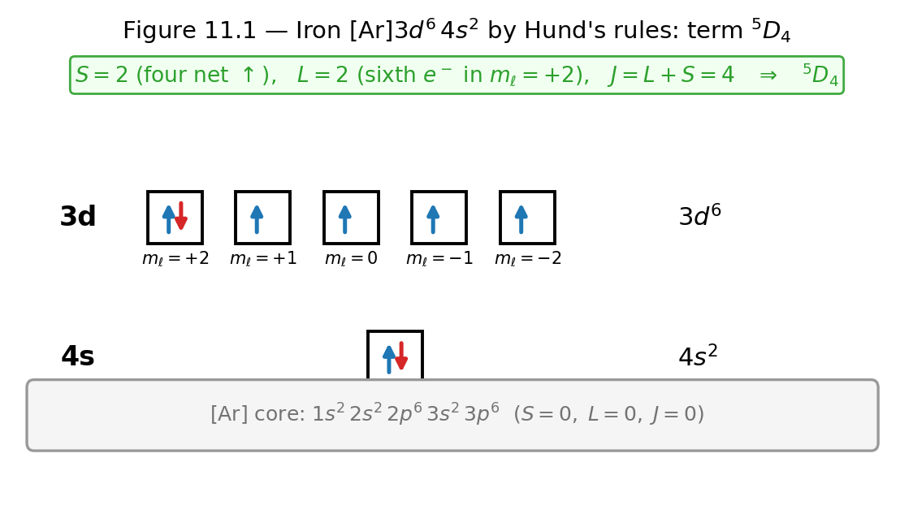
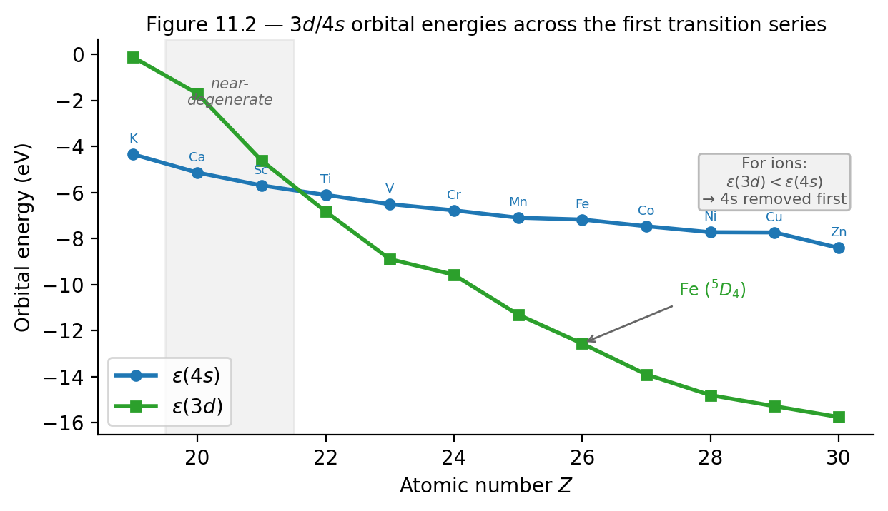

# Chapter 11 — Capstone: The Atom, Built from Simulations
*How a spectroscopist in 1927 knew the ground state of iron before anyone could explain why.*

The spectroscopist's notebook for iron, 1927.

The page lists hundreds of spectral lines for neutral iron — Fe I — measured to four decimal places in angstroms. Every line is a transition between energy levels, and assigning lines to transitions means knowing the levels. The ground state is established: six electrons in 3d, two in 4s. The term symbol is $^5D_4$. The spectroscopist knows this because Hund told them: maximize total spin, then orbital angular momentum, then determine total angular momentum from the filling fraction.

What the spectroscopist cannot fully explain — what nobody in 1927 could fully explain — is why. Why those rules? Why does iron prefer $^5D_4$ over any other configuration? The Schrödinger equation for 26 electrons repelling each other in the field of a 26-proton nucleus is a partial differential equation in 78 spatial dimensions. Nobody is solving that.

What we do instead is build a model. We treat each electron as moving independently in the average field of the nucleus and all the other electrons. We use hydrogenic wave functions, shifted by an effective nuclear charge that accounts for screening. We fill orbitals in the order that minimizes energy, constrained by Pauli exclusion. We apply Hund's three empirical rules. And it works — astonishingly well — for almost every element in the periodic table.

This chapter is about that model: its physical content, its approximations, where it breaks, and what it predicts. The synthesis is not just knowing the rules. It is building a simulation that applies them, validating its output against real data, and being able to say precisely what approximations were made and why they hold.

Every tool this book has given you is about to be used at once.

<!-- → [IMAGE: energy-level diagram for iron showing the [Ar]3d⁶4s² configuration with the five 3d orbitals arranged by Hund's rule — four orbitals singly occupied spin-up, one doubly occupied; the sixth electron shown pairing into the highest m_ℓ = +2 orbital; label S = 2, L = 2, J = 4, term ⁵D₄; this is the worked example made visual] -->

*Figure 11.1 — energy-level diagram for iron showing the (Ar)3d⁶4s² configuration with the five 3d orbitals arranged by Hund's rule — four orbitals singly…*

---

## Why Hydrogen Is Not Enough

Hydrogen has one electron. The Hamiltonian has an exact solution: wave functions $\psi_{n\ell m}(r,\theta,\phi) = R_{n\ell}(r)Y_\ell^m(\theta,\phi)$ and energies $E_n = -13.6\,\text{eV}/n^2$. Notice what is missing from $E_n$: the quantum number $\ell$. All $n^2$ states at a given $n$ are degenerate — a $3s$, $3p$, and $3d$ orbital all have identical energy. This is the accidental degeneracy of the pure Coulomb potential, arising from a hidden SO(4) symmetry of the $1/r$ interaction.

Add a second electron. The helium Hamiltonian is

$$\hat{H}_\text{He} = \frac{\hat{p}_1^2}{2m_e} + \frac{\hat{p}_2^2}{2m_e} - \frac{Ze^2}{4\pi\epsilon_0 r_1} - \frac{Ze^2}{4\pi\epsilon_0 r_2} + \frac{e^2}{4\pi\epsilon_0|\vec{r}_1-\vec{r}_2|}.$$

The last term — electron-electron Coulomb repulsion — destroys the exact solution and, crucially, destroys the $\ell$-degeneracy. The potential is no longer a pure $1/r$ Coulomb interaction; the SO(4) symmetry is broken. States with the same $n$ but different $\ell$ are no longer degenerate.

The physical mechanism is **orbital penetration and screening**. A $3s$ orbital has its radial probability density peaked closer to the nucleus than a $3d$ orbital with the same $n$. The centrifugal barrier $\ell(\ell+1)\hbar^2/2m_er^2$ pushes $\text{high-}\ell$ orbitals outward, keeping $3d$ electrons in the outer reaches of the atom where they are heavily shielded by the inner electrons. The $3s$ electron penetrates to the core and sees more of the bare nuclear charge. More nuclear charge seen means lower energy. The result:

$$E(ns) < E(np) < E(nd) < E(nf) \qquad \text{(multi-electron atoms, any } n\text{).}$$

The degeneracy that made hydrogen's levels so tidy is gone. The periodic table is built on its ruins.

The **central-field approximation** — also called the independent-electron model — replaces the full intractable Hamiltonian with a sum of effective single-electron problems:

$$\hat{H}_\text{eff} = \sum_{i=1}^N\!\left[\frac{\hat{p}_i^2}{2m_e} + V_\text{eff}(r_i)\right],$$

where $V_\text{eff}(r_i)$ is a spherically symmetric average potential including nuclear attraction and the mean Coulomb repulsion from all other electrons. Each electron occupies a hydrogenic-type orbital; the $N$-electron state is a Slater determinant of those orbitals. The energies now depend on both $n$ and $\ell$.

This approximation makes four identifiable sacrifices: it ignores electron-electron correlation (the instantaneous positions of all other electrons, not just their average), relativistic corrections (spin-orbit coupling, mass-velocity term, Darwin term), configuration mixing (the true ground state is a superposition of many Slater determinants), and the self-consistency between orbital energies and occupations. For the first 36 elements, the configurations it predicts are correct in all cases where the energy ordering is unambiguous.

---

## Screening and Effective Nuclear Charge

The effective nuclear charge $Z_\text{eff} = Z - \sigma$ is the net nuclear attraction felt by an electron after accounting for the shielding from all the others. The variational calculation for helium from the preceding chapter established the prototype: each $1s$ electron shields the nucleus by $5/16$ of a proton, giving $Z_\text{eff} = 27/16 \approx 1.69$.

**Slater's rules** (1930) generalize this to any electron in any atom. (Slater, J.C. (1930). *Physical Review*, 36, 57–64.)

First, group the orbitals in this order:

$$[1s]\;\;[2s,2p]\;\;[3s,3p]\;\;[3d]\;\;[4s,4p]\;\;[4d]\;\;[4f]\;\;\ldots$$

Note that $s$ and $p$ orbitals at the same $n$ are grouped together, but $d$ and $f$ orbitals are separated from them — this reflects the penetration difference.

Then apply the shielding contributions to the electron of interest:

For an **s or p electron**: each electron in the same group contributes 0.35 (except in the $[1s]$ group, where the companion contributes 0.30); each electron in the $n-1$ shell contributes 0.85; each electron in shells $n-2$ and below contributes 1.00; electrons in higher groups contribute 0.

For a **d or f electron**: each electron in the same group contributes 0.35; every electron in all inner groups contributes 1.00.

The reason $d$ and $f$ electrons use 1.00 for all inner electrons (rather than 0.85 for the $n-1$ shell) is orbital penetration — or rather, the lack of it. The centrifugal barrier prevents $d$ and $f$ electrons from reaching the core, so they are effectively screened by every inner electron.

Three worked calculations establish the pattern:

**Fluorine (Z = 9), 2p electron.** Groups: $[1s^2][2s^22p^5]$. The electron of interest is in the $[2s,2p]$ group. Same-group contribution: 6 electrons $\times$ 0.35 = 2.10. Inner shell $[1s]$: 2 electrons $\times$ 0.85 = 1.70. Total $\sigma = 3.80$. $Z_\text{eff} = 9 - 3.80 = \mathbf{5.20}$.

**Sodium (Z = 11), 3s electron.** Groups: $[1s^2][2s^22p^6][3s^1]$. The 3s electron is alone in its group. Same-group: 0. The $n-1$ shell $[2s,2p]$: 8 electrons $\times$ 0.85 = 6.80. The $n-2$ shell $[1s]$: 2 electrons $\times$ 1.00 = 2.00. Total $\sigma = 8.80$. $Z_\text{eff} = 11 - 8.80 = \mathbf{2.20}$.

**Iron (Z = 26), 3d electron.** Groups: $[1s^2][2s^22p^6][3s^23p^6][3d^6][4s^2]$. For a $d$ electron, all inner groups contribute 1.00. Same $[3d]$ group: 5 electrons $\times$ 0.35 = 1.75. All inner groups: $2 + 8 + 8 = 18$ electrons $\times$ 1.00 = 18.00. Total $\sigma = 19.75$. $Z_\text{eff} = 26 - 19.75 = \mathbf{6.25}$. The Hartree-Fock value is approximately 6.04 — Slater overestimates by about 3.5%. (Clementi & Roetti (1974), *Atomic Data and Nuclear Data Tables* 14, 177.)

<!-- → [TABLE: Slater Z_eff for the outermost electron of every element from H (Z=1) to Kr (Z=36) — columns: Z, element, outermost orbital, Slater σ, Slater Z_eff, HF Z_eff (from Clementi-Roetti), percent error; highlights the trend of Z_eff increasing across each period and the accuracy of Slater's approximation] -->

---

## The Madelung Rule and Where It Comes From (Or Doesn't)

The Madelung rule — also called the $(n+\ell)$ rule — states: fill subshells in order of increasing $n + \ell$; for equal $n+\ell$, fill lower $n$ first. This gives the sequence:

$$1s,\; 2s,\; 2p,\; 3s,\; 3p,\; 4s,\; 3d,\; 4p,\; 5s,\; 4d,\; 5p,\; 6s,\; 4f,\; 5d,\; 6p,\; \ldots$$

This must be stated honestly: **no one has derived the Madelung rule from first principles as of 2026.** The pattern was identified empirically by Charles Janet in 1929 and Erwin Madelung in 1936 and is confirmed by numerical Hartree-Fock calculations for most elements, but no analytic derivation from the Schrödinger equation exists. John Carlos Baez catalogued this as a genuine open problem in a 2021 survey. (Baez, J.C. (2021), "The Madelung Rules," Azimuth blog, Dec 8 2021.) Use the rule as a reliable empirical pattern — not a derived theorem.

The period structure of the periodic table follows by counting subshell capacities. Each subshell holds $2(2\ell+1)$ electrons: $2(2\ell+1)$ is the number of $m_\ell$ values ($2\ell+1$) times the two spin states per orbital. Sum the capacities of the subshells filling in each period:

| Period | Subshells | Capacity |
|--------|-----------|----------|
| 1 | $1s$ | 2 |
| 2 | $2s, 2p$ | $2 + 6 = 8$ |
| 3 | $3s, 3p$ | $2 + 6 = 8$ |
| 4 | $4s, 3d, 4p$ | $2 + 10 + 6 = 18$ |
| 5 | $5s, 4d, 5p$ | $2 + 10 + 6 = 18$ |
| 6 | $6s, 4f, 5d, 6p$ | $2 + 14 + 10 + 6 = 32$ |

The sequence 2, 8, 8, 18, 18, 32 is not numerology. It is the angular momentum algebra $2(2\ell+1)$ combined with the empirical Madelung ordering. The repeating structure of the periodic table is a consequence of the Schrödinger equation's eigenstates together with the antisymmetrization requirement.

**The exceptions.** The Madelung rule fails for approximately 20 elements. In the first transition series, the most important are chromium ($Z = 24$) and copper ($Z = 29$).

Madelung predicts chromium as $[\text{Ar}]\ 3d^4\ 4s^2$. The actual ground-state configuration (from spectroscopy, verified against NIST) is $[\text{Ar}]\ 3d^5\ 4s^1$. One $4s$ electron has moved into the $3d$ to give a half-filled $3d$ subshell.

Madelung predicts copper as $[\text{Ar}]\ 3d^9\ 4s^2$. Actual: $[\text{Ar}]\ 3d^{10}\ 4s^1$. One $4s$ electron has moved into the $3d$ to complete it.

The mechanism is **exchange-energy stabilization**. By Hund's first rule, a half-filled subshell (all electrons in distinct orbitals with parallel spins) gains extra exchange energy over a nearly-half-filled one with a paired electron. Each pair of electrons with parallel spins lowers the total energy by the exchange integral $K > 0$. A half-filled $3d$ (5 electrons, 10 parallel pairs) or fully filled $3d$ is disproportionately stabilized. When the $3d$–$4s$ gap is small enough — as it is near $Z = 24$ and $Z = 29$ — the exchange-energy gain from filling $3d$ to half or full exceeds the orbital energy cost of demoting one $4s$ electron.

The Madelung mnemonic does not capture this because it treats orbital energies as fixed, whereas the exchange energy depends on the actual occupation pattern.

---

## Hund's Three Rules

Once the configuration is established, we need to determine which quantum state the atom occupies. Within a given configuration, multiple **terms** (combinations of total $L$, total $S$, total $J$) are possible. Hund's three rules select the ground-state term.

**Rule 1 (maximize $S$):** The term with the highest total spin $S$ has the lowest energy.

The mechanism is not a spin-dependent force. It is purely geometric: the $\text{highest-}S$ state has the most symmetric spin wave function, which forces the most antisymmetric spatial wave function (to keep the total wave function antisymmetric under exchange). An antisymmetric spatial wave function has lower amplitude when two electrons coincide — the electrons avoid each other in space. Electrons that avoid each other see less Coulomb repulsion. Less repulsion means lower energy. The operative quantity is the exchange integral, which appeared in the helium variational calculation: electrons with parallel spins gain exchange energy of order $K > 0$ per pair.

**Rule 2 (maximize $L$ given $S$):** Among all terms with the same $S$, the one with highest total orbital angular momentum $L$ has the lowest energy.

Electrons orbiting in the same rotational sense tend to stay on opposite sides of the atom, again reducing Coulomb repulsion. The argument has the same flavor as Rule 1 but is less crisp; Rule 2 is less reliable than Rule 1, particularly for heavy elements.

**Rule 3 (determine $J$):** Among all terms with the same $S$ and $L$:

- Less-than-half-filled subshell: $J = |L - S|$
- More-than-half-filled subshell: $J = L + S$
- Exactly half-filled: $L = 0$, so $J = S$

The mechanism for Rule 3 is spin-orbit coupling — the interaction $\hat{H}_\text{so} \sim \lambda\vec{L}\cdot\vec{S}$ between the electron's orbital motion and its spin magnetic moment. The sign of $\lambda$ reverses at the half-filling point, which is why $J$ is minimized for less-than-half-filled and maximized for more-than-half-filled subshells. The full derivation requires perturbation theory and belongs to Volume 3. Apply Rule 3 mechanically in this chapter — it is correct for all elements through the first transition series — but know that its justification is being deferred.

**When Hund's rules fail:** Hund's rules assume the LS coupling (Russell-Saunders) regime, where electron-electron repulsion is much larger than spin-orbit coupling. For heavy elements ($Z \gtrsim 50$), spin-orbit coupling becomes comparable to the Coulomb term and jj coupling — where individual $j_i = \ell_i + s_i$ combine to give total $J$ — is the appropriate framework. $L$ and $S$ are no longer good quantum numbers, and Hund's rules cannot be applied. Even within the LS regime, Rule 1 is the most reliable, Rule 2 is good for the first transition series, and Rule 3 should always be flagged as a spin-orbit preview.

---

## Two Worked Examples

### Carbon (Z = 6): $^3P_0$

The ground-state configuration is $1s^2\, 2s^2\, 2p^2$. The filled $1s$ and $2s$ subshells are spectroscopically inert (they contribute $L=0$, $S=0$ to the total). The two $2p$ electrons determine the term.

**Rule 1.** Place both $2p$ electrons in different orbitals with parallel spins: $m_s = +\frac{1}{2}$ for each. Total $S = 1$; multiplicity $2S+1 = 3$ (triplet). Pairing them in the same orbital gives $S = 0$ — that singlet term is higher in energy by the exchange integral $2K_{2p} \approx 1$ eV.

**Rule 2.** Two electrons in distinct $2p$ orbitals, parallel spins. To maximize $M_L = m_{\ell,1} + m_{\ell,2}$, choose $m_\ell = +1$ and $m_\ell = 0$: total $M_L = 1$. So $L = 1$ (P term).

**Rule 3.** Less-than-half-filled (2 electrons in a 6-electron subshell): $J = |L - S| = |1-1| = 0$.

**Term symbol: $^3P_0$.** Verified against NIST: carbon ground level is $2s^2\,2p^2\,^3P_0$. ✓

The $^3P$ multiplet has $J = 0, 1, 2$; experimentally these lie at 0, 16.4, and 43.4 $\text{cm}^{-1}$ above the ground state. The splitting comes from spin-orbit coupling — exactly what Rule 3 encodes and what Volume 3 will derive.

### Iron (Z = 26): $^5D_4$

The configuration is $[\text{Ar}]\, 3d^6\, 4s^2$. The Ar core and $4s^2$ are inert. Six $3d$ electrons determine the term.

**Rule 1.** Five $3d$ orbitals: $m_\ell = +2, +1, 0, -1, -2$. Fill each with one spin-up electron (5 electrons, $S = 5/2$). The sixth must pair into one of them (antiparallel). Net: $(+\frac{1}{2})\times5 + (-\frac{1}{2})\times1 = 2$, so total $S = 2$. Multiplicity $= 5$ (quintet).

**Rule 2.** The five spin-up electrons contribute $M_L = 2+1+0+(-1)+(-2) = 0$ (a closed half-shell). To maximize $M_L$, place the sixth (spin-down) electron in the $m_\ell = +2$ orbital. Total $M_L = 0+2 = 2$, so $L = 2$ (D term).

**Rule 3.** More-than-half-filled (6 of 10 $3d$ electrons): $J = L + S = 2 + 2 = 4$.

**Term symbol: $^5D_4$.** Verified against NIST: iron ground level is $3d^6\,4s^2\,^5D_4$. ✓

This is the configuration the 1927 spectroscopist knew before anyone could explain it from first principles. The rules worked. The mechanism — exchange integrals, angular momentum algebra, spin-orbit coupling — took years more to clarify.

---

## The 3d/4s Subtlety

Iron's neutral ground state is $[\text{Ar}]\ 3d^6\ 4s^2$. The ion $\text{Fe}^{2+}$ is $[\text{Ar}]\ 3d^6$ — not $[\text{Ar}]\ 3d^4\ 4s^2$. When iron is doubly ionized, both $4s$ electrons are removed before any $3d$ electrons.

This seems paradoxical. If Madelung says $4s$ fills before $3d$, shouldn't $3d$ be removed first?

The resolution: orbital energies in multi-electron atoms are not fixed properties of the orbital label. They depend on how many electrons are in every other orbital, because each electron contributes to the effective potential felt by all the others. In the neutral atom with $4s^2$ and $3d^6$, the self-consistent $3d$ and $4s$ orbital energies are ordered one way. Remove two electrons, and the $3d$ energy drops relative to $4s$ — the effective potential changes. The Madelung filling order applies to neutral ground-state atoms; the ionization removal order follows the orbital energies in the ion, which may differ.

The independent-electron model with fixed Slater $Z_\text{eff}$ does not fully capture this crossing, because $Z_\text{eff}$ itself should change with occupation. This is one of the cleaner places where the approximation visibly fails. The quantitative treatment requires self-consistent Hartree-Fock.

<!-- → [FIGURE: schematic energy-level diagram showing how the 3d and 4s orbital energies vary across the first transition series — a qualitative plot of ε(4s) and ε(3d) vs. Z, showing them nearly degenerate near Z = 20 and the 3d sinking relative to 4s as Z increases; annotate the crossing point and note that the ordering for ions differs from neutral atoms] -->

*Figure 11.2 — schematic energy-level diagram showing how the 3d and 4s orbital energies vary across the first transition series — a qualitative plot of…*

---

## The Model's Boundaries

The model built across this chapter and in the simulation carries four identifiable approximations:

**Independent electrons.** Each electron moves in the average field of all others; their instantaneous positions are ignored. The true wave function is not a Slater determinant — it has contributions from many configurations. The correlation energy (the energy difference between the true ground state and the HF minimum) is typically a few percent of the total binding energy but matters for chemistry.

**Hydrogenic orbital shapes.** The radial and angular wave functions are hydrogenic, modified only by $Z_\text{eff}$. In reality the orbitals are self-consistently deformed by the full $V_\text{eff}(r)$.

**Central-field potential.** $V_\text{eff}(r)$ is spherically symmetric — the average Coulomb field. Any anisotropy (crystal fields, external fields) is ignored.

**Slater screening.** Slater's rules are a semi-empirical parameterization of $\sigma$ that reproduces orbital energies and ionization energies to 10–20%. The Hartree-Fock values (Clementi and Roetti 1974) are systematically more accurate.

Despite these approximations, the model predicts correct electron configurations for 16 of the 18 elements in the first transition series (Cr and Cu being the exceptions), correct term symbols for all of them, and $Z_\text{eff}$ values within a few percent of the Hartree-Fock benchmark. That is a remarkable return on a model whose central equation is a product of one-electron functions.

The Madelung rule itself has no derivation. Present it as what it is: an empirical pattern that works, with approximately 20 known exceptions, whose first-principles derivation remains an open problem in quantum mechanics as of 2026.

---

## Exercises

**Warm-up**

1. *Difficulty: Warm-up — tests the Madelung filling sequence and unpaired electron count.*
   Write the ground-state electron configuration of (a) nitrogen ($Z = 7$), (b) chlorine ($Z = 17$), (c) manganese ($Z = 25$) using the Madelung sequence. For each, state the number of unpaired electrons.
   *Tests: command of the Madelung order for main-group and transition elements.*

2. *Difficulty: Warm-up — tests Slater's rules for s and p electrons.*
   Compute $Z_\text{eff}$ using Slater's rules for (a) the $2p$ electron of oxygen ($Z = 8$), (b) the $4s$ electron of potassium ($Z = 19$). Show the grouping and each shielding contribution explicitly.
   *Tests: ability to execute Slater's grouping and apply the 0.35/0.85/1.00 constants correctly.*

3. *Difficulty: Warm-up — tests the $2(2\ell+1)$ counting and period structure.*
   The period structure of the periodic table has lengths 2, 8, 8, 18, 18, 32. Derive each from the Madelung filling sequence and the formula $2(2\ell+1)$. State which subshells fill in periods 4 and 6.
   *Tests: connection between the angular momentum counting formula and the macroscopic structure of the periodic table.*

**Application**

4. *Difficulty: Application — tests all three Hund's rules on a more-than-half-filled subshell.*
   Apply Hund's rules to oxygen ($Z = 8$, config $1s^2\,2s^2\,2p^4$) to find the ground-state term symbol. Show: (a) which rule determines $S$ and its value; (b) which rule determines $L$ and the $\text{maximum-}M_L$ microstate; (c) why Rule 3 gives $J = 2$ for a more-than-half-filled subshell; (d) the full term symbol $^{2S+1}L_J$. Verify against NIST.
   *Tests: full execution of Hund's three rules for the case opposite to carbon.*

5. *Difficulty: Application — tests the Madelung exception mechanism.*
   Chromium ($Z = 24$) is a Madelung exception. (a) State the Madelung prediction and the actual NIST configuration. (b) Explain in one paragraph, using the exchange integral, why the actual configuration has lower energy. (c) Compute $Z_\text{eff}$ for a $3d$ electron in the actual configuration $[\text{Ar}]\,3d^5\,4s^1$ using Slater's rules.
   *Tests: ability to apply the exchange-energy mechanism to explain a specific exception; Slater calculation in the exception case.*

6. *Difficulty: Application — tests the 3d/4s subtlety.*
   Neutral manganese ($Z = 25$) has configuration $[\text{Ar}]\,3d^5\,4s^2$. The ion $\text{Mn}^{2+}$ loses two electrons. (a) Identify which electrons are removed and write the $\text{Mn}^{2+}$ configuration. (b) Find the ground-state term symbol of $\text{Mn}^{2+}$ using Hund's rules. (c) Explain why the order of electron removal (4s before 3d) may seem to contradict the Madelung filling order.
   *Tests: the filling-vs-removal ordering distinction; Hund's rules for a half-filled subshell.*

**Synthesis**

7. *Difficulty: Synthesis — requires building the full microstate table for a partially filled subshell.*
   Construct the full term-symbol analysis for vanadium ($Z = 23$, config $[\text{Ar}]\,3d^3\,4s^2$). List all microstates for the $3d^3$ configuration in a table with columns $m_\ell$ for each of the three electrons and $m_s$. Identify the term with highest $S$, then highest $L$, then determine $J$. Write the ground-state term symbol and verify against NIST.
   *Tests: building the microstate table from scratch; the full procedure, not just the answer.*

8. *Difficulty: Synthesis — comprehensive survey of the first transition series.*
   For the elements $Z = 21$ through $Z = 30$, make a table with: (a) Madelung-predicted configuration; (b) actual ground-state configuration from NIST; (c) whether they agree; (d) for disagreements, the mechanism (half-filled or fully-filled stabilization). Identify every exception and briefly explain each.
   *Tests: comprehensive application of Madelung with NIST cross-checking; recognizes the exchange-stabilization pattern.*

**Challenge**

9. *Difficulty: Challenge — quantifies the exchange-energy mechanism for chromium.*
   For the two configurations under consideration for chromium — predicted $[\text{Ar}]\,3d^4\,4s^2$ and actual $[\text{Ar}]\,3d^5\,4s^1$ — count the number of parallel-spin electron pairs in the 3d subshell for each. The exchange energy is approximately $E_K = -K \times (\text{number of parallel-spin pairs})$, where $K \approx 0.18$ eV for 3d electrons in Cr. (a) How many parallel-spin pairs does each configuration have? (b) What is the exchange-energy difference in eV? (c) The $3d$–$4s$ energy gap for Cr is approximately 0.2 eV. Is the exchange-energy gain sufficient to explain the exception? (d) Why does this argument not work for titanium ($Z = 22$), which does not show the exception?
   *Tests: quantitative application of the exchange-energy mechanism; identifies why the exception occurs for Cr and not Ti.*

---

## References

Slater, J. C. (1930). Atomic shielding constants. *Physical Review*, 36, 57–64.

Clementi, E., & Roetti, C. (1974). Roothaan-Hartree-Fock atomic wavefunctions. *Atomic Data and Nuclear Data Tables*, 14, 177–478.

Madelung, E. (1936). *Mathematische Hilfsmittel des Physikers* (3rd ed.). Springer.

Baez, J. C. (2021). The Madelung Rules. *Azimuth* (blog).

Hund, F. (1925). Zur Deutung der Molekelspektren. *Zeitschrift für Physik*, 33, 345–371.

NIST Atomic Spectra Database. https://physics.nist.gov/asd. (Canonical source for ground-state configurations and term symbols; all verification in worked examples.)

Griffiths, D. J. (2018). *Introduction to Quantum Mechanics* (3rd ed.). Cambridge University Press. Chapter 5 and Appendix C.

Townsend, J. S. (2012). *A Modern Approach to Quantum Mechanics* (2nd ed.). University Science Books.

Cotton, F. A. (1990). *Chemical Applications of Group Theory* (3rd ed.). Wiley. Chapter 9.

