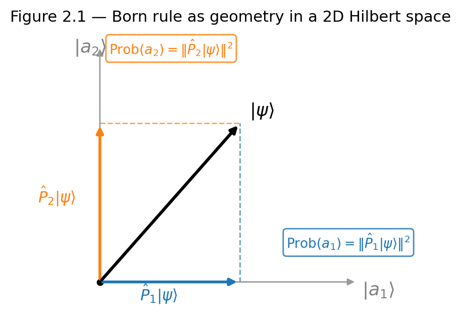

# Chapter 2 — Observables, Hermiticity, and the Spectral Theorem
*How the requirement that measurements return real numbers forces the entire structure of quantum observables.*

## TL;DR

- An observable is a Hermitian operator: $\hat{A} = \hat{A}^\dagger$, required by the condition that measurement outcomes are real.
- Hermitian operators have real eigenvalues, orthogonal eigenvectors, and a complete eigenbasis.
- The spectral decomposition $\hat{A} = \sum_n a_n|a_n\rangle\langle a_n|$ encodes all measurement outcomes, the corresponding states, and the Born rule probabilities.
- Probability of outcome $a_n$: $P(a_n) = |\langle a_n|\psi\rangle|^2$.
- Functions of operators: $f(\hat{A}) = \sum_n f(a_n)|a_n\rangle\langle a_n|$.

---

## Why Observables Must Be Hermitian

An observable must return real measurement outcomes. For any state $|\psi\rangle$, the expectation value

$$\langle\hat{A}\rangle = \langle\psi|\hat{A}|\psi\rangle$$

must be real. This requirement determines the operator condition.

Take the complex conjugate using the adjoint definition $\langle\phi|\hat{A}\psi\rangle^* = \langle\hat{A}^\dagger\phi|\psi\rangle$ with $|\phi\rangle = |\psi\rangle$:

$$\langle\hat{A}\rangle^* = \langle\psi|\hat{A}|\psi\rangle^* = \langle\psi|\hat{A}^\dagger|\psi\rangle.$$

Setting $\langle\hat{A}\rangle = \langle\hat{A}\rangle^*$:

$$\langle\psi|\hat{A}|\psi\rangle = \langle\psi|\hat{A}^\dagger|\psi\rangle \quad \text{for all }|\psi\rangle.$$

By the polarization identity, a sesquilinear form that vanishes on the diagonal vanishes everywhere. Therefore $\hat{A} = \hat{A}^\dagger$: the operator is **Hermitian**.

For the momentum operator $\hat{p} = -i\hbar\,\partial_x$:

$$\langle\phi|\hat{p}\psi\rangle = \int_{-\infty}^\infty\phi^*(x)(-i\hbar)\partial_x\psi(x)\,dx.$$

Integrate by parts (boundary term vanishes for normalizable states):

$$= \int_{-\infty}^\infty(i\hbar\partial_x\phi^*)\psi\,dx = \int_{-\infty}^\infty(-i\hbar\partial_x\phi)^*\psi\,dx = \langle\hat{p}\phi|\psi\rangle.$$

So $\hat{p}^\dagger = \hat{p}$. Without the factor $i$, the operator $\hat{p}' = \hbar\partial_x$ satisfies $\langle\hat{p}'\phi|\psi\rangle = -\langle\hat{p}'\phi|\psi\rangle$ — anti-Hermitian, with purely imaginary eigenvalues. The $i$ is structurally required.

In matrix language: $A_{mn} = A_{nm}^*$. Diagonal entries must be real. The diagnostic is $A_{mn} = A_{nm}^*$, not whether entries are real. The Pauli matrix $\sigma_y = \bigl(\begin{smallmatrix}0&-i\\i&0\end{smallmatrix}\bigr)$ has complex entries but satisfies $(\sigma_y)_{12} = -i = (i)^* = (\sigma_y)_{21}^*$, so it is Hermitian.

<!-- → [TABLE: summary of Hermitian vs. anti-Hermitian vs. unitary — showing the defining condition, the constraint on diagonal entries, the constraint on eigenvalues, and a $2\times 2$ example for each; this makes the distinctions among the three operator types visually immediate] -->

---

## Eigenvalues Are Real

**Theorem.** If $\hat{A}$ is Hermitian and $\hat{A}|a\rangle = a|a\rangle$, then $a\in\mathbb{R}$.

**Proof.** Compute $\langle a|\hat{A}|a\rangle$ two ways.

First, act $\hat{A}$ on the ket: $\langle a|\hat{A}|a\rangle = a\langle a|a\rangle = a$.

Second, act $\hat{A}$ on the bra using Hermiticity. Since $\hat{A}|a\rangle = a|a\rangle$, taking the bra of both sides gives $\langle a|\hat{A} = a^*\langle a|$. Therefore $\langle a|\hat{A}|a\rangle = a^*\langle a|a\rangle = a^*$.

Equating: $a = a^*$, so $a\in\mathbb{R}$. $\square$

Without Hermiticity, step two yields $\langle a|\hat{A}^\dagger = \bar{a}^*\langle a|$ where $\bar{a}$ is the eigenvalue of $\hat{A}^\dagger$ — in general different from $a$ — and no conclusion follows. The matrix $\bigl(\begin{smallmatrix}0&i\\i&0\end{smallmatrix}\bigr)$ fails $(A)_{12} = i \neq (i)^* = -i = A_{21}^*$ and has eigenvalues $\pm i$, purely imaginary.

---

## Eigenstates Are Orthogonal

**Theorem.** If $\hat{A}$ is Hermitian with eigenstates $\hat{A}|a\rangle = a|a\rangle$ and $\hat{A}|a'\rangle = a'|a'\rangle$, and $a \neq a'$, then $\langle a|a'\rangle = 0$.

**Proof.** Compute $\langle a|\hat{A}|a'\rangle$ two ways.

First: $\langle a|\hat{A}|a'\rangle = a'\langle a|a'\rangle$.

Second: since $a$ is real, $\langle a|\hat{A} = a\langle a|$, so $\langle a|\hat{A}|a'\rangle = a\langle a|a'\rangle$.

Equating: $(a' - a)\langle a|a'\rangle = 0$. Since $a' \neq a$, $\langle a|a'\rangle = 0$. $\square$

**Degeneracy.** When $a = a'$, the factor $(a' - a) = 0$ and orthogonality does not follow. The identity matrix makes this explicit — every vector is an eigenvector with eigenvalue 1 and no two arbitrary vectors need be orthogonal. Apply Gram-Schmidt within the degenerate subspace to construct an orthonormal basis. The choice of basis within the subspace is resolved in practice by a second observable that commutes with $\hat{A}$ and distinguishes the degenerate states. Degeneracy signals a symmetry: a transformation that leaves the Hamiltonian unchanged mixes the degenerate states, and the extra quantum numbers labeling those states are eigenvalues of the symmetry generators.

---

## The Spectral Theorem

**Spectral decomposition:**

$$\hat{A} = \sum_n a_n\,|a_n\rangle\langle a_n|.$$

Each term $\hat{P}_n = |a_n\rangle\langle a_n|$ is a **projector** onto the $n$-th eigenspace. The four projector properties:

$$\hat{P}_n^2 = \hat{P}_n \qquad \text{(idempotent: projecting twice is the same as once)}$$
$$\hat{P}_n^\dagger = \hat{P}_n \qquad \text{(Hermitian: projectors are themselves observables)}$$
$$\sum_n\hat{P}_n = \hat{I} \qquad \text{(completeness: the projectors partition the identity)}$$
$$\hat{P}_m\hat{P}_n = \delta_{mn}\hat{P}_n \qquad \text{(orthogonality: projectors onto different eigenspaces commute to zero)}$$

In the eigenbasis, $\hat{A}$ is diagonal with eigenvalues $a_n$ on the diagonal. For a degenerate eigenvalue $a_n$ with multiplicity $d > 1$, the projector is $\hat{P}_n = \sum_{k=1}^d|a_n,k\rangle\langle a_n,k|$ — a sum over the orthonormal basis chosen for the degenerate subspace.

<!-- → [FIGURE: geometric diagram in a 2D Hilbert space — showing a state vector |ψ⟩, the two eigenstates |a₁⟩ and |a₂⟩ as an orthonormal basis, and the projections P̂₁|ψ⟩ and P̂₂|ψ⟩ as components; the goal is to make the Born rule visually obvious as "squared length of the projection"] -->


*Figure 2.1 — geometric diagram in a 2D Hilbert space — showing a state vector |ψ⟩, the two eigenstates |a₁⟩ and |a₂⟩ as an orthonormal basis, and the…*

**Functions of operators:** apply the spectral decomposition to define $f(\hat{A})$:

$$f(\hat{A}) = \sum_n f(a_n)\,|a_n\rangle\langle a_n|.$$

The time-evolution operator follows directly:

$$\hat{U}(t) = e^{-i\hat{H}t/\hbar} = \sum_n e^{-iE_n t/\hbar}|E_n\rangle\langle E_n|.$$

Each energy eigenstate acquires a phase factor $e^{-iE_n t/\hbar}$; the full time evolution superimposes these phase rotations.

---

## The Born Rule as Geometry

Expand any state in the eigenbasis of $\hat{A}$:

$$|\psi\rangle = \sum_n c_n|a_n\rangle, \qquad c_n = \langle a_n|\psi\rangle.$$

The probability of obtaining outcome $a_n$ is

$$P(a_n) = |\langle a_n|\psi\rangle|^2 = |c_n|^2 = \langle\psi|\hat{P}_n|\psi\rangle = \|\hat{P}_n|\psi\rangle\|^2.$$

This is the squared norm of the projection of $|\psi\rangle$ onto the $a_n$ eigenspace.

The expectation value:

$$\langle\hat{A}\rangle = \langle\psi|\hat{A}|\psi\rangle = \langle\psi|\left(\sum_n a_n\hat{P}_n\right)|\psi\rangle = \sum_n a_n|c_n|^2 = \sum_n a_n P(a_n).$$

**Critical distinction:** $\langle a_n|\psi\rangle = c_n$ is a complex amplitude. The probability is $|c_n|^2$, its squared modulus. Writing "the probability is $\langle a_n|\psi\rangle$" and obtaining a complex number is the most common error — it conflates an amplitude with a probability.

<!-- → [INFOGRAPHIC: "amplitude vs. probability" — showing the same state decomposed in two different bases; in each case, the amplitude c_n is a complex vector, the probability |c_n|² is its squared length; the diagram should make clear that the phase θ_n disappears in |c_n|² but survives if you add two amplitudes before squaring] -->

---

## Worked Example: Diagonalizing a $2\times 2$ Observable

**Given.** The operator $\hat{B} = \begin{pmatrix}2 & 1+i \\ 1-i & 0\end{pmatrix}$.

**Find.** Eigenvalues, eigenvectors, spectral decomposition, and $\langle\hat{B}\rangle$ for $|\psi\rangle = (|1\rangle + |2\rangle)/\sqrt{2}$.

**Solution.**

*Hermiticity check:* $B_{12} = 1+i$ and $B_{21} = 1-i = (1+i)^* = B_{12}^*$. Diagonal entries 2 and 0 are both real. $\hat{B}$ is Hermitian.

*Eigenvalues* from $\det(\hat{B} - \lambda\hat{I}) = 0$:

$$-\lambda(2-\lambda) - (1+i)(1-i) = 0.$$

Note $(1+i)(1-i) = |1+i|^2 = 2$:

$$\lambda^2 - 2\lambda - 2 = 0 \implies \lambda = 1 \pm\sqrt{3}.$$

Both real. Sum check: $\lambda_+ + \lambda_- = 2 = \text{Tr}(\hat{B})$. Product check: $\lambda_+\lambda_- = 1-3 = -2 = \det(\hat{B})$.

*Eigenvectors:* For $\lambda_+= 1+\sqrt{3}$, substitute into $(\hat{B} - \lambda_+\hat{I})|b_+\rangle = 0$. The first row gives $(1-\sqrt{3})x + (1+i)y = 0$, so $x = \frac{1+i}{\sqrt{3}-1}y$. Rationalizing: $x = \frac{(1+i)(\sqrt{3}+1)}{2}y$. Normalize using $|x|^2 + |y|^2 = 1$; since $|1+i|^2 = 2$ and $(\sqrt{3}+1)^2 = 4 + 2\sqrt{3}$, one finds $|y|^2 = 1/(3+\sqrt{3})$.

Standard dead-end: reading eigenvectors directly off the matrix without solving the homogeneous system. This only works for diagonal matrices. For non-diagonal $\hat{B}$, substitute the eigenvalue and solve.

For $\lambda_-$, the same procedure gives $|b_-\rangle$ orthogonal to $|b_+\rangle$ — verify by computing $\langle b_+|b_-\rangle = 0$.

*Spectral decomposition:*

$$\hat{B} = \lambda_+|b_+\rangle\langle b_+| + \lambda_-|b_-\rangle\langle b_-|.$$

Verify: $\hat{B}|b_+\rangle = \lambda_+|b_+\rangle$ and $\hat{B}|b_-\rangle = \lambda_-|b_-\rangle$ by construction. Completeness: $|b_+\rangle\langle b_+| + |b_-\rangle\langle b_-| = \hat{I}$.

*Born rule:* For $|\psi\rangle = (|1\rangle + |2\rangle)/\sqrt{2}$:

$$\langle\hat{B}\rangle = \frac{1}{2}\bigl(\langle 1| + \langle 2|\bigr)\begin{pmatrix}2&1+i\\1-i&0\end{pmatrix}\begin{pmatrix}1\\1\end{pmatrix} = \frac{1}{2}\bigl((2+1+i)+(1-i+0)\bigr) = \frac{1}{2}(4) = 2.$$

This equals $\lambda_+ P(\lambda_+) + \lambda_- P(\lambda_-)$ — the spectral formula and the direct matrix calculation agree.

**Check.** Spectral decomposition encodes all measurement information: possible outcomes $\lambda_\pm$, states producing each outcome with certainty $|b_\pm\rangle$, and probabilities from inner products. For a $10\times 10$ Hermitian matrix, eigenvalues exist and are real by the spectral theorem, but no closed-form solution to the secular equation exists in general — use numerical diagonalization.

---

## What the Commutator Will Say

The spectral theorem resolves a single observable completely: possible outcomes, states producing each, probability computation. The question of two simultaneous observables depends on whether their operators commute. If $[\hat{A}, \hat{B}] = \hat{A}\hat{B} - \hat{B}\hat{A} = 0$, the operators share a common eigenbasis and simultaneous sharp values are possible. If $[\hat{A}, \hat{B}] \neq 0$, they do not share a basis and the uncertainty principle — derived from the commutator algebra — gives the quantitative constraint. That is Chapter 3.

---

## Exercises

**Warm-up**

1. *Difficulty: Warm-up — tests the Hermitian condition on $2\times 2$ matrices.*
   For each matrix below, determine whether it is Hermitian, anti-Hermitian ($\hat{A}^\dagger = -\hat{A}$), or neither. (a) $\bigl(\begin{smallmatrix}1&2i\\-2i&3\end{smallmatrix}\bigr)$, (b) $\bigl(\begin{smallmatrix}0&i\\-i&0\end{smallmatrix}\bigr)$, (c) $\bigl(\begin{smallmatrix}1&1+i\\1-i&-1\end{smallmatrix}\bigr)$. For each Hermitian case, verify that the diagonal entries are real. Correct a common error: explain why checking "symmetric" (i.e., $A_{mn} = A_{nm}$) rather than "conjugate-symmetric" ($A_{mn} = A_{nm}^*$) gives wrong answers for complex matrices.
   *Tests: ability to apply $A_{mn} = A_{nm}^*$ and distinguish from plain transpose symmetry.*

2. *Difficulty: Warm-up — tests the real-eigenvalue proof.*
   Prove in four lines: if $\hat{A}$ is Hermitian and $\hat{A}|a\rangle = a|a\rangle$, then $a\in\mathbb{R}$. Then exhibit a non-Hermitian $2\times 2$ matrix with a purely imaginary eigenvalue and identify exactly which step of the proof fails for it.
   *Tests: ability to reproduce and articulate the proof; locates the role of Hermiticity.*

3. *Difficulty: Warm-up — tests the amplitude-vs-probability distinction.*
   The state $|\psi\rangle = (3/5)|0\rangle + (4i/5)|1\rangle$ is measured in the $\sigma_z$ eigenbasis. (a) Compute the amplitudes $\langle 0|\psi\rangle$ and $\langle 1|\psi\rangle$. (b) Compute the probabilities $P(+1)$ and $P(-1)$ and verify they sum to 1. (c) Compute $\langle\sigma_z\rangle$ using the spectral sum $\sum_n a_n P(a_n)$ and verify by direct calculation $\langle\psi|\sigma_z|\psi\rangle$.
   *Tests: whether the student correctly squares the modulus rather than the amplitude; applies the spectral expectation formula.*

**Application**

4. *Difficulty: Application — full diagonalization.*
   Diagonalize $\hat{A} = \bigl(\begin{smallmatrix}3&1\\1&3\end{smallmatrix}\bigr)$. (a) Find eigenvalues from the secular equation $\lambda^2 - \text{Tr}(\hat{A})\lambda + \det(\hat{A}) = 0$. (b) Find and normalize the eigenvectors. (c) Write the spectral decomposition $\hat{A} = \lambda_1|a_1\rangle\langle a_1| + \lambda_2|a_2\rangle\langle a_2|$ and verify by expanding the outer products. (d) Verify $\hat{P}_1^2 = \hat{P}_1$ and $\hat{P}_1\hat{P}_2 = 0$.
   *Tests: complete execution of the diagonalization procedure and the projector properties.*

5. *Difficulty: Application — phase parameter in a Hermitian observable.*
   The operator $\hat{M} = \bigl(\begin{smallmatrix}0&e^{i\phi}\\e^{-i\phi}&0\end{smallmatrix}\bigr)$ for real $\phi$. (a) Verify Hermiticity. (b) Find the eigenvalues — they should be independent of $\phi$. (c) Find the eigenstates and show they depend on $\phi$. (d) Compute $\langle\hat{M}\rangle$ when the state is $|0\rangle$ and when it is $(|0\rangle + |1\rangle)/\sqrt{2}$. Explain physically why the eigenvalues are $\phi$-independent while the eigenstates are not.
   *Tests: diagonalization with a phase parameter; separates the role of eigenvalues from eigenstates.*

6. *Difficulty: Application — functions of operators via the spectral decomposition.*
   The Hamiltonian is $\hat{H} = E_0\bigl(\begin{smallmatrix}1&0\\0&-1\end{smallmatrix}\bigr)$. (a) Write the spectral decomposition of $\hat{H}$. (b) Use it to construct $e^{-i\hat{H}t/\hbar}$ explicitly as a $2\times 2$ matrix. (c) Evolve the initial state $|\psi(0)\rangle = (|0\rangle + |1\rangle)/\sqrt{2}$ to $|\psi(t)\rangle$. (d) Compute $\langle\hat{H}\rangle$ at time $t$ and verify it is constant.
   *Tests: construction of functions of operators via spectral decomposition; energy conservation.*

**Synthesis**

7. *Difficulty: Synthesis — degeneracy and Gram-Schmidt.*
   The observable
   $\hat{G} = \bigl(\begin{smallmatrix}2&0&0\\0&0&1\\0&1&0\end{smallmatrix}\bigr)$
   on a 3D Hilbert space. (a) Find all three eigenvalues. (b) Identify the degenerate eigenvalue and apply Gram-Schmidt to the degenerate subspace to produce two orthonormal eigenstates. (c) Write the full spectral decomposition, expressing the degenerate projector as a sum of two rank-1 outer products. (d) Compute $\langle\hat{G}\rangle$ for the state $|\psi\rangle = (|1\rangle + |2\rangle + |3\rangle)/\sqrt{3}$ by both the spectral sum $\sum_n a_n P(a_n)$ and the direct matrix product $\langle\psi|\hat{G}|\psi\rangle$.
   *Tests: handling the degenerate case; Gram-Schmidt within a subspace; spectral expectation in 3D.*

8. *Difficulty: Synthesis — projectors as observables.*
   Let $\hat{P} = |a\rangle\langle a|$ be a rank-1 projector. (a) Prove $\hat{P}^2 = \hat{P}$, $\hat{P}^\dagger = \hat{P}$, $\text{Tr}(\hat{P}) = 1$, and that the eigenvalues of $\hat{P}$ are 0 and 1. (b) Interpret each property physically: which says "projecting twice is the same as projecting once"? Which says "the projector is itself a Hermitian observable"? Which says "the projector has rank 1"? Which says "the measurement outcome is always 0 or 1"? (c) Explain why a projector valued observable corresponds to a yes/no measurement (does the system have property $a_n$?) and how $P(a_n) = \langle\psi|\hat{P}_n|\psi\rangle$ follows from treating $\hat{P}_n$ as an observable in the standard Born rule.
   *Tests: algebraic proof of projector properties, physical interpretation of each, and connection to the Born rule as a special case.*

**Challenge**

9. *Difficulty: Challenge — the polarization identity and its role in the Hermiticity argument.*
   The step "if $\langle\psi|(\hat{A} - \hat{A}^\dagger)|\psi\rangle = 0$ for all $|\psi\rangle$, then $\hat{A} = \hat{A}^\dagger$" is not obvious. Let $\hat{C} = \hat{A} - \hat{A}^\dagger$ and suppose $\langle\psi|\hat{C}|\psi\rangle = 0$ for all $|\psi\rangle$. (a) Use the substitution $|\psi\rangle = |\phi\rangle + |\chi\rangle$ to show $\langle\phi|\hat{C}|\chi\rangle + \langle\chi|\hat{C}|\phi\rangle = 0$. (b) Use $|\psi\rangle = |\phi\rangle + i|\chi\rangle$ to show $\langle\phi|\hat{C}|\chi\rangle - \langle\chi|\hat{C}|\phi\rangle = 0$. (c) Combining (a) and (b), show $\langle\phi|\hat{C}|\chi\rangle = 0$ for all $|\phi\rangle, |\chi\rangle$, and conclude $\hat{C} = 0$. This is the polarization identity. (d) Identify where in the argument you used the fact that the Hilbert space is over $\mathbb{C}$ rather than $\mathbb{R}$ — what goes wrong if the field is real?
   *Tests: ability to carry out the polarization identity argument; understands why complex scalars are essential to the conclusion.*

---

## LLM Exercises

The following exercises are designed to be worked with a large language model as a thinking partner — to probe arguments, generate counterexamples, and test the limits of what the chapter established.

1. Ask an LLM to explain why physical observables must be Hermitian, without invoking the postulate. Does its explanation start from the requirement that measurement outcomes are real? Ask it to make the argument completely explicit — the three-line derivation from $\langle\hat{A}\rangle = \langle\hat{A}\rangle^*$ to $\hat{A} = \hat{A}^\dagger$. Evaluate whether it fills in the polarization-identity step correctly.

2. Ask an LLM to give a $2\times 2$ example of a non-Hermitian operator with a real eigenvalue. (Such operators exist — for instance, any upper-triangular matrix with real diagonal has real eigenvalues but is not Hermitian.) Ask it to identify exactly which step of the real-eigenvalue proof fails for this operator, even though the eigenvalue happens to be real. Evaluate the explanation.

3. The chapter claims: "degeneracy is always the signature of a symmetry." Ask an LLM to give three physical examples of degenerate spectra and identify the symmetry responsible for the degeneracy in each case. For each, ask it to name the operator that commutes with the Hamiltonian and generates the symmetry. Evaluate whether its symmetry identifications are correct.

4. Ask an LLM to prove the five-line orthogonality theorem: eigenstates of a Hermitian operator with distinct eigenvalues are orthogonal. Then ask it: where exactly in the proof is it necessary that $a$ be real (from the previous theorem)? If an operator has real eigenvalues but is not Hermitian, does the orthogonality of its eigenstates follow? Ask for a counterexample.

5. The spectral theorem says $\hat{A} = \sum_n a_n|a_n\rangle\langle a_n|$. Ask an LLM: what is the spectral theorem for operators with a continuous spectrum, like the position operator $\hat{x}$? How does the sum become an integral? What replaces the projectors $|a_n\rangle\langle a_n|$? What replaces the probabilities $|\langle a_n|\psi\rangle|^2$? Ask it to write the continuous version of the Born rule and the spectral decomposition explicitly.

---

## References

Townsend, J. S. (2012). *A Modern Approach to Quantum Mechanics* (2nd ed.). University Science Books. §§1.2–1.5.

Sakurai, J. J., & Napolitano, J. (2021). *Modern Quantum Mechanics* (3rd ed.). Cambridge University Press. §§1.3–1.4.

Shankar, R. (1994). *Principles of Quantum Mechanics* (2nd ed.). Springer. §1.5.

Griffiths, D. J., & Schroeter, D. F. (2018). *Introduction to Quantum Mechanics* (3rd ed.). Cambridge University Press. §3.3.

Cohen-Tannoudji, C., Diu, B., & Laloë, F. (1977). *Quantum Mechanics*, Vol. I. Wiley.

Reed, M., & Simon, B. (1972). *Methods of Modern Mathematical Physics*, Vol. I. Academic Press. (Rigorous treatment of self-adjoint operators and the spectral theorem in infinite dimensions.)

Marshman, E., & Singh, C. (2017). Investigating and improving student understanding of the probability distributions for measuring physical observables in quantum mechanics. *European Journal of Physics*, 38, 025705.

---

## Running Project — Build the Atom

**This chapter adds:** the diagonalization step — represent a one-electron effective Hamiltonian as a Hermitian matrix and extract its orbital energies as the real eigenvalues, so the simulator can *order* the orbitals rather than just label them.

The central-field approximation (Chapter 11) replaces the intractable many-electron Hamiltonian with a sum of one-electron problems $\hat{h} = \hat{p}^2/2m_e + V_\text{eff}(r)$. Each one-electron $\hat{h}$ is Hermitian; the spectral theorem guarantees real eigenvalues (the orbital energies) and an orthonormal eigenbasis (the orbitals). This chapter builds the routine that takes a Hermitian one-electron Hamiltonian matrix and returns its sorted real spectrum — the energies you will fill electrons into by the Aufbau rule.

### Exercise R1 — When to Use AI
**The judgment:** In this chapter's project work, AI assistance is appropriate for:
- Wrapping a numerical eigensolver (`numpy.linalg.eigh`) and returning eigenvalues sorted ascending with their eigenvectors — *Why AI works here:* it is standard library plumbing; you can verify it on a $2\times2$ matrix whose eigenvalues you compute by hand from $\lambda^2 - \text{Tr}\,\lambda + \det = 0$.
- Writing a Hermiticity guard that raises if the input matrix fails $A_{mn} = A_{nm}^*$ to tolerance — *Why AI works here:* this is a mechanical check with a clear pass/fail, and it protects every later step.

**The tell:** You are using AI well when you have an independent check — the trace equals the sum of eigenvalues, the determinant equals their product.

### Exercise R2 — When NOT to Use AI
**The judgment:** These tasks require your judgment; AI output here can't be trusted without redoing the work:
- Deciding whether a near-degeneracy in the computed spectrum (e.g. $3d$ and $4s$ almost equal) is physical or a numerical artifact — *Why AI fails here:* this is exactly the central-field subtlety the capstone is honest about; an LLM will resolve a degeneracy by whatever its training prior suggests, with no way to tell a real level crossing from round-off.
- Trusting eigenvectors in a degenerate subspace — *Why AI fails here:* eigensolvers return an arbitrary basis within a degenerate eigenspace (Gram-Schmidt freedom), and an LLM presenting one such basis as "the" orbitals is silently making a choice that needs a second commuting observable to fix.

**The tell:** If you could not explain why two orbitals are ordered the way they are without the AI, the AI did physics that should have been yours.
**Physics-judgment connection:** this demands you check the computed spectrum against invariants — $\sum_n \lambda_n = \text{Tr}(H)$ and $\prod_n \lambda_n = \det(H)$ — before believing the energy ordering it produced.

### Exercise R3 — LLM Exercise
**What you're building this chapter:** a module `oneelectron.py` that diagonalizes a one-electron Hamiltonian matrix and returns sorted orbital energies and orbitals.
**Tool:** Claude chat (single module, no persistent context required).
**The Prompt:**
```
I am building an atomic-structure simulator. I already have orbitals.py (an orbital
basis and a matrix_of helper). Now I need the diagonalization layer.

Write a Python module `oneelectron.py` (numpy only) that:

1. Provides assert_hermitian(H, tol=1e-9) raising ValueError if H != H.conj().T
   to tolerance.
2. Provides solve_one_electron(H) that asserts Hermiticity, then returns
   (energies, orbitals) where energies is a 1D array sorted ascending and
   orbitals is the matrix of eigenvectors in the same order (columns).
3. Provides spectral_checks(H) returning a dict comparing sum(eigenvalues) to
   trace(H) and prod(eigenvalues) to det(H), with booleans for whether each
   matches to 1e-6 relative tolerance.
4. Includes a __main__ block that builds the 2x2 matrix [[2, 1+1j],[1-1j, 0]],
   diagonalizes it, prints the eigenvalues, and asserts they are real and equal
   1 +/- sqrt(3) to 1e-9 (this is the worked example from the chapter).

Do NOT build the physical V_eff or assign electrons — only the linear algebra
and the spectral consistency checks. Note in a docstring that real eigenvalues
are guaranteed because the Hamiltonian is Hermitian (the spectral theorem).
```
**What this produces:** `oneelectron.py` — the spectral engine that turns a one-electron Hamiltonian into an ordered list of orbital energies.
**How to adapt:** *Your system:* if you prefer SciPy, swap `numpy.linalg.eigh` for `scipy.linalg.eigh`. *ChatGPT/Gemini:* same prompt; ask additionally for a test that a non-Hermitian input raises. *Claude Project:* add alongside `orbitals.py` so the two modules form the project's linear-algebra core.
**Builds on:** Chapter 1's orbital basis and `matrix_of`.  **Next:** Chapter 3 supplies the quantum-number *labels* (CSCO) that disambiguate degenerate eigenvectors this chapter warns about.

### Exercise R4 — CLI Exercise
**What you're building this chapter:** the diagonalizer plus a test verifying the spectral consistency checks on a known matrix.
**Tool:** Claude Code.
**Skill level:** Beginner
**Setup — confirm:**
- [ ] `orbitals.py` from Chapter 1 is in `build-the-atom/`.
- [ ] `numpy` installed; `pytest` available.
- [ ] CLAUDE.md rule from Chapter 1 present.
**The Task:**
```
In build-the-atom/, create oneelectron.py with assert_hermitian(H, tol),
solve_one_electron(H) returning ascending-sorted (energies, orbitals), and
spectral_checks(H) comparing sum/prod of eigenvalues to trace/det.

Create test_oneelectron.py with pytest tests: (a) the matrix
[[2, 1+1j],[1-1j, 0]] has eigenvalues 1 +/- sqrt(3), both real to 1e-9;
(b) spectral_checks reports trace and det matches True for that matrix;
(c) a non-Hermitian matrix [[0,1j],[1j,0]] raises ValueError from
assert_hermitian.

Run `pytest -q` and show output. Do not modify orbitals.py.
```
**Expected output:** `oneelectron.py`, `test_oneelectron.py`, passing `pytest` (3 tests).
**What to inspect:** confirm the eigenvalues print as real (zero imaginary part to tolerance); confirm $\lambda_+ + \lambda_- = 2 = \text{Tr}$ and $\lambda_+\lambda_- = -2 = \det$.
**If it goes wrong:** most likely it uses `numpy.linalg.eig` (general, returns complex eigenvalues with tiny imaginary parts) instead of `eigh` (Hermitian, real). Recovery: switch to `eigh`, which both guarantees real output and exploits Hermiticity.
**CLAUDE.md / AGENTS.md note:** add — "Always diagonalize one-electron Hamiltonians with a Hermitian solver (`eigh`); run `spectral_checks` and refuse results where trace/det do not match."

### Exercise R5 — AI Validation Exercise
**What you're validating:** the `oneelectron.py` diagonalizer from R3/R4.
**Validation type:** Code / Numerical result
**Risk level:** Medium — a wrong eigensolver or unsorted output silently corrupts the orbital ordering that the entire Aufbau filling depends on.
**Setup:** use your R3/R4 artifact.
**The Validation Task:** Evaluate against this checklist; mark Pass / Fail / Cannot determine with reasoning.
```
Validation Checklist — Observables & the Spectral Theorem
□ Correctness: are the returned eigenvalues sorted ascending and real?
□ Completeness: does it reject non-Hermitian input rather than silently
  returning complex eigenvalues?
□ Scope: did it stay out of physics (no V_eff, no electron assignment)?
□ Physics criterion 1: sum(eigenvalues) == trace(H) to 1e-6?
□ Physics criterion 2: prod(eigenvalues) == det(H) to 1e-6?
□ Failure-mode check: any of —
  - fluent but wrong (used eig instead of eigh; eigenvalues carry spurious
    imaginary parts)
  - eigenvectors in a degenerate subspace presented as unique
  - eigenvalues returned unsorted, breaking later Aufbau filling
  - missing ground truth (no trace/det cross-check)
```
**What to do with findings:** pass → adopt it, noting the trace/det agreement is what made it trustworthy; one fail (e.g. unsorted) → add the sort, re-run; multiple fails → this is a "do it yourself" moment, `eigh` plus a sort is three lines.
**AI Use Disclosure (mandatory, two sentences):**
> *1:* The AI wrote the Hermitian-diagonalization wrapper and the trace/determinant consistency checks.
> *2:* The AI could not tell me whether a near-degeneracy between two orbital energies is physical or numerical — that judgment, central to the central-field approximation's honesty, was mine.
**Physics-judgment connection:** checking a numerical spectrum against the analytic invariants (trace = sum, det = product) before trusting it — the discipline that catches a wrong solver before it poisons downstream physics.
