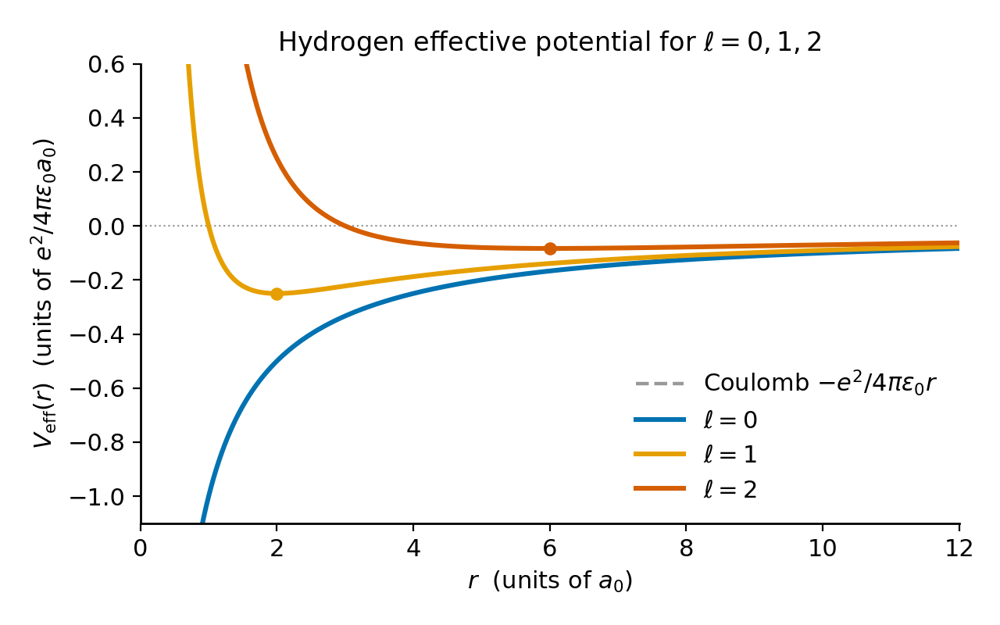
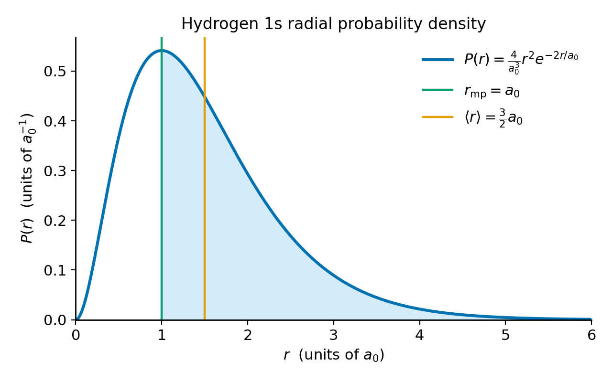
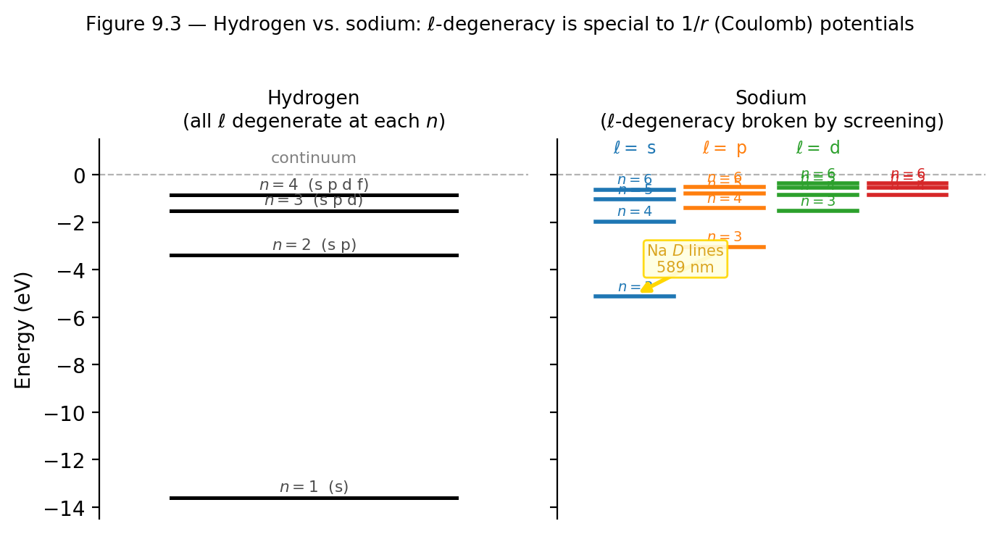
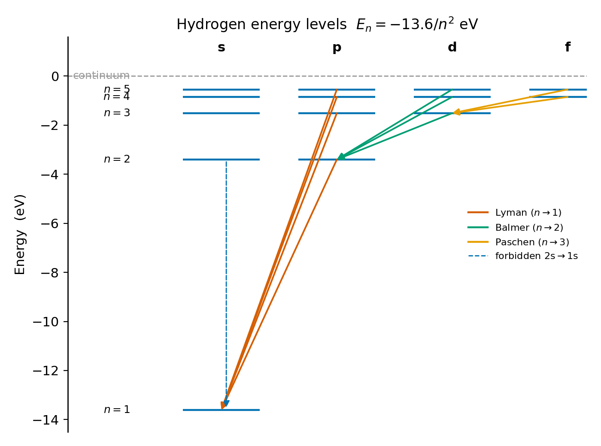

# Chapter 9 — The Hydrogen Atom
*One formula Balmer had no explanation for. One calculation Schrödinger did over Christmas break. The same number — and only one of them describes what you would see in the lab.*

## TL;DR

- Reduced-mass problem: $\hat{H}_\text{rel}$ has a single particle of mass $\mu = m_pm_e/(m_p+m_e)$ in a Coulomb potential.
- Separation: $\psi_{n\ell m} = R_{n\ell}(r)\,Y_\ell^m(\theta,\phi)$; radial equation uses $u(r) = rR(r)$.
- Energy levels: $E_n = -13.6\,\text{eV}/n^2$; Bohr radius $a_0 \approx 0.529\,\text{Å}$.
- Three quantum number constraints: $n \geq 1$ (Frobenius termination), $\ell \leq n-1$ (Laguerre degree), $|m| \leq \ell$ (angular momentum algebra).
- Degeneracy: $n^2$ orbital states per shell; $2n^2$ with spin.
- Critical distinction: the radial probability density is $P(r) = r^2|R_{n\ell}|^2$, not $|R_{n\ell}|^2$. Dropping the $r^2$ Jacobian is the most common error.
- Electric-dipole selection rules: $\Delta\ell = \pm1$, $\Delta m = 0, \pm1$.

---

## Reducing Two Bodies to One

A hydrogen atom is a proton (mass $m_p$) and an electron (mass $m_e$) interacting via $V = -e^2/(4\pi\epsilon_0|\vec{r}_e - \vec{r}_p|)$. Introduce the center-of-mass $\vec{R}$ and relative coordinate $\vec{r} = \vec{r}_e - \vec{r}_p$. The Hamiltonian separates:

$$\hat{H} = \frac{\hat{P}^2}{2M} + \underbrace{\frac{\hat{p}^2}{2\mu} - \frac{e^2}{4\pi\epsilon_0 r}}_{\hat{H}_\text{rel}},$$

where $M = m_p + m_e$ is the total mass and

$$\mu = \frac{m_p m_e}{m_p + m_e}$$

is the **reduced mass**. The center-of-mass piece describes a free particle drifting through space. All the physics is in $\hat{H}_\text{rel}$: a single particle of mass $\mu$ in a Coulomb potential.

Since $m_p \approx 1836\,m_e$, the reduced mass is $\mu \approx m_e(1 - 1/1836)$, within 0.05% of $m_e$. The difference matters for precision spectroscopy: Harold Urey discovered deuterium in 1932 by detecting a second copy of every Balmer line, shifted because deuterium's heavier nucleus changes $\mu$. The Balmer $\alpha$ line shifts by about 1.79 Å between hydrogen and deuterium.

The equation to solve:

$$\left[-\frac{\hbar^2}{2\mu}\nabla^2 - \frac{e^2}{4\pi\epsilon_0 r}\right]\psi(\vec{r}) = E\,\psi(\vec{r}).$$

---

## Separating the Problem

The potential is spherically symmetric. Write $\psi(r,\theta,\phi) = R(r)Y_\ell^m(\theta,\phi)$. The angular part is the spherical harmonics from Chapter 5 — universal, independent of $V(r)$. The radial part is where hydrogen's specific physics lives.

Substitute $u(r) = rR(r)$. The radial equation becomes:

$$-\frac{\hbar^2}{2\mu}\frac{d^2u}{dr^2} + \underbrace{\left[-\frac{e^2}{4\pi\epsilon_0 r} + \frac{\hbar^2\ell(\ell+1)}{2\mu r^2}\right]}_{V_\text{eff}(r)}u(r) = E\,u(r).$$

The effective potential $V_\text{eff}(r)$ has two competing pieces. The Coulomb well $-e^2/(4\pi\epsilon_0 r)$ attracts. The centrifugal barrier $+\hbar^2\ell(\ell+1)/(2\mu r^2)$ diverges for $\ell \geq 1$ as $r \to 0$ and pushes probability density away from the origin. For $\ell = 0$ (s-states), the barrier vanishes and the wave function can be nonzero at the nucleus — directly relevant for hyperfine coupling.

<!-- → [FIGURE: V_eff(r) for ℓ=0, 1, 2 — showing the pure Coulomb well for ℓ=0, the centrifugal barrier modifying the potential for ℓ=1 and ℓ=2, with a minimum at finite r for ℓ≥1; each curve labeled] -->


*Figure 9.1 — V_eff(r) for ℓ=0, 1, 2 — showing the pure Coulomb well for ℓ=0, the centrifugal barrier modifying the potential for ℓ=1 and ℓ=2, with a…*

Boundary conditions: $u(0) = 0$ so $R = u/r$ stays finite; $u(r) \to 0$ as $r \to \infty$ for normalizability. These two requirements quantize the energy.

---

## The Ground State, Worked Through

**Given.** Hydrogen ground state: $\ell = 0$, radial equation with the Coulomb potential.

**Find.** Ground-state energy $E_1$, Bohr radius $a_0$, normalized wave function $\psi_{100}$.

**Solution.**

Set $\ell = 0$: centrifugal barrier gone. The simplest function going to zero at the origin and decaying at infinity:

$$u(r) = Ar\,e^{-r/a},$$

where $a$ is an unknown length. Differentiate twice, substitute, collect terms by powers of $r$:

$$\underbrace{\left(\frac{\hbar^2}{\mu a} - \frac{e^2}{4\pi\epsilon_0}\right)}_{\text{constant term}} + \underbrace{\left(E + \frac{\hbar^2}{2\mu a^2}\right)}_{\text{coefficient of }r}\cdot r = 0.$$

For this to hold at every $r$, both groupings must independently vanish. From the constant terms:

$$a = a_0 \equiv \frac{4\pi\epsilon_0\hbar^2}{\mu e^2} \approx 0.529\,\text{Å}.$$

This is the **Bohr radius** — it emerged from the calculation. From the coefficient of $r$:

$$E = -\frac{\hbar^2}{2\mu a_0^2} \approx -13.6\,\text{eV}.$$

Normalize: $A = 2/a_0^{3/2}$, giving:

$$\psi_{100}(r) = \frac{1}{\sqrt{\pi a_0^3}}\,e^{-r/a_0}.$$

**Check.** Both the atom's size and ground-state energy follow from one consistency requirement — no adjustable parameters.

---

## Two Radii, and Why They Differ

The radial probability density — the probability of finding the electron between $r$ and $r + dr$ integrated over all angles — is:

$$P(r) = r^2|R_{10}(r)|^2 = \frac{4}{a_0^3}\,r^2 e^{-2r/a_0}.$$

The factor $r^2$ is not optional: it comes from the spherical volume element $4\pi r^2\,dr$. Dropping it — plotting $|R_{10}|^2$ and claiming it answers the radial question — gives a density that peaks at $r = 0$. This is the single most common error in hydrogen atom calculations.

<!-- → [FIGURE: P(r) = (4/a₀³)r²e^{−2r/a₀} for the 1s state, with r_mp=a₀ and ⟨r⟩=3a₀/2 marked as vertical lines, the right-skewed tail visible, and a caption noting the shaded area beyond r_mp exceeds 50%] -->


*Figure 9.2 — P(r) = (4/a₀³)r²e^{−2r/a₀} for the 1s state, with r_mp=a₀ and ⟨r⟩=3a₀/2 marked as vertical lines, the right-skewed tail visible, and a…*

**The most-probable radius.** Differentiate $P(r)$ and set to zero:

$$\frac{dP}{dr} = \frac{4}{a_0^3}\left(2r - \frac{2r^2}{a_0}\right)e^{-2r/a_0} = 0.$$

Solutions: $r = 0$ (minimum) and $r = a_0$ (maximum):

$$r_\text{mp} = a_0.$$

**The mean radius.** Integrate $r \cdot P(r)$:

$$\langle r\rangle = \frac{4}{a_0^3}\int_0^\infty r^3 e^{-2r/a_0}\,dr = \frac{4}{a_0^3}\cdot\frac{3!}{(2/a_0)^4} = \frac{3}{2}a_0.$$

$r_\text{mp} = a_0$, $\langle r\rangle = \tfrac{3}{2}a_0$. The distribution is right-skewed: the long tail at large $r$ pulls the mean to the right of the peak. A classical electron on a fixed circular orbit would have $r_\text{mp} = \langle r\rangle$. The disagreement is a structural feature of wave mechanics.

---

## The Full Spectrum

For general $(n, \ell)$, expand $u(r)$ as a power series and demand termination (non-terminating series diverges at large $r$ and cannot be normalized). Termination forces:

$$E_n = -\frac{13.6\,\text{eV}}{n^2}, \qquad n = 1, 2, 3, \ldots$$

Energy depends only on $n$, not on $\ell$ or $m$ — the **Coulomb degeneracy**, specific to the $1/r$ potential.

The full radial wave functions:

$$R_{n\ell}(r) = \mathcal{N}_{n\ell}\cdot\left(\frac{r}{a_0}\right)^\ell\cdot e^{-r/(na_0)}\cdot L_{n-\ell-1}^{2\ell+1}\!\!\left(\frac{2r}{na_0}\right),$$

where $L_{n-\ell-1}^{2\ell+1}$ is an associated Laguerre polynomial of degree $n - \ell - 1$.

**Three constraints, three sources:**

- $n \geq 1$: Frobenius series terminates only for positive integer $n$.
- $\ell \leq n-1$: Laguerre polynomial has degree $n - \ell - 1$; negative degree does not exist.
- $|m| \leq \ell$: from Chapter 6, the angular momentum algebra.

**Counting states.** For each $n$:

$$\sum_{\ell=0}^{n-1}(2\ell+1) = n^2.$$

Each shell contains $n^2$ orbital states; $2n^2$ with spin. Shell $n=2$ holds 8; shell $n=3$ holds 18; shell $n=4$ holds 32. These are the row lengths of the periodic table.

Node counting: $n-1$ total nodes partitioned into $n - \ell - 1$ **radial nodes** and $\ell$ **angular nodes**.

General mean radius:

$$\langle r\rangle_{n\ell} = \frac{a_0}{2}\bigl[3n^2 - \ell(\ell+1)\bigr].$$

For $(1,0)$: $\langle r\rangle = \tfrac{3}{2}a_0$. For $(2,0)$: $6a_0$. For $(2,1)$: $5a_0$. At fixed $n$, increasing $\ell$ decreases $\langle r\rangle$.

<!-- → [TABLE: shell structure table — n from 1 to 4, shell label K/L/M/N, n² orbital states, 2n² with spin, corresponding periodic table row lengths] -->

---

## Complex Orbitals and Real Orbitals

The wave functions $\psi_{n\ell m}$ with $m \neq 0$ are complex: eigenstates of $\hat{L}_z$ with eigenvalue $m\hbar$, axially symmetric about $z$.

The chemistry $p_x$ and $p_y$ orbitals are real linear combinations:

$$p_x \propto \psi_{21,-1} - \psi_{21,+1} \propto \sin\theta\cos\phi, \qquad p_y \propto i(\psi_{21,-1} + \psi_{21,+1}) \propto \sin\theta\sin\phi.$$

These are dumbbell shapes pointing along Cartesian axes but are not eigenstates of $\hat{L}_z$. Both descriptions span the same subspace. The complex eigenstates diagonalize $\hat{L}_z$; the real combinations highlight directional overlap for bonding.

---

## The Hidden Symmetry

The Coulomb degeneracy ($\ell$-degeneracy at fixed $n$) is not generic. For any other central potential, energy depends on both $n$ and $\ell$. Classically: $1/r$ orbits close perfectly (non-precessing Kepler ellipses). The conserved quantity preventing precession is the **Laplace–Runge–Lenz vector**. In quantum mechanics, three angular-momentum operators and three Runge–Lenz operators form the Lie algebra $\mathfrak{so}(4)$. Pauli used this algebra to solve hydrogen algebraically in 1926.

When the potential departs from $1/r$, $\mathfrak{so}(4)$ symmetry breaks and the $\ell$-degeneracy splits. In sodium, inner electrons screen the nuclear charge; the effective potential is not $1/r$. The 3s level falls below 3p, which falls below 3d. The sodium D lines at 589 nm are $3p \to 3s$ transitions — spectroscopic evidence of broken $\mathfrak{so}(4)$ symmetry.

<!-- → [FIGURE: energy level diagram comparing hydrogen (all ℓ degenerate at each n) vs. sodium (levels split by ℓ at n=3), illustrating the $\ell$-degeneracy breaking; sodium D line marked] -->


*Figure 9.3 — energy level diagram comparing hydrogen (all ℓ degenerate at each n) vs. sodium (levels split by ℓ at n=3), illustrating the…*

---

## Transitions and Selection Rules

Two levels separated by $\Delta E$ are connected by a photon of frequency $\omega = \Delta E/\hbar$. The Balmer $\alpha$ line ($n=3 \to n=2$):

$$\lambda = \frac{hc}{\Delta E} = \frac{1240\,\text{eV·nm}}{13.6\times(1/4 - 1/9)\,\text{eV}} \approx 656.3\,\text{nm}.$$

Experimental value: 656.281 nm. Agreement to 0.003%.

Electric-dipole selection rules (from $\langle\psi_f|\hat{\vec{r}}|\psi_i\rangle \neq 0$):

$$\Delta\ell = \pm 1, \qquad \Delta m = 0, \pm 1.$$

The $2s \to 1s$ transition has $\Delta\ell = 0$ and is electric-dipole forbidden. It occurs via two-photon emission with lifetime $\approx 0.12$ s — eight orders of magnitude slower than allowed transitions. The $1S$-$2S$ two-photon transition in hydrogen has been measured to fifteen significant figures; the ALPHA collaboration at CERN measured the same transition in antihydrogen at parts-per-trillion precision.

<!-- → [FIGURE: hydrogen energy level diagram for n=1 through 5, with allowed electric-dipole transitions (Δℓ=±1) as solid arrows grouped into Lyman, Balmer, Paschen series, and the forbidden 2s→1s as a dashed arrow labeled "two-photon, τ≈0.12s"] -->


*Figure 9.4 — hydrogen energy level diagram for n=1 through 5, with allowed electric-dipole transitions (Δℓ=±1) as solid arrows grouped into Lyman,…*

---

## What the Orbital Is Not

The 90% isosurface images in chemistry textbooks are not containing walls. The surface encloses the region of 90% probability for a single position measurement; 10% of measurements land outside. The $r_\text{mp} \neq \langle r\rangle$ calculation is direct evidence: a path has one radius; a probability distribution has a peak and a mean that need not coincide.

The Bohr model gets $E_n = -13.6\,\text{eV}/n^2$ right because hydrogen's $\mathfrak{so}(4)$ symmetry makes the energy depend on one quantum number, and Bohr's condition $L = n\hbar$ counts that quantum number correctly for circular orbits. But Bohr requires $\ell = n$ always, while Schrödinger says $\ell = 0, 1, \ldots, n-1$. The 2s state ($\ell=0$) is forbidden in Bohr's model and perfectly physical in Schrödinger's. The Bohr model is a numerical coincidence.

$|\psi|^2$ is the distribution of outcomes over many repeated position measurements on identically prepared atoms, not a smeared continuous charge distribution.

---

## LLM Exercises

### Part 1 — CLAUDE.md extension

Append this block to your project's `CLAUDE.md`:

```
## Chapter 9 — Hydrogen Orbital Visualizer Rules

- Single HTML file, single SVG canvas. No three.js, no WebGL.
- Layout: primary heat-map panel (top, ~400 × 400 px), radial probability
  plot directly below it (~400 × 200 px), energy-level diagram on the right
  (~200 × 400 px). Numeric readouts at the very bottom.
- Sliders for (n, ℓ, m) in a left-hand sidebar, plus a dropdown for
  "complex Y_lm" vs. "real chemistry orbitals: p_x, p_y, p_z, d_z², ...".
- Color scale: d3.interpolateViridis, sequential. Domain rescaled per state
  to [0, max(|ψ|²)] on the rendered grid.
- Grid resolution: 200 × 200 pixels covering ±20 a₀ × ±20 a₀ in the xz-plane.
- Radial probability plot marks r_mp (peak) and ⟨r⟩ (mean) with vertical
  lines, labeled.
- Energy-level diagram: horizontal lines at E_n = −13.6/n² eV for n = 1..5,
  spectroscopic labels. Currently selected state is highlighted.
- Numeric readouts (≤ 3 sig figs, monospaced): ⟨r⟩, r_mp, E_n,
  radial nodes (n − ℓ − 1), angular nodes (ℓ), total nodes (n − 1).
- Quantum number sliders enforce constraints: ℓ ∈ [0, n−1], m ∈ [−ℓ, +ℓ].
- No DOM mutation outside the redraw function.
```

### Part 2 — The simulation prompt

```
Build me a D3 v7 hydrogen orbital visualizer following CLAUDE.md.

HOOK. Render |ψ_{nℓm}(x, 0, z)|² for the hydrogen atom as a 2D heat map
in the xz-plane. The user drags sliders for (n, ℓ, m) and the orbital
reorganizes.

UNFOLD. The hydrogen wave function factorizes:
  ψ_{nℓm}(r, θ, φ) = R_{nℓ}(r) Y_{ℓm}(θ, φ),
where R_{nℓ}(r) involves the associated Laguerre polynomial L^{2ℓ+1}_{n−ℓ−1}
and an exponential e^{−r/(n a₀)}, and Y_{ℓm}(θ, φ) is the spherical harmonic.
Set a₀ = 1 internally. Code R_{nℓ}(r) explicitly for (n, ℓ) up to (4, 3).

MECHANISM. Three coupled panels.
  (1) Primary 2D heat map: at each pixel (x, z), compute r = √(x²+z²),
      θ = atan2(x, z), φ = 0. Evaluate |ψ_{nℓm}(r, θ, 0)|² via Viridis.
  (2) Radial probability P(r) = r² |R_{nℓ}(r)|² as a line plot from
      r = 0 to r = 20 a₀. Mark r_mp and ⟨r⟩ with labeled vertical lines.
  (3) Energy-level diagram: horizontal lines at E_n = −13.6/n² eV for
      n = 1..5, spectroscopic labels. Current state highlighted.

SYNTHESIZE. Add a "Transition mode" toggle. Two state selectors:
  |ψ_i⟩ and |ψ_f⟩. Compute ΔE = E_{n_i} − E_{n_f}. Display photon
  wavelength λ = hc/ΔE in nm. Identify the spectral series (Lyman if
  n_f = 1, Balmer if 2, Paschen if 3). Check selection rules Δℓ = ±1,
  Δm = 0, ±1 and flag ALLOWED or FORBIDDEN.

Output a single self-contained HTML file using the D3 v7 CDN.
```

### Part 3 — Exploration tasks

**Verify the 1s headline numbers.** Set $(n,\ell,m) = (1,0,0)$. Read $r_\text{mp}$ and $\langle r\rangle$ from the radial probability plot. Confirm $r_\text{mp} \approx 1.00\,a_0$ and $\langle r\rangle \approx 1.50\,a_0$. Look at the heat map: a spherical blob. No ring at $a_0$.

**Count nodes.** Set $(2,0,0)$. The radial probability plot shows two peaks separated by a zero at $r = 2a_0$. Set $(3,1,0)$: predict $n-1 = 2$ total nodes, partitioned as 1 radial + 1 angular. Verify on the simulation.

**The $n^2$ degeneracy.** Switch among $(2,0,0)$, $(2,1,0)$, $(2,1,+1)$, $(2,1,-1)$. All four share $E = -3.4$ eV on the energy diagram. Shapes differ dramatically.

**Compute the Balmer $\alpha$ wavelength.** Transition mode. Set $(n_i, \ell_i, m_i) = (3, 1, 0)$ and $(n_f, \ell_f, m_f) = (2, 0, 0)$. Read the wavelength. Confirm $\lambda \approx 656$ nm. Verify ALLOWED.

**A forbidden transition.** Set $(2,0,0) \to (1,0,0)$. The simulation flags FORBIDDEN ($\Delta\ell = 0$). This is the metastable 2s state.

**Real vs. complex orbitals.** Switch to "real chemistry orbitals." Set sub-shell $= p$. Cycle through $p_x, p_y, p_z$ and watch the dumbbells rotate. Switch back to complex and cycle $m = -1, 0, +1$: the $m=0$ case is identical to $p_z$; the $m=\pm 1$ cases are azimuthally symmetric rings.

### Part 4 — Extension: time evolution

```
Extend the hydrogen visualizer to a "Superposition mode."

The state is (1/√2)[ψ_{100} e^{−i E_1 t/ℏ} + ψ_{210} e^{−i E_2 t/ℏ}].
Animate |ψ(x, 0, z, t)|² in real time with a slowed-down clock.
Display "physical time" alongside the simulation frame number.
The probability density should oscillate between the 1s blob and the
2p_z dumbbell with period T_{12} = 2π / ((E_2 − E_1)/ℏ) ≈ 0.405 fs.
```

### Part 5 — Six failure modes to watch for

**Color-scale domain not reset.** If the Viridis domain is fixed at $n=1$, high-$n$ orbitals appear uniformly dark. Recompute per state change.

**Forgetting the $r^2$ Jacobian.** Plotting $|R_{n\ell}|^2$ instead of $r^2|R_{n\ell}|^2$ makes the 1s density peak at $r=0$. The error is visible and dramatic.

**Energy formula sign error.** $E_n = -13.6/n^2$, negative. Positive values on the energy diagram mean a sign was dropped.

**Selection rule for $\Delta m$ too strict.** The rule is $\Delta m = 0, \pm 1$ — all three are allowed. Not just $\Delta m = 0$.

**Quantum number ranges not enforced.** The combination $(n,\ell,m) = (1,1,0)$ requires a Laguerre polynomial of degree $-1$. Constrain the sliders.

**Heat-map coordinate confusion.** For $x < 0$, $\phi = \pi$, not $\phi = 0$. The sign of $x$ must be handled correctly; otherwise the simulation renders a half-orbital.

---

## Still Puzzling

The Laplace–Runge–Lenz vector is conserved classically because $1/r$ orbits do not precess, and Bertrand's theorem confirms that only $1/r$ and $r^2$ potentials have all bound orbits closed. The quantum $\mathfrak{so}(4)$ degeneracy and the classical closed-orbit property must be the same fact in two languages. The algebra is settled; the commutators are well-defined; the derivation is correct. The connection between the algebraic structure and the orbit closure property remains worth examining carefully.

A separate observation: the hydrogen atom has exact analytic solutions only because the Coulomb potential is exactly $1/r$ and there is only one electron. Helium has two electrons and no exact solution. The electron-electron interaction breaks the $\mathfrak{so}(4)$ symmetry and makes the problem analytically intractable. Chapter 9 is the last time exact solutions exist.

---

## Exercises

**Warm-up**

1. *[Reduced mass and its consequences]* The reduced mass of ordinary hydrogen is $\mu = m_pm_e/(m_p+m_e)$, $m_p \approx 1836\,m_e$. (a) Compute $\mu$ to four significant figures in units of $m_e$. (b) By what fractional amount does using exact $\mu$ rather than $m_e$ change $a_0$? (c) A muonic hydrogen atom replaces the electron with a muon ($m_\mu \approx 207\,m_e$). Compute the muonic Bohr radius $a_0^\mu$ and ground-state energy $E_1^\mu$.
*What this tests: following the reduced-mass calculation through to observable consequences, including the isotope shift and muonic hydrogen.*

2. *[Normalization and the Jacobian]* Verify $\psi_{100}(r) = (\pi a_0^3)^{-1/2}e^{-r/a_0}$ is normalized. Write the radial probability density $P(r) = r^2|R_{10}(r)|^2$ and verify $\int_0^\infty P(r)\,dr = 1$. Confirm $P(0) = 0$ and explain in one sentence why this does not contradict $|\psi_{100}(0)|^2 \neq 0$.
*What this tests: the Jacobian is compulsory, not optional — and $P(0)=0$ is a geometric fact about shell volume, not a property of the wave function.*

3. *[Quantum number counting]* List all allowed $(n,\ell,m)$ combinations for $n=3$. Verify the count gives $n^2 = 9$ orbital states and $2n^2 = 18$ with spin. For each of the three constraints on quantum numbers, write one sentence stating its mathematical origin.
*What this tests: the three constraints come from three separate sources, and conflating them is a persistent error.*

**Application**

4. *[The 2s state]* The 2s radial wave function is $R_{20}(r) = (8a_0^3)^{-1/2}(2 - r/a_0)e^{-r/(2a_0)}$. (a) Find the radial node. (b) Find $r_\text{mp}$ by maximizing $P(r) = r^2|R_{20}|^2$. (c) Compute $\langle r\rangle_{2s}$ using $\int_0^\infty r^n e^{-r/b}\,dr = n!\,b^{n+1}$. Do $r_\text{mp}$ and $\langle r\rangle$ still differ?
*What this tests: the $r_\text{mp} \neq \langle r\rangle$ discrepancy is not a ground-state peculiarity but a general feature of skewed distributions.*

5. *[Spectral series and the isotope shift]* (a) Compute the Lyman $\alpha$ wavelength ($n=2 \to n=1$) and confirm it is ultraviolet. (b) Compute the Paschen $\alpha$ wavelength ($n=4 \to n=3$) and confirm it is near-infrared. (c) Estimate the isotope shift at Balmer $\alpha$ between hydrogen ($m_p \approx 1836\,m_e$) and deuterium ($m_d \approx 3672\,m_e$), and explain why Urey could detect it in 1932.
*What this tests: the reduced mass is not a correction but a physical quantity with measurable spectroscopic consequences.*

6. *[Selection rules]* For each transition, state allowed or forbidden and give the reason: (a) $3p \to 1s$; (b) $3d \to 1s$; (c) $3p \to 2p$; (d) $3d \to 2p$; (e) $2s \to 1s$. For each forbidden transition, name one process by which it can still occur.
*What this tests: $\Delta\ell = \pm 1$ is the electric-dipole selection rule; forbidden transitions do occur, just slowly.*

7. *[Mean radius formula]* The general formula is $\langle r\rangle_{n\ell} = (a_0/2)[3n^2 - \ell(\ell+1)]$. (a) Verify for $(1,0)$ and $(2,0)$. (b) For fixed $n$, does increasing $\ell$ increase or decrease $\langle r\rangle$? Use the centrifugal-barrier picture. (c) For $(3,2)$, compute $\langle r\rangle$ and compare to $r_\text{mp} \approx n^2 a_0$.
*What this tests: the mean-radius formula is derived from the algebra of the Laguerre polynomials, and its dependence on $\ell$ has a physical interpretation.*

**Synthesis**

8. *[Broken $\mathfrak{so}(4)$ symmetry in sodium]* Hydrogen's $\ell$-degeneracy is a signature of the $1/r$ potential. In sodium, the 3s level sits at $-5.14$ eV and 3p at $-3.04$ eV. (a) What observable could distinguish 2s from 2p in hydrogen without measuring energy? (b) Compute the wavelength of the sodium $3p \to 3s$ transition. (c) The sodium D line is a doublet at 589.0 nm and 589.6 nm. What interaction splits the 3p level into two?
*What this tests: connecting the abstract symmetry argument to a real spectroscopic observable, and identifying spin-orbit coupling as the source of the fine-structure doublet.*

9. *[Oscillating dipole]* The superposition $\Psi = (1/\sqrt{2})[\psi_{100}e^{-iE_1 t/\hbar} + \psi_{210}e^{-iE_2 t/\hbar}]$. (a) Show $|\Psi|^2$ contains a cross-term oscillating at $\omega_{12} = (E_2-E_1)/\hbar$. Compute $\omega_{12}$ in rad/s and the period in femtoseconds. (b) Compute $\langle z\rangle(t)$ and show it oscillates at $\omega_{12}$. (c) Explain in two sentences why the oscillating dipole represents the atom in the act of emitting a photon, rather than sitting in either stationary state.
*What this tests: connecting the time-dependent superposition to the classical-radiation picture — the oscillating charge distribution is what drives photon emission.*

**Challenge**

10. *[$n^2$ degeneracy and what makes Coulomb special]* The identity $\sum_{\ell=0}^{n-1}(2\ell+1) = n^2$ underlies the shell structure. Prove it by induction or by pairing terms. Then: in a hypothetical atom where energy depends on $n_r + \ell + 1$ (with $n_r = n - \ell - 1$ radial nodes), how many orbital states share energy level $N = n_r + \ell + 1$? Compare to hydrogen and explain in one sentence why Coulomb degeneracy requires $\mathfrak{so}(4)$ symmetry and not just $\mathfrak{so}(3)$.
*What this tests: seeing the counting argument from the inside, and understanding that the $n^2$ degeneracy is not a generic feature of central potentials but a special property of the $1/r$ interaction.*

---

## References

Balmer, J. J. (1885). Notiz über die Spectrallinien des Wasserstoffs. *Annalen der Physik*, 25, 80.

Bohr, N. (1913). On the constitution of atoms and molecules. *Philosophical Magazine*, 26, 1–25.

Schrödinger, E. (1926). Quantisierung als Eigenwertproblem. *Annalen der Physik*, 79, 361–376.

Pauli, W. (1926). Über das Wasserstoffspektrum vom Standpunkt der neuen Quantenmechanik. *Zeitschrift für Physik*, 36, 336–363. (Algebraic solution via the Runge–Lenz vector.)

Urey, H. C., Brickwedde, F. G., & Murphy, G. M. (1932). A hydrogen isotope of mass 2. *Physical Review*, 39, 164.

ALPHA Collaboration (2017). Measurement of the 1S–2S transition frequency in antihydrogen. *Nature*, 541, 506–510.

Griffiths, D. J., & Schroeter, D. F. (2018). *Introduction to Quantum Mechanics* (3rd ed.). Cambridge University Press. Chapter 4.

Townsend, J. S. (2012). *A Modern Approach to Quantum Mechanics* (2nd ed.). University Science Books. Chapter 10.

---

## Running Project — Build the Atom

**This chapter adds:** the hydrogenic orbital with an effective charge — the radial functions $R_{n\ell}(r)$ built from associated Laguerre polynomials, scaled by $Z_\text{eff}$, with the $a_0/Z_\text{eff}$ size scaling and the $n-\ell-1$ radial-node structure; these are the concrete orbitals the central-field model assigns to each electron.

The central-field approximation uses *hydrogenic* orbitals shifted by $Z_\text{eff}$ (Chapter 11): replace $Z$ with $Z_\text{eff}$ in the hydrogen radial functions and you get the screened orbital an electron actually occupies. This chapter supplies those $R_{n\ell}$ explicitly — the orbital shapes, their mean radii $\langle r\rangle_{n\ell}=(a_0/2Z_\text{eff})[3n^2-\ell(\ell+1)]$, and the node count $n-\ell-1$. These are the building blocks the Slater-determinant (Chapter 10) antisymmetrizes and the energies the Aufbau order fills.

### Exercise R1 — When to Use AI
**The judgment:** In this chapter's project work, AI assistance is appropriate for:
- Coding the hydrogenic $R_{n\ell}(r; Z_\text{eff})$ using `scipy.special.genlaguerre` for $(n,\ell)$ up to $(4,3)$ — *Why AI works here:* it is a formula transcription against a tabulated special function; you check $R_{10}$ against the closed form $2(Z_\text{eff}/a_0)^{3/2}e^{-Z_\text{eff}r/a_0}$.
- Generating the radial probability $P(r)=r^2|R_{n\ell}|^2$ and a routine to count its nodes — *Why AI works here:* node counting is mechanical (sign changes), and you verify against the rule $n-\ell-1$ radial nodes.

**The tell:** You are using AI well when you have an analytic anchor — $r_\text{mp}=a_0/Z_\text{eff}$ and $\langle r\rangle_{1s}=\tfrac32 a_0/Z_\text{eff}$ for the ground state, and the node-count rule.

### Exercise R2 — When NOT to Use AI
**The judgment:** These tasks require your judgment; AI output here can't be trusted without redoing the work:
- Forgetting the $r^2$ Jacobian when reporting "where the electron is" — *Why AI fails here:* this is the single most common hydrogen error; an LLM may plot or integrate $|R|^2$ instead of $r^2|R|^2$, giving a density that peaks at $r=0$, and the mistake is invisible unless you know the physics.
- Setting the value of $Z_\text{eff}$ for a multi-electron orbital — *Why AI fails here:* $Z_\text{eff}$ comes from Slater's rules (Chapter 11); plugging a guessed charge produces a plausible orbital of the wrong size, and nothing in the output flags it.

**The tell:** If you cannot say why $r_\text{mp}\neq\langle r\rangle$ — the right-skew of $P(r)$ — without the AI, the AI did the physics that should have been yours.
**Physics-judgment connection:** this trains checking a radial computation against analytic landmarks ($r_\text{mp}$, $\langle r\rangle$, node count) and against the mandatory $r^2$ Jacobian before trusting any orbital it produces.

### Exercise R3 — LLM Exercise
**What you're building this chapter:** a module `hydrogenic.py` that returns screened hydrogenic radial orbitals and their observables.
**Tool:** Claude chat.
**The Prompt:**
```
I am building an atomic-structure simulator using the central-field approximation:
hydrogenic orbitals shifted by an effective nuclear charge Z_eff.

Write a Python module `hydrogenic.py` (numpy + scipy.special) that:

1. R_nl(r, n, l, Z_eff, a0=1.0) returning the hydrogenic radial function with Z
   replaced by Z_eff, using genlaguerre for the associated Laguerre polynomial,
   normalized so integral of r^2 |R|^2 dr = 1.
2. radial_prob(r, n, l, Z_eff) = r^2 * R_nl(...)^2  (the Jacobian is mandatory).
3. most_probable_radius and mean_radius for (n, l, Z_eff), computed numerically.
4. radial_nodes(n, l, Z_eff) counting sign changes of R_nl on a fine grid.
5. __main__: for the 1s orbital with Z_eff=1, assert r_mp == 1.0 a0 and
   <r> == 1.5 a0 to 1%; assert radial_nodes(n,l) == n-l-1 for several (n,l);
   show that increasing Z_eff shrinks the orbital (r_mp scales as a0/Z_eff).

Comment that Z_eff is an INPUT (Slater's rules supply it in a later module).
Always use r^2|R|^2 for radial probabilities — never |R|^2.
```
**What this produces:** `hydrogenic.py` — the screened orbital library with verified radii and node counts.
**How to adapt:** *Your system:* set $a_0=1$ internally and convert for display. *ChatGPT/Gemini:* same prompt; ask for a plot of $P(r)$ with $r_\text{mp}$ and $\langle r\rangle$ marked. *Claude Project:* keep with the physics core; Chapter 10 antisymmetrizes these into Slater determinants.
**Builds on:** Chapter 5's central-field radial equation (this gives its Coulomb closed-form solution).  **Next:** Chapter 10 builds the many-electron Slater determinant from these one-electron orbitals.

### Exercise R4 — CLI Exercise
**What you're building this chapter:** the hydrogenic-orbital module plus tests on radii, nodes, and the $Z_\text{eff}$ scaling.
**Tool:** Claude Code.
**Skill level:** Intermediate–Advanced
**Setup — confirm:**
- [ ] Earlier modules in `build-the-atom/`.
- [ ] `numpy`, `scipy`, `pytest`.
- [ ] CLAUDE.md rules from Chapters 1–8 present.
**The Task:**
```
In build-the-atom/, create hydrogenic.py with R_nl(r, n, l, Z_eff),
radial_prob, most_probable_radius, mean_radius, and radial_nodes.

Create test_hydrogenic.py: (a) the 1s orbital (Z_eff=1) has r_mp == 1.0 and
<r> == 1.5 (a0 units) to 1%; (b) radial_nodes(n,l) == n-l-1 for (1,0),(2,0),
(2,1),(3,1); (c) integral of r^2|R|^2 dr == 1 to 1e-3 for several (n,l);
(d) doubling Z_eff halves r_mp (a0/Z_eff scaling).

Run `pytest -q` and show output. Modify no other module.
```
**Expected output:** `hydrogenic.py`, `test_hydrogenic.py`, passing `pytest`.
**What to inspect:** confirm $r_\text{mp}=1.0$ and $\langle r\rangle=1.5$ for 1s (the $r_\text{mp}\neq\langle r\rangle$ headline); confirm node counts; confirm the $a_0/Z_\text{eff}$ shrink.
**If it goes wrong:** if the most-probable radius comes out at $r=0$, the $r^2$ Jacobian was dropped — the code is maximizing $|R|^2$, not $r^2|R|^2$. Recovery: maximize `radial_prob`, not $R^2$.
**CLAUDE.md / AGENTS.md note:** add — "Radial probability is always $r^2|R_{n\ell}|^2$. Orbitals are hydrogenic with $Z\to Z_\text{eff}$; $Z_\text{eff}$ is supplied by Slater's rules, never guessed."

### Exercise R5 — AI Validation Exercise
**What you're validating:** the `hydrogenic.py` orbital module from R3/R4.
**Validation type:** Numerical result / Code
**Risk level:** Medium — these orbitals are the atoms of the whole model; a Jacobian or normalization slip distorts every radius and density.
**Setup:** use your R3/R4 artifact.
**The Validation Task:** Evaluate against this checklist; mark Pass / Fail / Cannot determine with reasoning.
```
Validation Checklist — The Hydrogen Atom
□ Correctness: 1s gives r_mp = 1.0 a0/Z_eff and <r> = 1.5 a0/Z_eff?
□ Completeness: does it include the r^2 Jacobian in every radial probability?
□ Scope: is Z_eff an input (no Slater's rules baked in here)?
□ Physics criterion 1: radial_nodes(n,l) == n-l-1 for several states?
□ Physics criterion 2: integral of r^2|R|^2 dr == 1 (normalized)?
□ Failure-mode check: any of —
  - fluent but wrong (peaks density at r=0 — dropped the r^2 Jacobian)
  - normalization off (integral != 1)
  - node count wrong (Laguerre degree off by one)
  - Z_eff scaling absent (orbital size independent of Z_eff)
```
**What to do with findings:** pass → adopt the orbitals, noting the $r_\text{mp}/\langle r\rangle$ match is what made them trustworthy; one fail → restore the Jacobian or renormalize and re-run; multiple fails / cannot-determine → hand-check $R_{10}$ against the closed form and rebuild.
**AI Use Disclosure (mandatory, two sentences):**
> *1:* The AI implemented the screened hydrogenic radial orbitals and their radii/node routines, which I checked against the 1s analytic landmarks.
> *2:* The AI could not supply a physically grounded $Z_\text{eff}$ nor be trusted to keep the $r^2$ Jacobian — both were my responsibility.
**Physics-judgment connection:** validating a radial computation against analytic landmarks ($r_\text{mp}$, $\langle r\rangle$, node count, normalization) and enforcing the mandatory Jacobian — the discipline that catches the most common hydrogen error.
