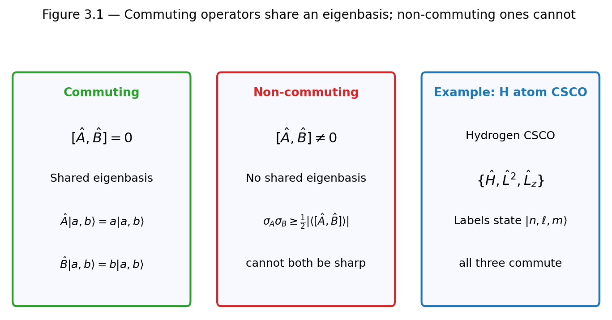
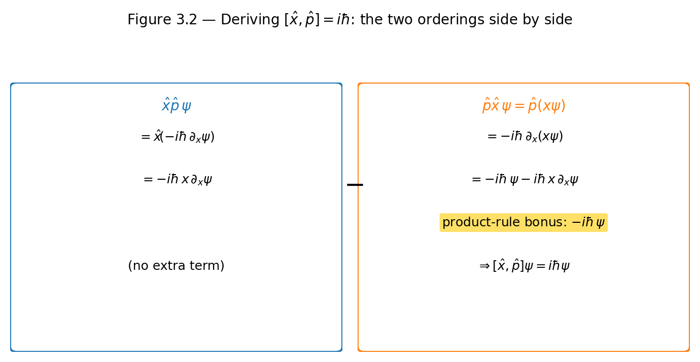
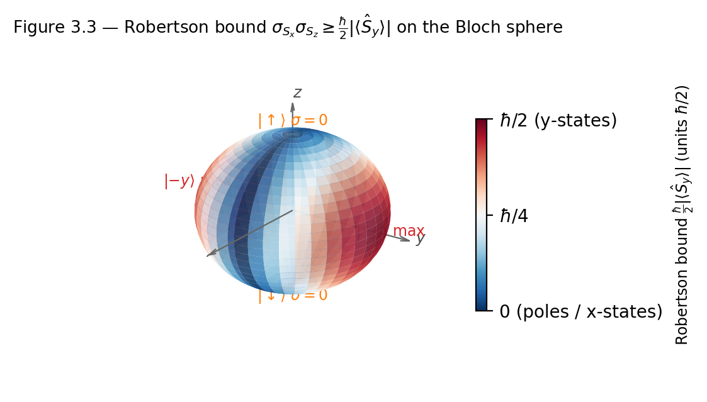

# Chapter 3 — Commutators, Compatibility, and the Generalized Uncertainty Principle
*Why the order you apply operators to a state is not, in general, something you can ignore.*

Here is the experiment that refutes Heisenberg's microscope story. Prepare a million electrons in exactly the same state $|\psi\rangle$. Measure position on 500,000 of them. Measure momentum on the other 500,000. No electron is measured twice. No photon kicks anything. Compute the standard deviations $\sigma_x$ and $\sigma_p$ from the two histograms. Their product satisfies $\sigma_x\sigma_p \geq \hbar/2$.

The bound was there before any measuring device turned on. It is a property of the state $|\psi\rangle$, enforced by the algebra of operators during the preparation, not during the measurement.

The microscope story says: the photon used to locate the electron kicks it, scrambling its momentum. The story produces the correct inequality by accident. But the causal chain is backwards. The correct statement is not "you cannot simultaneously measure position and momentum precisely." It is: *no quantum state has $\sigma_x = 0$ and $\sigma_p = 0$ simultaneously.* Robertson proved this in 1929 in a single page, from a two-line application of the Cauchy-Schwarz inequality to the commutator $[\hat{x}, \hat{p}] = i\hbar$. That commutator is where this chapter starts.

---


## What a Commutator Measures

Here is a question that sounds almost too simple. Does it matter which operator you apply first?

In ordinary arithmetic, $3 \times 5 = 5 \times 3$. Multiplication commutes. But operators are not numbers — they are instructions. "Differentiate, then multiply by $x$" is a different instruction than "multiply by $x$, then differentiate." Try it on the function $\psi(x) = e^{ax}$ and you will get different answers. The difference between those two answers is the commutator.

The **commutator** of two operators is:

$$[\hat{A}, \hat{B}] = \hat{A}\hat{B} - \hat{B}\hat{A}.$$

When $[\hat{A}, \hat{B}] = 0$, the operators are **compatible**. When it is nonzero, they are **incompatible**. The names are not decorative — they carry a precise theorem.

**Compatible operators share a complete orthonormal eigenbasis.** The proof in the non-degenerate case is short. Suppose $[\hat{A}, \hat{B}] = 0$ and $\hat{A}|a\rangle = a|a\rangle$. Apply $\hat{B}$ to the eigenvalue equation:

$$\hat{B}(\hat{A}|a\rangle) = a\hat{B}|a\rangle.$$

Since they commute, $\hat{B}\hat{A} = \hat{A}\hat{B}$, so $\hat{A}(\hat{B}|a\rangle) = a(\hat{B}|a\rangle)$. The vector $\hat{B}|a\rangle$ is itself an eigenvector of $\hat{A}$ with the same eigenvalue $a$. If the eigenspace at $a$ is one-dimensional, then $\hat{B}|a\rangle \propto |a\rangle$ — meaning $|a\rangle$ is simultaneously an eigenvector of $\hat{B}$. For degenerate eigenvalues, $\hat{B}$ maps the degenerate subspace into itself and can be diagonalized within it by Gram-Schmidt. In both cases, a simultaneous eigenbasis exists.

The physical consequence is direct: in a state $|a, b\rangle$ that is simultaneously an eigenstate of $\hat{A}$ with eigenvalue $a$ and of $\hat{B}$ with eigenvalue $b$, both observables take definite values. The **complete set of commuting observables (CSCO)** is the maximal collection of mutually commuting Hermitian operators whose joint eigenvalues uniquely label every state. For the hydrogen atom without spin, $\{\hat{H}, \hat{L}^2, \hat{L}_z\}$ forms such a set. The three quantum numbers $(n, \ell, m)$ simultaneously label every energy eigenstate not by assumption or convention, but because these three operators algebraically commute. Commutativity is the reason quantum numbers exist.

<!-- → [DIAGRAM: three-column visual — left column shows two commuting operators A, B with a shared eigenbasis |a,b⟩; middle column shows non-commuting operators with separate eigenbases that cannot coincide; right column shows the hydrogen CSCO {H, L², Lz} with the label triple (n,ℓ,m)] -->


*Figure 3.1 — three-column visual — left column shows two commuting operators A, B with a shared eigenbasis |a,b⟩*

Conversely: if $[\hat{A}, \hat{B}] \neq 0$, no state is simultaneously an eigenstate of both. Any state sharp in $A$ (meaning $\sigma_A = 0$, i.e., an eigenstate of $\hat{A}$) necessarily has $\sigma_B > 0$. Robertson's theorem makes this quantitative.

---

## The Canonical Commutation Relation

Let me show you the single most important commutator in quantum mechanics, and let me show you every step so nothing is hiding.

The question is simple: does it matter whether you first multiply by $x$ and then differentiate, or first differentiate and then multiply by $x$? Apply both orderings to a test function $\psi(x)$, keeping every step of the product rule visible.

$$[\hat{x}, \hat{p}]\,\psi = \hat{x}\bigl(-i\hbar\,\partial_x\psi\bigr) - (-i\hbar\,\partial_x)(x\psi).$$

First term: $\hat{x}$ multiplies by $x$:

$$-i\hbar\,x\,\partial_x\psi.$$

Second term: $\partial_x$ acts on the product $x\psi$ by the product rule:

$$\partial_x(x\psi) = \psi + x\,\partial_x\psi,$$

so the second term is $-(-i\hbar)(\psi + x\,\partial_x\psi) = i\hbar\psi + i\hbar\,x\,\partial_x\psi$.

Subtract first from second (with the sign from the commutator definition):

$$[\hat{x},\hat{p}]\psi = -i\hbar\,x\,\partial_x\psi - (i\hbar\psi + i\hbar\,x\,\partial_x\psi) \cdot(-1) = i\hbar\psi.$$

Wait — assemble it carefully. First term minus second term:

$$\bigl(-i\hbar\,x\,\partial_x\psi\bigr) - \bigl(i\hbar\psi + i\hbar\,x\,\partial_x\psi\bigr) = -i\hbar\,x\,\partial_x\psi - i\hbar\psi - i\hbar\,x\,\partial_x\psi.$$

The two $x\,\partial_x\psi$ terms cancel:

$$[\hat{x},\hat{p}]\psi = i\hbar\psi.$$

Since this holds for every $\psi$:

$$\boxed{[\hat{x}, \hat{p}] = i\hbar.}$$

<!-- → [DIAGRAM: side-by-side calculation showing the two orderings x̂p̂ψ and p̂(x̂ψ) with the product rule term highlighted in a different color, and the cancellation that leaves iℏψ] -->


*Figure 3.2 — side-by-side calculation showing the two orderings x̂p̂ψ and p̂(x̂ψ) with the product rule term highlighted in a different color, and the…*

This is the **canonical commutation relation**. It is a theorem, not a postulate: it follows directly from the operator representations $\hat{x} = $ multiplication by $x$ and $\hat{p} = -i\hbar\partial_x$, which themselves follow from requiring that $\hat{p}$ generates translations and has real eigenvalues. Every statement about position-momentum incompatibility — including the uncertainty principle — is downstream of this three-line derivation.

Two quick extensions worth noting. In three dimensions: $[\hat{x}_i, \hat{p}_j] = i\hbar\delta_{ij}$, while coordinates along different axes commute. And $[\hat{x}^2, \hat{p}] = 2i\hbar\hat{x}$, the quantum version of the classical identity $\{x^2, p\}_\text{Poisson} = 2x$. The general pattern $[\hat{x}^n, \hat{p}] = i\hbar n\hat{x}^{n-1}$ hints at the Dirac quantization rule: replace the classical Poisson bracket $\{f, g\}$ with $[\hat{f}, \hat{g}]/i\hbar$.

---

## The Robertson Uncertainty Principle

**Theorem (Robertson, 1929).** For any two Hermitian operators $\hat{A}$, $\hat{B}$ and any normalized state $|\psi\rangle$:

$$\sigma_A\,\sigma_B \geq \frac{1}{2}\bigl|\langle[\hat{A}, \hat{B}]\rangle\bigr|,$$

where $\sigma_A^2 = \langle\hat{A}^2\rangle - \langle\hat{A}\rangle^2$ is the variance of $A$-outcomes across many identically prepared copies.

The proof has four named steps. Walk through them once and you own the result permanently.

**Step 1 — shift to zero mean.** Define $\hat{A}' = \hat{A} - \langle\hat{A}\rangle$ and $\hat{B}' = \hat{B} - \langle\hat{B}\rangle$. Then $\sigma_A^2 = \|\hat{A}'|\psi\rangle\|^2$ and $\sigma_B^2 = \|\hat{B}'|\psi\rangle\|^2$. Shifting by a constant does not change commutators: $[\hat{A}', \hat{B}'] = [\hat{A}, \hat{B}]$.

**Step 2 — Cauchy-Schwarz.** For any two vectors $|u\rangle = \hat{A}'|\psi\rangle$ and $|v\rangle = \hat{B}'|\psi\rangle$:

$$\sigma_A^2\,\sigma_B^2 = \|u\|^2\|v\|^2 \geq |\langle u|v\rangle|^2 = |\langle\psi|\hat{A}'\hat{B}'|\psi\rangle|^2.$$

**Step 3 — decompose the inner product.** Write $\hat{A}'\hat{B}' = \tfrac{1}{2}\{\hat{A}',\hat{B}'\} + \tfrac{1}{2}[\hat{A}',\hat{B}']$. The anticommutator is Hermitian, so its expectation value is real. The commutator $[\hat{A}',\hat{B}'] = [\hat{A},\hat{B}]$ is anti-Hermitian when $\hat{A}$ and $\hat{B}$ are Hermitian, so its expectation value is purely imaginary. A real number and a purely imaginary number add in modulus without cross-terms:

$$|\langle\hat{A}'\hat{B}'\rangle|^2 = \frac{1}{4}\langle\{\hat{A}',\hat{B}'\}\rangle^2 + \frac{1}{4}|\langle[\hat{A},\hat{B}]\rangle|^2.$$

**Step 4 — drop the non-negative term.** The anticommutator term is $\geq 0$, so dropping it only weakens the bound:

$$\sigma_A^2\sigma_B^2 \geq \frac{1}{4}|\langle[\hat{A},\hat{B}]\rangle|^2.$$

Take the positive square root: $\sigma_A\sigma_B \geq \tfrac{1}{2}|\langle[\hat{A},\hat{B}]\rangle|$. $\square$

**Corollary.** Set $\hat{A} = \hat{x}$, $\hat{B} = \hat{p}$. Since $[\hat{x},\hat{p}] = i\hbar$ is an operator identity — a constant, not an operator with state-dependent expectation value — $|\langle[\hat{x},\hat{p}]\rangle| = \hbar$ for every state. Therefore:

$$\sigma_x\sigma_p \geq \frac{\hbar}{2}.$$

This bound is state-independent. It holds for every $|\psi\rangle$ without exception, because the commutator is a c-number rather than an observable that could average to zero.

---

## When the Bound Depends on the State

Now here is something that can fool you. For the position-momentum pair, the right-hand side of Robertson is a constant — $\hbar/2$ — the same no matter what state you are in. The uncertainty is baked in at the level of the algebra.

But for spin? The commutator $[\hat{S}_x, \hat{S}_z] = -i\hbar\hat{S}_y$ is itself an operator, not a number. So the Robertson bound depends on the state through how $\hat{S}_y$ averages.

The Pauli algebra gives $[\hat{S}_x, \hat{S}_z] = -i\hbar\hat{S}_y$, so:

$$\sigma_{S_x}\sigma_{S_z} \geq \frac{\hbar}{2}|\langle\hat{S}_y\rangle|.$$

At the north pole of the Bloch sphere — the state $|\!\uparrow\rangle$, an eigenstate of $\hat{S}_z$ — $\langle\hat{S}_y\rangle = 0$, the bound is zero, and there is no algebraic obstruction to $\sigma_{S_z} = 0$ (which is indeed the case). At the $\hat{S}_y$ eigenstate $|+y\rangle = (|\!\uparrow\rangle + i|\!\downarrow\rangle)/\sqrt{2}$: $\langle\hat{S}_y\rangle = \hbar/2$, the bound becomes $\hbar^2/4$, and both $\sigma_{S_x}$ and $\sigma_{S_z}$ are forced to $\hbar/2$, saturating the bound exactly.

A zero Robertson bound does not mean both observables can be simultaneously sharp — it means the inequality is not binding for that state. One observable might still be fully spread out. The state $(|+y\rangle + |-y\rangle)/\sqrt{2}$ has $\langle\hat{S}_y\rangle = 0$, giving a zero bound for $\hat{S}_x$ and $\hat{S}_z$; yet both $\sigma_{S_x}$ and $\sigma_{S_z}$ are nonzero. A zero bound is a silence from the theorem, not a guarantee.

<!-- → [CHART: Bloch sphere with color map showing the Robertson bound (ℏ/2)|⟨S_y⟩| as a function of position on the sphere — blue (zero) at the north/south poles and the x-eigenstates, red (maximum = ℏ²/4) at the y-eigenstates; shows the state-dependence of the bound visually] -->


*Figure 3.3 — Bloch sphere with color map showing the Robertson bound (ℏ/2)|⟨S_y⟩| as a function of position on the sphere — blue (zero) at the…*

---

## A Worked Calculation: Spin-½ in an $\hat{x}$ Eigenstate

Take the state $|\!\uparrow_x\rangle = (|\!\uparrow\rangle + |\!\downarrow\rangle)/\sqrt{2}$ and evaluate the Robertson bound for $\hat{S}_x$ and $\hat{S}_z$.

**The commutator.** Using $\hat{S}_i = (\hbar/2)\sigma_i$ and the Pauli algebra $[\sigma_x,\sigma_z] = -2i\sigma_y$:

$$[\hat{S}_x, \hat{S}_z] = \frac{\hbar^2}{4}[\sigma_x,\sigma_z] = \frac{\hbar^2}{4}(-2i\sigma_y) = -i\hbar\hat{S}_y.$$

So the Robertson bound is $\sigma_{S_x}\sigma_{S_z} \geq \tfrac{\hbar}{2}|\langle\hat{S}_y\rangle|$.

**Evaluate $\langle\hat{S}_y\rangle$.** In matrix form, $|\!\uparrow_x\rangle = \tfrac{1}{\sqrt{2}}\bigl(\begin{smallmatrix}1\\1\end{smallmatrix}\bigr)$:

$$\langle\hat{S}_y\rangle = \frac{\hbar}{2}\cdot\frac{1}{\sqrt{2}}\begin{pmatrix}1 & 1\end{pmatrix}\begin{pmatrix}0 & -i\\ i & 0\end{pmatrix}\frac{1}{\sqrt{2}}\begin{pmatrix}1\\1\end{pmatrix} = \frac{\hbar}{4}\begin{pmatrix}1&1\end{pmatrix}\begin{pmatrix}-i\\i\end{pmatrix} = \frac{\hbar}{4}(-i+i) = 0.$$

The bound is $\tfrac{\hbar}{2}\cdot 0 = 0$. Trivially satisfied.

**Actual spreads.** $|\!\uparrow_x\rangle$ is an eigenstate of $\hat{S}_x$ with eigenvalue $+\hbar/2$, so $\sigma_{S_x} = 0$. For $\hat{S}_z$: the state is the equal superposition of $|\!\uparrow\rangle$ and $|\!\downarrow\rangle$, so $P(S_z = +\hbar/2) = P(S_z = -\hbar/2) = 1/2$, giving $\langle\hat{S}_z\rangle = 0$ and $\sigma_{S_z} = \hbar/2$.

Product: $\sigma_{S_x}\cdot\sigma_{S_z} = 0$. Consistent with the bound $\geq 0$. $\checkmark$

**Where saturation is revealed.** Repeat for $|+y\rangle = (|\!\uparrow\rangle + i|\!\downarrow\rangle)/\sqrt{2}$, the $\hat{S}_y$ eigenstate. Now $\langle\hat{S}_y\rangle = +\hbar/2$, so the bound becomes $\sigma_{S_x}\sigma_{S_z} \geq \hbar^2/4$. In $|+y\rangle$: $\langle\hat{S}_x\rangle = \langle\hat{S}_z\rangle = 0$ and $\langle\hat{S}_{x,z}^2\rangle = \hbar^2/4$ (since $\sigma_{x,z}^2 = I$), so $\sigma_{S_x} = \sigma_{S_z} = \hbar/2$ and $\sigma_{S_x}\sigma_{S_z} = \hbar^2/4$. Bound exactly saturated.

On the Bloch sphere: the state most constrained in the $y$-direction is maximally uncertain in both $x$ and $z$, and that is precisely the state that saturates the Robertson bound for those two observables. The saturation condition — that the anticommutator term dropped in Step 4 of the proof equals zero — is satisfied exactly at the $\hat{S}_y$ eigenstates.

---

## Compatible Observables: A Quick Diagnostic

The commutator $[\hat{L}^2, \hat{L}_z]$ is worth computing explicitly, because the result underpins the entire quantum number structure of the hydrogen atom.

$$[\hat{L}^2, \hat{L}_z] = [\hat{L}_x^2 + \hat{L}_y^2 + \hat{L}_z^2, \hat{L}_z] = [\hat{L}_x^2, \hat{L}_z] + [\hat{L}_y^2, \hat{L}_z].$$

Using the identity $[\hat{A}^2, \hat{B}] = \hat{A}[\hat{A},\hat{B}] + [\hat{A},\hat{B}]\hat{A}$ and the angular momentum commutators $[\hat{L}_x,\hat{L}_z] = -i\hbar\hat{L}_y$ and $[\hat{L}_y,\hat{L}_z] = i\hbar\hat{L}_x$:

$$[\hat{L}_x^2, \hat{L}_z] = -i\hbar(\hat{L}_x\hat{L}_y + \hat{L}_y\hat{L}_x), \qquad [\hat{L}_y^2, \hat{L}_z] = i\hbar(\hat{L}_x\hat{L}_y + \hat{L}_y\hat{L}_x).$$

They cancel: $[\hat{L}^2, \hat{L}_z] = 0$. The operators $\hat{L}^2$ and $\hat{L}_z$ are compatible. This algebraic fact is why $\ell$ and $m$ can simultaneously label states — why the spherical harmonics $Y_\ell^m$ are eigenfunctions of both operators at once. The quantum numbers are not a labeling choice; they are forced by commutativity.

---

## LLM Exercises

### Part 1 — CLAUDE.md extension

Open your project's CLAUDE.md and append:

```
## Chapter 3 — Commutator Explorer Rules

- Single HTML file, D3 v7 from CDN, SVG canvas only.
- Two coupled panels side by side:
  (1) Bloch sphere (left, ~400×400 px): draggable state arrow at (θ, φ).
      Draw latitude and longitude guide lines. Color the arrow by the
      value of |⟨S_y⟩| / (ℏ/2), from blue (0) to red (1).
  (2) Bar chart (right, ~400×300 px): four bars in two groups:
      Group A: σ_{S_x}, σ_{S_z} (actual standard deviations)
      Group B: Robertson bound ℏ/2 |⟨S_y⟩|, product σ_{S_x}·σ_{S_z}
      Always show product ≥ bound numerically with a label "ratio = X.XX".
      Color the ratio label red when ratio < 1.001 (bound nearly saturated),
      green otherwise.
- Numeric readouts: θ (degrees), φ (degrees), ⟨S_x⟩, ⟨S_y⟩, ⟨S_z⟩,
  σ_{S_x}, σ_{S_z}, product, Robertson bound.
- Physics must be correct: in ℏ=1 units,
    ⟨S_y⟩ = sin(θ)sin(φ)
    σ_{S_x}^2 = 1/4 - sin²(θ)cos²(φ)/4    [since ⟨S_x⟩ = sin θ cos φ / 2]
    σ_{S_z}^2 = 1/4 - cos²(θ)/4           [since ⟨S_z⟩ = cos θ / 2]
    Robertson bound = |sin(θ)sin(φ)| / 4
- All redraws through a single redraw() function.
```

### Part 2 — The simulation prompt

```
Build me a D3 v7 Commutator Robertson-Bound Explorer following CLAUDE.md.

SHOW.
The qubit state is at Bloch angles (θ, φ). For operators Ŝ_x and Ŝ_z:
  ⟨Ŝ_y⟩ = (ℏ/2) sin θ sin φ
  Robertson bound = (ℏ/2)|⟨Ŝ_y⟩| = ℏ²/4 · |sin θ sin φ|
  σ_{S_x}² = (ℏ/2)² (1 - sin²θ cos²φ)
  σ_{S_z}² = (ℏ/2)² (1 - cos²θ)
  product σ_{S_x}·σ_{S_z} ≥ Robertson bound at all points on the sphere.

SAY.
Produce a single file 04-commutator-explorer.html.
Left panel: Bloch sphere (isometric projection), draggable arrow.
Right panel: grouped bar chart with four quantities (σ_x, σ_z, product,
  bound), updating in real time as the user drags.
  Label: "Ratio = (σ_{S_x}·σ_{S_z}) / Robertson bound". Must be ≥ 1.
  Color the ratio label red when ratio < 1.001 (bound nearly saturated),
  green otherwise.
Bottom strip: numeric table of all expectation values and standard deviations.

CONSTRAIN.
- D3 v7 from CDN. SVG only. Vanilla JS. No three.js.
- Use ℏ = 1 throughout; label axes in units of ℏ.
- All physics computed from (θ, φ) analytically — no numeric integration.
- Verify at startup: at θ=π/2, φ=π/2 (+y eigenstate),
    σ_{S_x} = σ_{S_z} = 1/2,
    Robertson bound = 1/4, ratio = 1.00 (saturated).
  At θ=0 (north pole),
    σ_{S_z} = 0, Robertson bound = 0, ratio = undefined (display "N/A").

VERIFY. Give three checks:
(a) North pole (θ=0): σ_{S_z} = 0, product = 0, bound = 0.
(b) +y eigenstate (θ=π/2, φ=π/2): ratio = 1.00 (saturated).
(c) +x eigenstate (θ=π/2, φ=0): σ_{S_x} = 0, product = 0, bound = 0.

List failure modes:
  - sign error in ⟨S_y⟩ (check (b) catches it)
  - missing sin factor in Robertson bound
  - σ² formula incorrect (verify positivity for all θ, φ)
  - ratio reported as < 1 (impossible — signals a physics error)
```

### Part 3 — Exploration tasks

**Saturate the bound.** Drag to $\theta = \pi/2$, $\phi = \pi/2$ (the $\hat{S}_y$ eigenstate). Confirm the ratio reads 1.00. Drag along the equator: the bound rises and falls as $|\sin\phi|$, reaching zero at $\phi = 0$ and $\phi = \pi$ (the $\hat{S}_x$ eigenstates).

**Zero bound, nonzero spread.** Drag to $\phi = 0$ (the $\hat{S}_x$ eigenstate). Confirm $\sigma_{S_x} = 0$ and the Robertson bound equals zero. Note that $\sigma_{S_z} = 1/2$ — the bound is zero, but one spread is decidedly nonzero. This is the counterexample to "zero bound means both sharp."

**Drag along a latitude circle.** Fix $\theta = \pi/3$ and rotate $\phi$ from $0$ to $2\pi$. The bound $|\sin\theta\sin\phi|$ oscillates between $0$ and $\sqrt{3}/2$. The product $\sigma_{S_x}\sigma_{S_z}$ follows above it, touching the bound only at $\phi = \pi/2$ and $3\pi/2$.

---

## Still Puzzling

**What saturates the Robertson bound?** For Gaussian wave packets, the saturation condition $\langle\{\hat{A}',\hat{B}'\}\rangle = 0$ is satisfied by coherent states — minimum-uncertainty states where $\sigma_x\sigma_p = \hbar/2$ exactly. Finding the minimum-uncertainty states for arbitrary operator pairs is a research-level problem in general.

**Can the bound be tightened?** Yes. Step 4 of the Robertson proof drops the anticommutator term. The **Schrödinger uncertainty relation** (1930) retains it:

$$\sigma_A^2\sigma_B^2 \geq \frac{1}{4}|\langle\{\hat{A}',\hat{B}'\}\rangle|^2 + \frac{1}{4}|\langle[\hat{A},\hat{B}]\rangle|^2.$$

This reduces to Robertson when the anticommutator term vanishes. Beyond this, **entropic uncertainty relations** (Maassen and Uffink, 1988) replace standard deviation with Shannon entropy: $H(A) + H(B) \geq \log(1/c)$ where $c = \max_{i,j}|\langle a_i|b_j\rangle|^2$. Entropic bounds are tighter for discrete observables and are actively used in quantum cryptography.

**Is the disturbance interpretation completely wrong?** Not exactly — it is just not what Robertson's theorem says. Ozawa (2003) and Busch, Lahti, and Werner (2013) derived rigorous measurement-disturbance relations that formalize Heisenberg's intuition. These are distinct inequalities from Robertson's preparation uncertainty. The field is active: experiments have tested Ozawa's formulation using neutron spin systems and photons. The distinction between preparation uncertainty and disturbance uncertainty is conceptually important and not yet standard in most undergraduate curricula.

---

## Exercises

**Warm-up**

1. *[Canonical commutation relation]* Derive $[\hat{x},\hat{p}] = i\hbar$ by applying both operators to a test function $\psi(x)$. Show every step of the product rule explicitly. (a) At which step does $i\hbar$ emerge? (b) What would the commutator be if $\hat{p}$ were defined as $\hbar\partial_x$ (no factor of $-i$), and what would be physically wrong with that definition?
*What this tests: mechanical fluency with the commutator derivation and understanding why the $-i$ is required.*

2. *[Matrix commutator for Pauli matrices]* Verify by direct matrix multiplication that $[\sigma_x,\sigma_z] = -2i\sigma_y$. Before computing, verify that your $\sigma_y$ is Hermitian ($\sigma_y^\dagger = \sigma_y$). A wrong sign in $\sigma_y$ is the most common error in this calculation.
*What this tests: executing a matrix commutator and catching the canonical sign trap.*

3. *[Commutator of a composite operator]* The harmonic oscillator Hamiltonian is $\hat{H} = \hat{p}^2/2m + m\omega^2\hat{x}^2/2$. Compute $[\hat{H}, \hat{x}]$ using $[\hat{p}^2, \hat{x}] = \hat{p}[\hat{p},\hat{x}] + [\hat{p},\hat{x}]\hat{p}$ and $[\hat{p},\hat{x}] = -i\hbar$. State what the result implies about whether $\hat{x}$ is a constant of motion.
*What this tests: computing commutators of composite operators and connecting the result to dynamics.*

**Application**

4. *[Compatibility diagnostic for three pairs]* For each pair, state compatible or incompatible and justify with the commutator: (a) $\hat{L}^2$ and $\hat{L}_z$; (b) $\hat{L}_x$ and $\hat{L}_y$; (c) $\hat{H}$ and $\hat{L}^2$ for the hydrogen atom. For each incompatible pair, write the Robertson bound and identify which quantity on the right-hand side determines whether the bound is binding for a particular state.
*What this tests: identifying compatible vs. incompatible pairs and applying Robertson without rerunning the full proof.*

5. *[Robertson bound for spin on the Bloch sphere]* Apply Robertson to $\hat{S}_x$ and $\hat{S}_y$ for a general qubit state with Bloch vector $(\sin\theta\cos\phi, \sin\theta\sin\phi, \cos\theta)$. (a) Compute $[\hat{S}_x,\hat{S}_y]$. (b) Evaluate the Robertson bound $\tfrac{\hbar}{2}|\langle\hat{S}_z\rangle| = \tfrac{\hbar^2}{4}|\cos\theta|$. (c) Find the Bloch-sphere locus where the bound is maximized. (d) Find the locus where the bound is zero.
*What this tests: applying Robertson to spin and understanding the bound's geometric dependence on the state.*

6. *[Cauchy-Schwarz from first principles]* Verify the Cauchy-Schwarz inequality $\|u\|^2\|v\|^2 \geq |\langle u|v\rangle|^2$ by expanding $\|\hat{A}'|\psi\rangle - \lambda\hat{B}'|\psi\rangle\|^2 \geq 0$ for all complex $\lambda$, then choosing $\lambda = \langle v|u\rangle/\|v\|^2$ optimally. This is the only assumption the Robertson proof makes.
*What this tests: deriving Cauchy-Schwarz from the positivity of norms and seeing that it is the single load-bearing step in the Robertson proof.*

**Synthesis**

7. *[Robertson for angular momentum]* The orbital angular momentum commutators include $[\hat{L}_x,\hat{L}_y] = i\hbar\hat{L}_z$. (a) Write the Robertson bound for $\hat{L}_x$ and $\hat{L}_y$ in terms of $\langle\hat{L}_z\rangle$. (b) For the state $|\ell=1, m=1\rangle$: compute $\langle\hat{L}_z\rangle = \hbar$ and evaluate the bound $\sigma_{L_x}\sigma_{L_y} \geq \hbar^2/2$. Verify this is consistent with $\sigma_{L_x}^2 = \sigma_{L_y}^2 = \hbar^2/2$ (using $\langle\hat{L}_x\rangle = \langle\hat{L}_y\rangle = 0$ in this state). (c) Is the bound saturated?
*What this tests: applying Robertson to orbital angular momentum and connecting to the eigenvalue structure.*

8. *[The CSCO and quantum number labeling]* The CSCO for the hydrogen atom without spin is $\{\hat{H}, \hat{L}^2, \hat{L}_z\}$. (a) Sketch the argument that $[\hat{L}^2,\hat{L}_z] = 0$ using the angular momentum commutation relations. (b) Explain in words why the CSCO concept is the reason three quantum numbers $(n,\ell,m)$ simultaneously label each eigenstate. (c) Is $\{\hat{H}, \hat{L}^2, \hat{L}_z, \hat{S}_z\}$ still a CSCO? Justify.
*What this tests: connecting commutativity to the existence of simultaneous quantum numbers — synthesis, not just calculation.*

**Challenge**

9. *[The Schrödinger uncertainty relation]* (a) Show explicitly that the anticommutator term $\tfrac{1}{4}\langle\{\hat{A}',\hat{B}'\}\rangle^2$ dropped in Step 4 is non-negative. (b) Retain it to derive the Schrödinger bound: $\sigma_A^2\sigma_B^2 \geq \tfrac{1}{4}|\langle\{\hat{A}',\hat{B}'\}\rangle|^2 + \hbar^2/4$. (c) For the Gaussian wave packet, compute $\langle\{\hat{x}',\hat{p}'\}\rangle$ directly and show it vanishes — confirming that Robertson and Schrödinger agree for the Gaussian. (d) Argue (without full computation) that for the infinite-square-well ground state, the anticommutator term is nonzero, making the Schrödinger bound strictly tighter.
*What this tests: understanding the hierarchy of uncertainty bounds and seeing where Robertson is loose.*

---

## References

Robertson, H. P. (1929). The uncertainty principle. *Physical Review*, 34, 163. The original one-page proof, readable by an undergraduate with one hour of effort.

Kennard, E. H. (1927). Zur Quantenmechanik einfacher Bewegungstypen. *Zeitschrift für Physik*, 44, 326. First proof of $\sigma_x\sigma_p \geq \hbar/2$, two years before Robertson's general theorem.

Schrödinger, E. (1930). Zum Heisenbergschen Unschärfeprinzip. *Sitzungsberichte der Preussischen Akademie der Wissenschaften*, Physikalisch-mathematische Klasse, 296–303.

Ozawa, M. (2003). Universally valid reformulation of the Heisenberg uncertainty principle on noise and disturbance in measurement. *Physical Review A*, 67, 042105.

Busch, P., Lahti, P., & Werner, R. F. (2013). Proof of Heisenberg's error-disturbance relation. *Physical Review Letters*, 111, 160405.

Maassen, H., & Uffink, J. B. M. (1988). Generalized entropic uncertainty relations. *Physical Review Letters*, 60, 1103.

Coles, P. J., Berta, M., Tomamichel, M., & Wehner, S. (2017). Entropic uncertainty relations and their applications. *Reviews of Modern Physics*, 89, 015002.

Townsend, J. S. (2012). *A Modern Approach to Quantum Mechanics* (2nd ed.). University Science Books. §3.5.

Sakurai, J. J., & Napolitano, J. (2021). *Modern Quantum Mechanics* (3rd ed.). Cambridge University Press. §1.4.

Griffiths, D. J., & Schroeter, D. F. (2018). *Introduction to Quantum Mechanics* (3rd ed.). Cambridge University Press. §3.5.

---

## Running Project — Build the Atom

**This chapter adds:** the quantum-number labeling rule — the orbitals are labeled by the joint eigenvalues of a complete set of commuting observables $\{\hat{H}_\text{eff}, \hat{L}^2, \hat{L}_z, \hat{S}_z\}$, which is *why* $(n, \ell, m_\ell, m_s)$ is a legitimate four-number label and not an arbitrary tag.

In Chapter 2 the diagonalizer warned that eigenvectors in a degenerate subspace are ambiguous. This chapter resolves the ambiguity: because $[\hat{H}_\text{eff}, \hat{L}^2] = [\hat{H}_\text{eff}, \hat{L}_z] = [\hat{L}^2, \hat{L}_z] = 0$ for a central field, the orbitals can be chosen as simultaneous eigenstates of all of them. The simulator's `Orbital(n, l, m_l, m_s)` is well-defined precisely because these operators commute. This chapter adds the CSCO-validation guard that confirms the labeling is consistent.

### Exercise R1 — When to Use AI
**The judgment:** In this chapter's project work, AI assistance is appropriate for:
- Writing a routine that computes a matrix commutator $[\hat A, \hat B] = AB - BA$ and tests it against zero to tolerance — *Why AI works here:* it is one line of `numpy` plus a norm check; you verify it on $[\hat{L}^2, \hat{L}_z]$ (should be zero) and $[\hat{L}_x, \hat{L}_y]$ (should not).
- Generating a table that, for each orbital in the basis, records its $(\ell(\ell+1), m_\ell)$ eigenvalue pair under $\hat{L}^2$ and $\hat{L}_z$ — *Why AI works here:* it is reformatting already-computed eigenvalues into a label table.

**The tell:** You are using AI well when you can check the output against a known commutator — $[\hat{L}^2, \hat{L}_z] = 0$ must come back zero; $[\hat{L}_x, \hat{L}_y] = i\hbar\hat{L}_z$ must not.

### Exercise R2 — When NOT to Use AI
**The judgment:** These tasks require your judgment; AI output here can't be trusted without redoing the work:
- Deciding which operators form a *complete* set — enough to uniquely label every orbital — *Why AI fails here:* completeness is a physics judgment about whether any degeneracy remains unbroken; an LLM may declare a set complete when, say, $m_s$ is still needed to distinguish two states, and the code will run with silently duplicated labels.
- Asserting that two orbitals with the same $(n, \ell)$ but different $m_\ell$ are genuinely distinct physical states rather than a basis artifact — *Why AI fails here:* this is the same degenerate-subspace trap from Chapter 2, now dressed as a labeling question; the algebra ($[\hat L^2,\hat L_z]=0$) is what licenses the distinction, not the solver's output.

**The tell:** If you cannot say why $(n,\ell,m_\ell,m_s)$ uniquely names a state without the AI, the AI supplied a justification that should have been yours.
**Physics-judgment connection:** this trains checking a proposed label set against the commutator algebra — a label is only good if its operator commutes with the others, so the joint eigenbasis exists.

### Exercise R3 — LLM Exercise
**What you're building this chapter:** a module `csco.py` that verifies the orbital labels correspond to a commuting set, using the $\ell = 1$ and $\ell = 2$ angular-momentum matrices.
**Tool:** Claude chat.
**The Prompt:**
```
I am building an atomic-structure simulator and need to justify that my orbital
labels (n, l, m_l, m_s) come from a complete set of commuting observables.

Write a Python module `csco.py` (numpy only) that:

1. Builds the (2l+1)x(2l+1) matrices L2, Lz, Lx, Ly for a given l, using the
   ladder formulas: Lz diagonal with entries m (units hbar); L_plus with entries
   hbar*sqrt((l-m)(l+m+1)) on the appropriate off-diagonal; Lx=(L+ + L-)/2,
   Ly=(L+ - L-)/(2i); L2 = Lx@Lx + Ly@Ly + Lz@Lz.
2. Provides commutator(A, B) = A@B - B@A and is_zero(M, tol=1e-9).
3. Provides verify_csco(l) that checks [L2, Lz] == 0 and L2 == l(l+1)*I, and
   confirms [Lx, Ly] != 0 (so Lz is a *needed* label, not redundant). Returns a
   dict of booleans.
4. __main__: run verify_csco for l=1 and l=2, print the results, and assert
   [L2, Lz] is zero while [Lx, Ly] is nonzero in both cases.

Explain in a comment why [L2, Lz] = 0 is exactly what makes (l, m_l) a valid
simultaneous label, and why [Lx, Ly] != 0 means we cannot also label by m_x.
Do not touch energy ordering or screening.
```
**What this produces:** `csco.py` — a guard confirming the angular-momentum labels are simultaneously diagonalizable.
**How to adapt:** *Your system:* set $\hbar = 1$ to keep numbers clean. *ChatGPT/Gemini:* same prompt; ask for a check that $\hat{L}^2 = \ell(\ell+1)\mathbb{1}$ exactly. *Claude Project:* keep next to `orbitals.py`; later chapters reuse these angular-momentum matrices for term symbols.
**Builds on:** Chapter 2's diagonalizer (which produced the eigenvectors these labels disambiguate).  **Next:** Chapter 4 confirms the labeled ground configuration is a genuine *stationary* state.

### Exercise R4 — CLI Exercise
**What you're building this chapter:** the CSCO verifier plus tests that the commuting/non-commuting structure is correct.
**Tool:** Claude Code.
**Skill level:** Intermediate
**Setup — confirm:**
- [ ] `orbitals.py` and `oneelectron.py` in `build-the-atom/`.
- [ ] `numpy`, `pytest` available.
- [ ] CLAUDE.md rules from Chapters 1–2 present.
**The Task:**
```
In build-the-atom/, create csco.py building L2, Lz, Lx, Ly from the ladder
formulas for a given l, plus commutator(A,B), is_zero(M,tol), and verify_csco(l).

Create test_csco.py: for l in {1, 2}, assert (a) [L2, Lz] is the zero matrix to
1e-9; (b) L2 == l(l+1)*I to 1e-9; (c) [Lx, Ly] is NOT the zero matrix; (d) for
l=1, Lz == hbar*diag(-1,0,1) with hbar=1.

Run `pytest -q` and show output. Do not modify orbitals.py or oneelectron.py.
```
**Expected output:** `csco.py`, `test_csco.py`, passing `pytest` (tests across $\ell=1,2$).
**What to inspect:** confirm $[\hat{L}^2,\hat{L}_z]$ is zero to machine precision; confirm $\hat{L}^2 = 2\hbar^2\mathbb{1}$ for $\ell=1$ and $6\hbar^2\mathbb{1}$ for $\ell=2$; confirm $[\hat{L}_x,\hat{L}_y]$ is *not* zero (so $m_\ell$ from $\hat{L}_z$ is a real, non-redundant label).
**If it goes wrong:** the classic error is an off-by-one in the ladder coefficient $\sqrt{(\ell-m)(\ell+m+1)}$, which makes $\hat{L}^2$ come out non-diagonal. Recovery: print $\hat{L}_+$ and check the top rung is annihilated ($\hat{L}_+|\ell,\ell\rangle = 0$) before trusting $\hat{L}^2$.
**CLAUDE.md / AGENTS.md note:** add — "Orbital labels $(n,\ell,m_\ell,m_s)$ are valid only because $\{\hat H_\text{eff},\hat L^2,\hat L_z,\hat S_z\}$ mutually commute; never introduce a label whose operator does not commute with the rest."

### Exercise R5 — AI Validation Exercise
**What you're validating:** the `csco.py` commutator/labeling guard from R3/R4.
**Validation type:** Code / Reasoning chain
**Risk level:** Medium — if the labeling is not actually a commuting set, every later orbital reference is built on a false premise.
**Setup:** use your R3/R4 artifact.
**The Validation Task:** Evaluate against this checklist; mark Pass / Fail / Cannot determine with reasoning.
```
Validation Checklist — Commutators & Compatibility
□ Correctness: is [L2, Lz] zero to tolerance for l=1 and l=2?
□ Completeness: does it confirm [Lx, Ly] is NONZERO (so Lz is a needed label)?
□ Scope: did it avoid touching energy ordering / screening?
□ Physics criterion 1: L2 == l(l+1)*I exactly (diagonal, correct eigenvalue)?
□ Physics criterion 2: does the explanation correctly state that commuting
  operators share an eigenbasis, which is what licenses (l, m_l) as a joint label?
□ Failure-mode check: any of —
  - fluent but wrong (claims a set is complete when m_s is still needed)
  - off-by-one in ladder coefficient (L2 not proportional to I)
  - sign error in Ly (commutators come out wrong)
  - reasoning reversed (says non-commuting operators share a basis)
```
**What to do with findings:** pass → trust the labeling, noting that $[\hat L^2,\hat L_z]=0$ verified numerically is what made it trustworthy; one fail → fix the ladder coefficient and re-run; multiple fails / cannot-determine → rebuild the angular-momentum matrices by hand from the chapter's $\ell=1$ example.
**AI Use Disclosure (mandatory, two sentences):**
> *1:* The AI built the angular-momentum matrices and the commutator checks that confirm $(\ell, m_\ell)$ is a simultaneous-eigenvalue label.
> *2:* The AI could not judge whether my label set is *complete* — that $\{\hat H_\text{eff},\hat L^2,\hat L_z,\hat S_z\}$ leaves no orbital ambiguous — which I confirmed against the algebra myself.
**Physics-judgment connection:** verifying a proposed labeling against the commutator algebra — a quantum number is legitimate only when its operator commutes with the others, so the joint eigenbasis genuinely exists.
